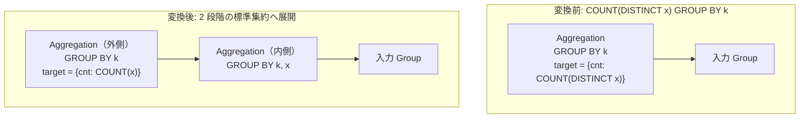

# count_distinct_expansion

- 状態: draft / 執筆基準リビジョン: `3880673` (2026-09-12)
- 定義位置: `plan/cascades.cpp` の `RuleSet::Default()`（登録名: `"count_distinct_expansion"`）

## 概要

`COUNT(DISTINCT x)` を 1 個のみ含む集約ノードを、「元の GROUP BY キーと列 `x` の組み合わせで事前グループ化して重複を排除する内側集約」と「そのサマリ結果に対して通常の `COUNT(x)` を適用する外側集約」という 2 段階の集約構造へと展開する論理最適化 Rule です。

高コストな DISTINCT 付き集約を、通常の非 DISTINCT 集約 2 段のパイプラインへと帰着させ、実行時のメモリ圧迫を軽減します。

## 変換前後の関係



## 適用条件

パターンは `Aggregation(Any("input"))`、ターゲットヒントは `LogicalOperator::kAggregation` です。以下の条件をすべて満たす場合に発火します。

1. **ターゲットリストの要素数が厳密に 1 個であること**（`expression.target_list.size() == 1`）。複数の集約が混在するクエリでは適用されません。
2. 入力 Group が自分自身の Group ではないこと（循環抑止）。
3. 当該ターゲット項目が `agg.Distinct()` かつ `agg.GetType() == AggregationType::kCount` であり、対象列 `agg.Child()` を保持していること。
4. 派生 Group `count_distinct_inner` が既存の Group と衝突しないこと。

```cpp
if (expression.operation != LogicalOperator::kAggregation ||
    expression.target_list.size() != 1) {
  return;
}
```

内側集約のグルーピングキーには、元のグルーピングキー集合に加えて列 `x` が追加されます（重複チェック済み）。外側集約では、集約関数が `COUNT(x, /*distinct=*/false)` へと置き換えられます。

## 意味論的根拠と多重度・代数的同値性

`COUNT(DISTINCT x)` の数学的定義は「対象グループ内における列 `x` の非 NULL 値のユニーク数」です。

内側の集約を `GROUP BY k, x` で実行すると、各グループ `k` 内において、存在する相異なる `x` の値ごとにちょうど 1 行のサマリタプルが生成されます。NULL 値も SQL の GROUP BY の仕様に従って 1 つのグループとして集約されます。

この内側結果に対し、外側で `GROUP BY k` を行いながら通常の `COUNT(x)` を適用すると、通常の COUNT は NULL を自動的にスキップして非 NULL の行数（すなわちユニークな `x` の値の総数）のみを正確にカウントします。これにより、元の `COUNT(DISTINCT x)` と完全に同値な集約結果が得られます。

ターゲットリストが 1 つの `COUNT(DISTINCT)` のみに限定される理由は、`SUM(y)` 等の他の集約が同一クエリ内に併存している場合、内側で `GROUP BY k, x` を適用すると行の多重度が改変され、外側での `SUM(y)` の再集約結果が狂ってしまうためです。

## 実装の詳細

内側集約用の派生 Group `inner_agg` を生成し、`GROUP BY k, x` を設定した `LogicalExpression` を登録します。

```cpp
memo.AddExpression(
    inner_agg,
    LogicalExpression{.operation = LogicalOperator::kAggregation,
                      .children = {input_id},
                      .target_list = std::move(inner_targets),
                      .grouping_sets = std::move(inner_grouping)});
```

外側集約では、ターゲットリスト内の集約定義を `distinct = false` へと反転させ、内側集約 Group を子ノードとする `kAggregation` 式を元の Group に追加します。

```cpp
if (agg.Distinct()) {
  outer_targets.emplace_back(
      target.name,
      AggregateExpressionExp(agg.GetType(), agg.Child(),
                             /*distinct=*/false));
```

## 最適化効果

`DISTINCT` 付き集約は、グループごとにタプルの値集合（ハッシュセットなど）をメモリ上に保持し続ける必要があり、大規模データセットにおいて極めて大きなメモリフットプリントを消費します。

本 Rule による 2 段階集約化により、内側・外側ともに標準的なストリーミング集約やハッシュ集約が利用可能となり、グループごとのユニーク追跡バッファが不要となるため、スピル（一時ディスク書き出し）の防止と並列集約パイプラインへの適合性が大幅に向上します。

## 関連 Rule との相互作用

- `aggregate_union_transpose`: `UnionAll` に対する集約の押し込みルールですが、`DISTINCT` 付き集約は分配不可として拒否します。本 Rule を先行させることで、非 DISTINCT の 2 段集約として分配可能にする契機を与えます。

## 検証テスト

- `plan/cascades_test.cpp` の `CascadesTest.CountDistinctExpansion`: `COUNT(DISTINCT t1.id)` を持つ単一集約が、2 段構成の集約代替プランへと正しく展開されることの検証。
