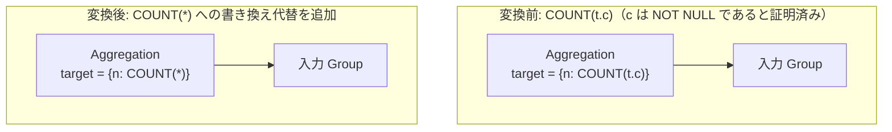

# count_star_rewrite_on_not_null

- 状態: draft / 執筆基準リビジョン: `3880673` (2026-09-12)
- 定義位置: `plan/cascades.cpp` の `RuleSet::Default()`（登録名: `"count_star_rewrite_on_not_null"`）

## 概要

対象列が NOT NULL であると静的解析により証明できる場合に、`COUNT(col)` を子式を持たない `COUNT(*)` へと書き換えた等価式を Memo に登録する論理最適化 Rule です。

SQL において `COUNT(expr)` は NULL 値を無視してカウントしますが、NULL が絶対に生じないことが保証された列においては「NULL を除いた行数」と「テーブルの総行数」が完全に一致するため、評価コストの低い `COUNT(*)` へと安全に昇格できます。

## 変換前後の関係



## 適用条件

パターンは `Aggregation(Any("input"))`、ターゲットヒントは `LogicalOperator::kAggregation` です。以下の条件をすべて満たす場合に適用されます。

1. 集約ノードが単一の子を持ち、ターゲットリストが非空であること。入力 Group が自分自身でないこと。
2. 対象となる集約が、単一の列参照（`TypeTag::kColumnValue`）を引数に取る `kCount` 集約であること。
3. `DISTINCT` 修飾子、`FILTER`、`HAVING` 修飾子、内部 `ORDER BY`、内部 `LIMIT`、および追加引数を**持たない**こと。

   ```cpp
   if (agg.GetType() != AggregationType::kCount || agg.Distinct() ||
       agg.WhereFilter() ||
       agg.Having() != AggregateHavingModifier::kNone ||
       !agg.InnerOrderBy().empty() || agg.InnerLimit().has_value() ||
       !agg.TrailingArgs().empty() || agg.SecondaryArg() ||
       !agg.Child() || agg.Child()->Type() != TypeTag::kColumnValue) {
     rewritten_targets.push_back(target);
     continue;
   }
   ```

4. 列の修飾名が存在し、かつ以下のいずれかの経路で **NOT NULL が証明できること**。
   - **カタログ宣言**: カタログに登録されたテーブル定義において、当該列が `NOT NULL` または主キー（`kPrimaryKey`）であること（`ColumnIsDeclaredNonNull`）。
   - **派生プロパティ**: 入力 Group の論理プロパティにおいて、フィルタや結合条件によって当該列が非 NULL であると導出されていること（`input_group.logical_properties.IsNotNull`）。

```cpp
const bool declared =
    ColumnIsDeclaredNonNull(memo, column.schema, column);
const bool derived =
    input_group.logical_properties.IsNotNull(column.ToString());
if (!declared && !derived) {
  rewritten_targets.push_back(target);
  continue;
}
```

## 意味論的根拠と NULL セマンティクスの保護

SQL の集約規則において、`COUNT(col)` は $\sum_{t \in R, t.col \neq \text{NULL}} 1$ を計算し、`COUNT(*)` は $|R|$ を計算します。

もし NULL を含み得る列に対して本変換を適用すると、本来カウントから除外されるべき NULL 行が計上され、集約結果が誤って過大になります。したがって、スキーマ制約または入力述語によって $t.col \neq \text{NULL}$ がすべての有効行で成立することが証明されている場合に限り、両者は等価となります。

修飾子（`DISTINCT` 等）を持つ集約を除外する理由は、それらの修飾子が NULL チェック以外の追加のセマンティクス（重複排除など）を担っているためです。

## 実装の詳細

ターゲットリスト内の対象 `COUNT` 式に対し、引数に `nullptr` を設定した `AggregateExpressionExp`（子式なしの `COUNT(*)` 表現）を生成します。

```cpp
NamedExpression star = target;
star.expression =
    AggregateExpressionExp(AggregationType::kCount, nullptr, false);
rewritten_targets.push_back(std::move(star));
changed = true;
```

元の出力列名（`target.name`）は厳密に維持されるため、上位プランにおける参照関係を一切損ないません。

## 最適化効果

行ごとの列値取り出しおよび NULL 判定の CPU オーバーヘッドが完全に排除されます。

さらに重要な効果として、`COUNT(*)` への正規化によって、後続の `count_star_without_group_rewrite` やストレージ層のメタデータ走査（B+Tree のリーフエントリ数やインデックスオンリースキャン）といった超高速な最適化パスが解禁（unlock）されます。

## 関連 Rule との相互作用

- `count_star_without_group_rewrite`: 単一テーブルに対する `COUNT(*)` をテーブル統計やインデックスメタデータから即座に解決する高速化ルールです。本 Rule はその前提形を供給します。
- `not_null_is_not_null_elimination`: 同一の NOT NULL 証明機構を共有する述語簡約ルールです。

## 検証テスト

- `plan/cascades_test.cpp` の `CascadesTest.CountStarRewriteOnNotNullColumn`: NOT NULL 列に対する `COUNT(t.c)` が子式なしの `COUNT(*)` へと正しく変換されることの検証。
- `plan/cascades_test.cpp` の `CascadesTest.CountStarRewriteKeepsNullableColumn`: NULL 可能列に対しては変換が安全に抑止されることの検証。
