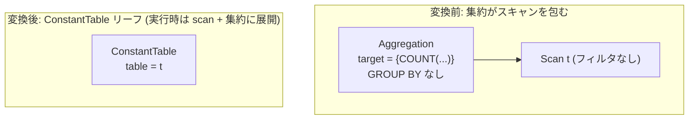

# count_star_without_group_rewrite

- 状態: draft / 執筆基準リビジョン: `3880673` (2026-09-12)
- 定義位置: `plan/cascades.cpp` の `RuleSet::Default()` (登録名 `"count_star_without_group_rewrite"`)

## 概要

`count_star_without_group_rewrite` は、単一テーブルに対するフィルタなしスキャンを入力とする GROUP BY 句のない COUNT 集約を、テーブル名のみを保持する `ConstantTable` リーフ演算へ置き換える等価式を追加する論理 Rule です。

集約の出力行推定を 1 行に固定するとともに、物理プラン生成において COUNT 専用の高速アクセス経路（インデックスオンリースキャン等）に接続可能な内部表現へと正規化することを目的とします。

## 変換前後の関係



## 適用条件

本 Rule の pattern は `Aggregation(Any("input"))`、target ヒントは `LogicalOperator::kAggregation` です。発火には以下のガード条件をすべて満たす必要があります。

1. 演算子が `kAggregation` であり、子が 1 個であること。かつ `grouping_sets` および `partition_by` がともに空であること。

   ```cpp
          if (expression.operation != LogicalOperator::kAggregation ||
              expression.children.size() != 1) {
            return;
          }
          if (!expression.grouping_sets.empty() ||
              !expression.partition_by.empty()) {
            return;
          }
   ```

2. target list が空でなく、**すべての** target が `kCount` かつ DISTINCT 修飾、FILTER 句（`WhereFilter`）、HAVING 修飾（`AggregateHavingModifier::kNone` 以外）を持たない集約式であること。1 つでも逸脱する target が存在する場合は発火しません。

   ```cpp
            const auto& agg = target.expression->AsAggregateExpression();
            if (agg.GetType() != AggregationType::kCount || agg.Distinct() ||
                agg.WhereFilter() ||
                agg.Having() != AggregateHavingModifier::kNone) {
              return;
            }
   ```

3. 入力 Group が単一リレーションで構成され、かつ Group 属性として scan filter を持たないこと。

   ```cpp
          if (input_group.relations.size() != 1 || input_group.filter) {
            return;
          }
   ```

4. 入力 Group の関係集合先頭、または子式内に存在する `kScan` 式から有効なテーブル名を取得できること。

## 意味論的根拠と多重度保存・例外保護

本 Rule は「集約結果が基底テーブルの入力行数のみに依存して一意に定まる」関係を代数的にリーフ演算へ縮約します。適用条件から外れた場合の意味論的破壊は以下のとおりです。

- **GROUP BY の不在（ガード 1）**: グループ化が存在する場合、出力行数は入力キー値の個別値数（NDV）に依存し、行数そのものでは決定されません。
- **COUNT 以外の集約（ガード 2）**: `SUM` や `AVG` などの集約は列値のドメインおよび NULL に依存し、ゼロ除算や数値オーバーフロー等の実行時例外を起こし得ます。一方、行数カウントはテーブルの多重度のみに依存します。
- **DISTINCT / FILTER 句の不在（ガード 2）**: `COUNT(DISTINCT x)` は重複値および NULL を除外するため、全行数と一致しません。FILTER 句付き COUNT は述語を満たす行の部分集合のみを対象とするため、基底行数から乖離します。
- **フィルタなし単一リレーション（ガード 3）**: 入力に結合や選択フィルタが介在する場合、直積による行増幅やフィルタによる行脱落が発生するため、基底テーブルの登録行数と出力カウントが一致しなくなります。

なお、tinylamb の本 Rule 実装は `COUNT(*)` のみならず `COUNT(col)` も許容します。これは後述のとおり物理プラン実装が即値返却ではなく実際のテーブルスキャンと集約計算を保持するため、意味論の破壊（NULL 列のカウント誤差など）を回避できる契約に基づいています。

## 実装の詳細

変換本体は、元の target list と `output_schema` を引き継いだ `kConstantTable` 式を構築し、Memo の対象 Group に追加します。

```cpp
          memo.AddExpression(
              group,
              LogicalExpression{.operation = LogicalOperator::kConstantTable,
                                .table = std::move(table_name),
                                .target_list = expression.target_list,
                                .output_schema = expression.output_schema});
```

このリーフ式の物理実装は `plan/implementation_rules.cpp` の `constant_table` 実装 Rule が担当します。`values` が空でテーブル名のみを持つ場合、実テーブルからのスキャンとハッシュ集約へ展開されます。

```cpp
          if (logical.values.empty() && !logical.table.empty()) {
            // COUNT(*) is rewritten to this leaf for optimizer purposes, but
            // its result must still be computed from the transaction-visible
            // table.  Catalog statistics are estimates and become stale after
            // INSERT/DELETE, so materializing the count from them is wrong.
```

物理展開では `FullScanPlan` または `IndexScanPlan` と `HashAggregatePlan` が組み合わされ、`estimated_rows` が `1.0` に設定されます。カタログ統計は INSERT/DELETE により陳腐化するため、統計値をそのままカウント値としてマテリアライズすることはせず、トランザクション可視なタプルを実走査して計算します。

## 最適化効果

Memo に「集約が 1 つのリーフ演算に縮約された形」が加わります。

物理プランにおいて出力行数が厳密に 1 行と確定するため、本集約演算の上位に位置するスカラサブクエリ比較や結合のカーディナリティ推定値が劇的に引き下げられます。また、物理実装 Rule 経由で不要なタプル復元を省いた `IndexOnlyScan` を選択する動機付けを与えます。

## 関連 Rule との相互作用

- `count_star_rewrite_on_not_null`: 非 NULL 制約が証明された列の `COUNT(col)` を `COUNT(*)` 形式へ正規化し、本 Rule の前提条件を整えます。
- 実装 Rule `constant_table`: 本 Rule が生成した `kConstantTable` 式を物理プランへ展開します。
- `one_row_cross_join_elimination`: 1 行リレーションを検出する際、本 Rule と同様の基準（`kAggregation` かつ `grouping_sets` / `partition_by` が空）を 1 行確定の判定に利用します。

## 検証テスト

- `plan/cascades_test.cpp`: `CascadesTest.CountStarWithoutGroupRewriteToConstantTable`
  - `COUNT(*)` スカラ集約の探索により、`table == "t1"` を保持する `kConstantTable` 式が Group に追加されることを検証。
- `plan/optimizer_test.cpp`: `OptimizerTest.CountStarUsesUnboundedIndexOnlyScan`
  - スカラ `COUNT(*)` クエリに対してオプティマイザが `IndexOnlyScan` を選択し、正確な集約結果を算出することを end-to-end で検証。
