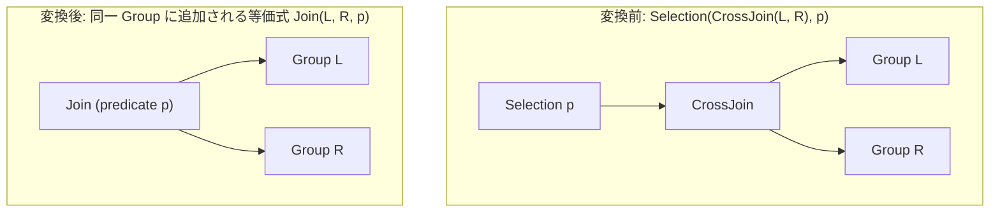

# cross_to_inner_with_predicate

- 状態: draft / 執筆基準リビジョン: `3880673` (2026-09-12)
- 定義位置: `plan/cascades.cpp` の `RuleSet::Default()` (登録名 `"cross_to_inner_with_predicate"`)

## 概要

`cross_to_inner_with_predicate` は、クロス積の上に存在するフィルタ演算 `Selection(CrossJoin(L, R), p)` を、述語を結合条件へと昇格させた内側結合 `Join(L, R, p)` に折りたたむ論理 Rule です。

直積を生成した後にフィルタを適用する愚直な構造を、述語付き結合演算子へ変換することで、ハッシュ結合やインデックス結合などの効率的な物理結合アルゴリズムを選択可能にします。

## 変換前後の関係



## 適用条件

本 Rule の pattern は `Selection(CrossJoin(Any("left"), Any("right")))`、target ヒントは `LogicalOperator::kSelection` です。

発火のためのガード条件は以下の通りです。

1. Selection 演算子に述語（`expression.predicate`）が存在すること。

```cpp
    // cross_to_inner_with_predicate: Selection(CrossJoin(L, R), p) -> Join(L,
    // R, p) when predicate p references both left and right relations.
    built.Add(Rule(
        "cross_to_inner_with_predicate",
        Selection(CrossJoin(Any("left"), Any("right"))),
        [](const Bindings& bindings, Memo& memo, GroupId group,
           const LogicalExpression& expression) {
          if (!expression.predicate) {
            return;
          }
          memo.AddExpression(
              group, LogicalExpression{.operation = LogicalOperator::kJoin,
                                       .children = {bindings.at("left"),
                                                    bindings.at("right")},
                                       .predicate = expression.predicate});
        },
        LogicalOperator::kSelection));
```

`expression.predicate` が `std::nullopt` である場合のみ早期 return します。

登録コメントには「述語 p が左右両方の関係を参照するとき（when predicate p references both left and right relations）」と記述されていますが、実際の実装コードでは参照リレーションの検証は行っておらず、片側リレーションのみを参照する述語であっても発火します。

## 意味論的根拠と代数的一致

関係代数において、選択付き直積と内側結合は定義により等価です。

$$\sigma_p(L \times R) \equiv L \bowtie_p R$$

内側結合のフィルタセマンティクスは「直積結果に対して三値論理で TRUE と評価されるタプルのみを通過させる」操作であり、直積の後にフィルタを評価しても、結合処理の段階で述語を評価しても多重集合として完全に一致します。

述語が片側の関係（例えば $L$ のみ）を参照している場合であっても代数的等価性は保たれます。逆方向の変換である `join_to_cross_if_no_predicate` では述語の喪失を防ぐ厳密な検査が必要ですが、本 Rule では Selection の述語をそのまま Join の結合述語へと引き渡すため、情報損失や例外消去（error erasure）の問題は発生しません。

## 実装の詳細

変換本体は、左右の子 Group ID を保持し、元の Selection の述語を引き継いだ `kJoin` 式を Memo の対象 Group に追加します。

```cpp
          memo.AddExpression(
              group, LogicalExpression{.operation = LogicalOperator::kJoin,
                                       .children = {bindings.at("left"),
                                                    bindings.at("right")},
                                       .predicate = expression.predicate});
```

生成された `kJoin` 式は、元の `Selection(CrossJoin)` と同じ Group 内に共存します。物理実装段階では、`hash_join` や `merge_join`、`index_join` などの実装 Rule が述語付き `kJoin` を対象として展開され、クロス積を実行した後にタプル単位でフィルタする非効率な実行パスを回避します。

## 最適化効果

直積サイズ $|L| \times |R|$ のタプル実体化と、全タプルに対する述語評価オーバーヘッドを排除します。

述語が等値条件を含む場合、物理プランではハッシュ結合による $O(|L| + |R|)$ の実行や、インデックススキャンと連動した結合が可能になります。

## 関連 Rule との相互作用

- `join_to_cross_if_no_predicate`: 本 Rule の対称対です。述語のない内側結合をクロス積へ正規化します。
- `split_selection_over_join` / `push_selection_through_join`: Selection の述語を分解・押し下げる Rule 群です。単側述語は押し下げ Rule により各枝へ下り、結合述語として残った要素が本 Rule により内側結合へ集約されます。
- `push_selection_into_scan`: 本 Rule によって結合に組み込まれた単側述語が存在する場合、下流の走査系 Rule との連携でスキャン側へさらに押し下げられる余地が生まれます。

## 検証テスト

- `plan/cascades_test.cpp`: `CrossToInnerWithPredicate`
  - `CrossJoin(t1, t2)` の上位に `Selection(t1.id = t2.id)` が置かれた論理プランにおいて、述語付き `kJoin` 式が Group に追加されることを検証。
