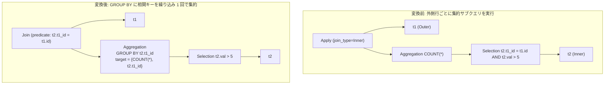

# decorrelate_aggregate_apply

- 状態: draft / 執筆基準リビジョン: `3880673` (2026-09-12)
- 定義位置: `plan/cascades.cpp` の `RuleSet::Default()` (登録名 `"decorrelate_aggregate_apply"`)

## 概要

`decorrelate_aggregate_apply` は、相関サブクエリを含む `Apply(Outer, Aggregation(Selection(Inner)))` を、相関等値キーを集約の GROUP BY 句へと繰り込み、Apply 演算を（外側リレーション $\times$ グループ化集約）の通常結合へと変換する論理 Rule です。

外側タプルごとに内側の集約を都度再計算するループ実行（Nested Loops 評価）を、1 回のグループ化集約とハッシュ結合等による一括評価へ解消することを目的とします。

## 変換前後の関係



## 適用条件

本 Rule の pattern は `Apply(Any("outer"), Aggregation(Any("inner_sub"), "inner_agg"))`、target ヒントは `LogicalOperator::kApply` です。

発火のためのガード条件は以下の通りです。

1. 演算子が `kApply` であり、子が 2 個であること。かつ右側 Group に単一入力の `kAggregation` 代替が存在し、その下位 Group に述語付き Selection 式が存在すること。

   ```cpp
            if (agg_expr.operation != LogicalOperator::kAggregation ||
                agg_expr.children.size() != 1) {
              continue;
            }
   ```

2. Selection の述語を連言分解し、内側リレーションの列と外側リレーションの列の等値比較（`kEquals`）を `corr_equalities`（および対応する内側列 `corr_inner_cols`）として抽出できること。外側リレーションを参照しない述語は `local_preds` に分類されます。

   ```cpp
                    if (c1_inner && c2_outer) {
                      corr_equalities.push_back(conjunct);
                      corr_inner_cols.push_back(bin.Left());
                      continue;
                    }
                    if (c2_inner && c1_outer) {
                      corr_equalities.push_back(conjunct);
                      corr_inner_cols.push_back(bin.Right());
                      continue;
                    }
   ```

3. `corr_equalities` が 1 つ以上存在すること。相関等値キーが存在しない場合は発火しません。

   ```cpp
              if (corr_equalities.empty()) {
                continue;
              }
   ```

4. 派生 Group 生成における循環参照チェックを通過すること。

## 意味論的根拠と多重度保存・代数的一致

外側タプル $o \in Outer$ に対する集約値は、$o$ の結合キーと一致する内側タプル集合 $\{i \in Inner \mid i.k = o.k\}$ に対する集約です。したがって、相関等値キーを集約演算の GROUP BY キーに追加すると、集約結果は「キーごとの集約値テーブル」となり、外側テーブルと当該キーで通常結合（または外部結合）することで各行に対応する集約値が得られます。

この変換が成立するための意味論的制約は以下の通りです。

- **相関述語の等値性**: 相関条件が列対列の等式（`kEquals`）である必要があります。不等号相関（`t2.val > t1.val`）や複雑な式相関（`t2.k + 1 = t1.k`）では、単純な GROUP BY 集約への畳み込みが成立しません。
- **非等値相関項の除外**: 外側リレーションを参照する非等値述語が存在する場合、本 Rule ではその述語を引き継げないため適用対象外となります。
- **空集合に対する集約特性**: COUNT などの集約は空入力に対して 0 を返しますが、通常の内側グループ化集約は該当グループを出力しません。相関サブクエリの意味論を厳密に保つためには `LEFT OUTER JOIN` への写像と COALESCE 等の NULL 置換が必要となります。現在の実装では `join_type` の値に応じて `kJoin` または `kOuterJoin` を生成します。

## 実装の詳細

相関キーは重複を排除した上で、集約演算子の `grouping_sets` および `target_list` へ追加されます。

```cpp
              LogicalExpression new_agg = agg_expr;
              new_agg.children = {filtered_inner};
              for (const auto& col_expr : corr_inner_cols) {
                bool already_grouped = false;
                for (const auto& g : new_agg.grouping_sets) {
                  if (g->ToString() == col_expr->ToString()) {
                    already_grouped = true;
                    break;
                  }
                }
                if (!already_grouped) {
                  new_agg.grouping_sets.push_back(col_expr);
                  new_agg.target_list.emplace_back(
                      col_expr->AsColumnValue().GetColumnName().ToString(),
                      col_expr);
                }
              }
```

続いて Apply の `join_type` に応じた結合式を生成し、Memo に追加します。

```cpp
              LogicalExpression join_res;
              join_res.operation = (expression.join_type == 0)
                                       ? LogicalOperator::kJoin
                                       : LogicalOperator::kOuterJoin;
              join_res.join_type = expression.join_type;
              join_res.children = {outer_id, new_agg_group};
              join_res.predicate = CombineConjuncts(corr_equalities);
              join_res.target_list = expression.target_list;
              join_res.output_schema = expression.output_schema;
              memo.AddExpression(group, std::move(join_res));
```

## 最適化効果

外側テーブルのタプル数に応じた $O(|Outer| \times \mathrm{cost}(Subquery))$ の反復実行が、1 回の集約と 1 回の結合 $O(|Outer| + |Inner|)$ へと削減されます。

さらに、Apply 演算子が標準の `kJoin` へ置き換わることで、結合順序の再構成や結合アルゴリズム（Hash Join 等）の探索空間が有効化されます。

## 関連 Rule との相互作用

- `apply_to_join`: 集約を含まない通常の相関 Apply 演算子を結合へ下ろす Rule です。本 Rule は集約サブクエリを含むパターンの専用経路です。
- `hoist_correlated_selection_to_apply`: Selection 内の相関述語を Apply 条件へと引き上げる Rule です。本 Rule は引き上げにとどまらず GROUP BY への畳み込みまでを一括して行います。
- `push_selection_through_aggregation`: 本 Rule によって分離された内側の局所述語（`local_preds`）をさらに集約下部へ押し下げる際に連動します。

## 検証テスト

- `plan/cascades_test.cpp`: `CascadesTest.DecorrelateAggregateApply`
  - `COUNT(*)` 集約サブクエリを持つ Apply 演算子が、相関キーを GROUP BY に含む集約式と通常結合 `kJoin` 式へと書き換えられることを検証。
- `plan/cascades_test.cpp`: `CascadesTest.DefaultRulesIncludePredicateAndProjectionTransforms`
  - 本 Rule がデフォルトの論理 Rule セットに正常に登録されていることを確認。
