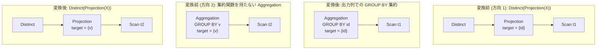

# distinct_and_group_by_interchange

- 状態: draft / 執筆基準リビジョン: `3880673` (2026-09-12)
- 定義位置: `plan/cascades.cpp` の `RuleSet::Default()` (登録名 `"distinct_and_group_by_interchange"`)

## 概要

`distinct_and_group_by_interchange` は、射影を伴う重複排除演算 `Distinct(Projection(X))` と、集約関数を含まないグループ化演算 `Aggregation(X, GROUP BY ...)` を相互に変換する論理 Rule です。

SQL において重複排除は「全出力列をキーとする GROUP BY」と意味論的に同値です。両方向の等価式を Memo に登録することで、ハッシュ集約によるグループ化実装とソートまたはハッシュベースの重複排除実装の双方を探索可能にします。

## 変換前後の関係



## 適用条件

本 Rule の pattern は `Pattern::Any()`、target ヒントは `std::nullopt` です。マクロ構造として入力演算子の種類に応じて 2 系統の分岐を持ちます。

- **方向 1 (`kDistinct`)**:
  1. 演算子が `kDistinct` であり、子が 1 個であること。
  2. 子 Group 内に単一入力かつ target list が空でない `kProjection` 式が存在すること。
  3. 射影の子 Group が現在の Group 自身と一致しないこと（循環防止）。

- **方向 2 (`kAggregation`)**:
  1. 演算子が `kAggregation` であり、子が 1 個であること。
  2. `grouping_sets` および `target_list` が空でないこと。
  3. `target_list` 内に集約関数（`ContainsAggregate`）が 1 つも含まれていないこと。
  4. `grouping_sets` に含まれる列参照キーのすべてが、`target_list` に射影されていること（キー脱落がないこと）。

```cpp
              // Only interchange back to Distinct(Projection(X)) when all
              // grouping keys survive the projection; otherwise the Distinct
              // would not deduplicate rows that differ on a dropped key.
```

方向 2 において列参照キーが 1 つでも出力から脱落している場合、または `grouping_sets` に列参照が一切存在しない場合は発火しません。

## 意味論的根拠と多重度保存

`DISTINCT` の操作は、全射影列のタプル値に対する重複排除であり、全射影列をグループ化キーとする集約操作と多重集合意味論において厳密に一致します。

三値論理における NULL の等値比較に関しても、SQL 規格および tinylamb の実装において双方の演算子は「NULL 同士を同一グループとして重複排除する」同一の振る舞いを取るため、代数的等価性が保証されます。

方向 2 において「全グループ化キーが射影出力に残存していること」を要求する理由は多重度の破壊防止です。集約では GROUP BY キーを出力に含めずに射影することが許容されます（例: `SELECT 1 FROM t GROUP BY k`）。もし出力から除外されたキーが存在する状態で `Distinct(Projection)` へ変換すると、異なるキー値を持つグループ同士が出力上で同一値となり、過剰に 1 行へと統合されて出力行数が減少します。このため、全キーの残存が厳密な前提条件となります。

## 実装の詳細

方向 1 では、射影式の target list をそのままグループ化キー（`grouping_sets`）および出力 target list として流用し、`kAggregation` 式を Memo に追加します。

```cpp
              LogicalExpression aggregation;
              aggregation.operation = LogicalOperator::kAggregation;
              aggregation.children = inner.children;
              aggregation.target_list = inner.target_list;
              aggregation.output_schema = inner.output_schema;
              aggregation.grouping_sets = std::move(grouping);
              memo.AddExpression(group, std::move(aggregation));
```

方向 2 では、派生 Group として射影式を生成した上で、その上位に `kDistinct` 式を配置します。

```cpp
              memo.AddExpression(
                  proj_group,
                  LogicalExpression{.operation = LogicalOperator::kProjection,
                                    .children = {child},
                                    .target_list = expression.target_list,
                                    .output_schema = expression.output_schema});
              memo.AddExpression(
                  group,
                  LogicalExpression{.operation = LogicalOperator::kDistinct,
                                    .children = {proj_group}});
```

## 最適化効果

物理プラン探索において、同一の論理要求に対して異なる物理実装アルゴリズムの比較が可能になります。

大規模データセットに対するハッシュ集約アルゴリズム（`HashAggregatePlan`）と、ソート済み入力に対するストリーム重複排除（`SortDistinctPlan` 等）のコストを比較し、先行する演算子のソート順序プロパティに応じた最適な物理プランが選択されます。

## 関連 Rule との相互作用

- `distinct_over_group_by`: GROUP BY 集約の上位に Distinct が付与されている冗長パターンを解消します。
- `distinct_over_distinct`: 重複排除の入れ子を 1 段に縮約します。
- `merge_projections`: 方向 2 で生成された派生射影式を、近接する他の射影演算子と統合します。

## 検証テスト

- `plan/cascades_test.cpp`: `CascadesTest.DistinctAndGroupByInterchangeBothDirections`
  - 方向 1: `Distinct(Projection(scan))` から `grouping_sets` を保持する `kAggregation` 式が生成されることを検証。
  - 方向 2: 集約関数を含まない `kAggregation` から `Distinct(Projection)` 式が生成されることを検証。
