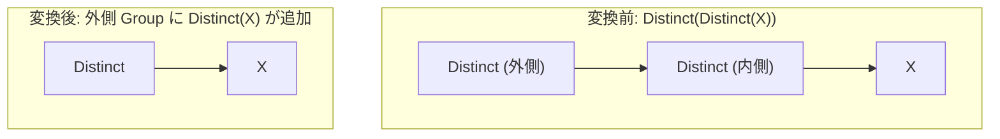

# distinct_over_distinct

- 状態: draft / 執筆基準リビジョン: `3880673` (2026-09-12)
- 定義位置: `plan/cascades.cpp` の `RuleSet::Default()` (登録名 `"distinct_over_distinct"`)

## 概要

`distinct_over_distinct` は、入れ子になった重複排除演算 `Distinct(Distinct(X))` を単一の `Distinct(X)` へ縮約する論理 Rule です。

集合および多重集合に対する重複排除操作（Projection of Unique Tuples）の冪等性を利用し、多重に重なった重複排除演算の下位レイヤをバイパスします。

## 変換前後の関係



## 適用条件

本 Rule の pattern は `Distinct(Distinct(Any(), "inner"))`、target ヒントは `LogicalOperator::kDistinct` です。

```cpp
    // distinct_over_distinct: Distinct(Distinct(X)) -> Distinct(X)
    built.Add(Rule(
        "distinct_over_distinct", Distinct(Distinct(Any(), "inner")),
```

内側 Group（`bindings.at("inner")`）の各式を走査し、以下のガード条件を満たす最初の式に対して発火します。

1. 内側式の演算子が `kDistinct` であること。
2. 内側式の子リストが空でないこと（`!inner.children.empty()`）。
3. 内側式の子 Group が現在の外側 Group 自身（`group`）と一致しないこと（循環参照防止）。

いずれの条件も満たさない場合はスキップされ、発火しません。

## 意味論的根拠と多重度保存

重複排除演算 $\delta$ は冪等性（Idempotence）を満たします。

$$\delta(\delta(X)) \equiv \delta(X)$$

1 回の重複排除を通過したタプル集合は、すべてのタプルがユニーク（多重度 1）となります。この一意な多重集合に対して再度重複排除を適用しても、タプルの構成・多重度・包含関係は一切変化しません。

三値論理において NULL を含むタプルが存在する場合であっても、tinylamb の `Distinct` は NULL 値同士を同値として 1 つに縮約するため、2 回適用した場合と 1 回適用した場合で NULL の個数および出力多重度に差異は生じません。例外や副作用を伴うスカラー式も介在しないため、意味論的等価性は無条件に成立します。

## 実装の詳細

変換処理は、内側 Group 内から見出された有効な `kDistinct` 式を取り出し、外側の対象 Group に同一の子 Group を指す形で登録します。

```cpp
          const Group& inner_group = memo.Get(bindings.at("inner"));
          for (const LogicalExpression& inner : inner_group.expressions) {
            if (inner.operation != LogicalOperator::kDistinct ||
                inner.children.empty() || inner.children[0] == group) {
              continue;
            }
            memo.AddExpression(group, inner);
            return;
          }
```

`kDistinct` 演算子は述語や target list を保持しないため、子 Group ID を引き継ぐだけで等価式を生成できます。1 つの式を追加した時点で早期 return します。

## 最適化効果

余分な重複排除処理（ソートやハッシュテーブル構築、タプル比較）を完全に削減します。

パイプライン実行においてブロック化演算子（Pipeline Breaker）として動作する重複排除演算が 1 つ消滅するため、メモリ消費量の削減とレイテンシの改善に直結します。

## 関連 Rule との相互作用

- `distinct_over_group_by`: GROUP BY 集約の上位に置かれた冗長な Distinct を削減します。
- `distinct_and_group_by_interchange`: Distinct と GROUP BY の相互変換に伴い一時的に生成された多重 Distinct パターンを本 Rule が回収・単純化します。
- `push_filter_through_distinct`: Distinct を跨ぐフィルタの押し下げ処理と協調して不要な中間演算子を排除します。

## 検証テスト

- `plan/cascades_test.cpp`: `CascadesTest.DistinctOverDistinctElimination`
  - `Distinct(Distinct(scan))` の探索において、外側 Group に scan を直接の子とする `Distinct` 等価式が生成されることを検証。
