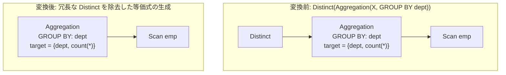

# distinct_over_group_by

- 状態: draft / 執筆基準リビジョン: `3880673` (2026-09-12)
- 定義位置: `plan/cascades.cpp` の `RuleSet::Default()`（登録名 `"distinct_over_group_by"`）

## 概要

グループ化集約演算の上に位置する重複排除演算 $\text{Distinct}(\gamma_K(X))$ に対し、外側の $\text{Distinct}$ を除去した集約ノード $\gamma_K(X)$ を等価式として Memo へ追加する論理 Rule です。

関係代数におけるグループ化演算はグループ化キーの評価値の組ごとに高々 1 つの出力タプルを生成するため、出力ターゲットリストにすべてのグループ化キーが含まれている場合、後段での重複排除は完全に恒等変換（無操作）となります。

## 変換前後の関係



## 適用条件

パターンは `Distinct(Aggregation(Any(), "agg"))` であり、ルートが `kDistinct` ノードであることを検査します（`plan/cascades.cpp`）。

```cpp
    built.Add(Rule(
        "distinct_over_group_by", Distinct(Aggregation(Any(), "agg")),
```

適用判定（guard）は以下の 3 条件から成ります。

1. **非循環性**: 子グループ内の集約式が現在の `group` 自身を参照していないこと（自己参照ループの防止）。
2. **グループ化キーの存在**: 集約演算子にグループ化キー集合 `grouping_sets` が指定されていること（スカラ集約などの空キーは対象外）。
3. **グループ化キーの射影被覆性**: `grouping_sets` 内のすべての列参照が、集約ノードの出力ターゲットリスト（`target_list`）に漏れなく含まれていること。

```cpp
            // DISTINCT is redundant over GROUP BY ONLY when the projected
            // targets include all grouping keys. Aggregates like COUNT(*) can
            // produce duplicate values across groups, so DISTINCT must not be
            // eliminated.
```

条件を満たした集約式は、そのまま現在のルートグループへ等価代替案として登録されます。

```cpp
            memo.AddExpression(group, agg);
            return;
```

## 意味論的根拠と被覆検査の必然性

### 1. グループ化による一意性の保証
SQL における `GROUP BY K` は、入力タプル集合をキー属性集合 $K$ の等値関係によって同値類に分割し、類ごとに 1 つの代表タプルを算出します。したがって、出力属性集合 $A$ が $K$ を完全に包含している（$K \subseteq A$）場合、出力タプル集合における各行は $K$ の値によって必ず一意に識別されます。

このとき、後続の $\text{Distinct}$ 演算子（集合化射影）を適用しても、重複タプルが存在しないため行集合は一切変化しません。

### 2. キー欠落時における重複発生
もし集約の出力リストからグループ化キーが欠落している場合、本変形は不健全となります。

例えばクエリ `SELECT DISTINCT COUNT(*) FROM emp GROUP BY dept` を考えます。複数の部門で従業員数が同一であった場合、$\text{GROUP BY dept}$ は同じカウント値を持つ複数行を出力します。その直上の $\text{DISTINCT}$ はこれらの重複値を 1 行に畳み込みますが、$\text{Distinct}$ を誤って消去すると出力行数が増加し、クエリ意味論が破壊されます。したがって、ガード条件 3 による全キーの射影被覆確認が必須となります。

## 実装の詳細

キー属性の包含判定は、修飾名（`ToString()`）および単純列名（`name`）の双方をハッシュセットへ登録して照合します。

```cpp
            std::unordered_set<std::string> grouping_cols;
            for (const auto& g : agg.grouping_sets) {
              if (g && g->Type() == TypeTag::kColumnValue) {
                grouping_cols.insert(
                    g->AsColumnValue().GetColumnName().ToString());
                grouping_cols.insert(g->AsColumnValue().GetColumnName().name);
              }
            }
```

ターゲットリスト側の属性集合 `proj_cols` に対して `grouping_cols` の全要素が存在することを検証し、完全一致を確認した時点で `memo.AddExpression(group, agg)` を実行して探索を終了します。

## 最適化効果

- **重複排除演算子の完全削除**: 実行計画から `sort_distinct` や `hash_distinct` などの物理演算子が排除されます。
- **実行リソースの節約**: 一時ハッシュテーブルのメモリ割り当てや、ソート実行に伴うメモリ・I/O コストが削減され、パイプラインのストリーミング処理が維持されます。

## 関連 Rule との相互作用

- `distinct_and_group_by_interchange`: 集約と DISTINCT の双対性を利用してプランを相互変換する Rule です。
- `distinct_over_distinct`: 連続する重複排除演算 $\text{Distinct}(\text{Distinct}(X))$ を単一化します。
- `pk_unique_distinct_elimination`: 主キーや一意性制約のメタデータを根拠として DISTINCT を消去するファミリーの Rule です。

## 検証テスト

`plan/cascades_test.cpp` 等における集約重複排除に関する回帰テスト網でカバーされています。出力キー欠落時における非発火、および全キー包含時における正常な消去が検証対象となります。
