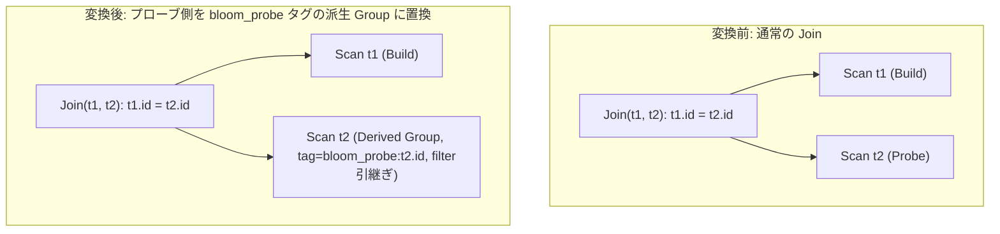

# dynamic_filter_pushdown_join

- 状態: draft / 執筆基準リビジョン: `3880673` (2026-09-12)
- 定義位置: `plan/cascades.cpp` の `RuleSet::Default()` (登録名 `"dynamic_filter_pushdown_join"`)

## 概要

`dynamic_filter_pushdown_join` は、ハッシュ結合の等値結合条件からプローブ側の結合キーを抽出し、プローブ側のスキャン Group を `bloom_probe:` 接頭辞を持つ派生 Group へと置き換えた新たな Join 等価式を Memo に追加する論理 Rule です。

実行時にビルド側リレーションから動的 Bloom フィルタまたは範囲フィルタを構築し、プローブ側のベーステーブルスキャン段階で早期プルーニングを行う実行パスを Memo 上で表現・探索可能にします。

## 変換前後の関係



## 適用条件

本 Rule の pattern は `Join(Any("build"), Any("probe"))`、target ヒントは `LogicalOperator::kJoin` です。

発火のためのガード条件は以下の通りです。

1. 対象 Join Group のタグに `bloom` が含まれていないこと（無限再帰および多重適用の防止）。かつリレーション数が厳密に 2 であること。
2. 結合式に有効な述語（`expression.predicate`）が存在すること。
3. プローブ側 Group ID が現在の Join Group 自身と一致しないこと（循環参照防止）。
4. プローブ側 Group のリレーション数が 1 であること（単一テーブルスキャンに対するプルーニングに限定）。
5. 結合述語の等値連言（`kEquals`）から、プローブ側リレーションに属するキー列（`bloom_keys`）が 1 つ以上抽出できること。

```cpp
          if (memo.Get(group).tag.find("bloom") != std::string::npos ||
              memo.Get(group).relations.size() != 2) {
            return;
          }
          if (!expression.predicate || !*expression.predicate) {
            return;
          }
          const GroupId probe_id = bindings.at("probe");
          if (probe_id == group) {
            return;
          }
          const std::vector<std::string> probe_rels =
              memo.Get(probe_id).relations;
          if (probe_rels.size() != 1) {
            return;
          }
```

## 意味論的根拠と D5 規律（残差フィルタ保持・フィンガープリント）

動的フィルタプッシュダウンは、本来実行時に生成される動的述語を論理表現上に織り込む最適化です。静的な意味論的一致を維持するため、tinylamb の D5 監査規律に基づく厳格な不変条件が課されています。

- **残差フィルタの保持（No Filter Loss）**:
  `memo.EnsureDerivedGroup` はデフォルトでフィルタを持たない空の Group を生成します。もし元のプローブ側 Group が既にスキャンフィルタ（例: `t2.val > 10`）を保持していた場合、フィルタを引き継がずに派生 Group へ置き換えると、元の選択条件が消失して出力多重度が増大します。したがって、派生 Group 生成直後に元のプローブ Group の `filter` を明示的にコピーし、述語的同値性を担保します。
- **キー集合のフィンガープリント化**:
  派生 Group はリレーション名とタグ文字列の組で一意化されます。キー集合が異なる結合条件が同一テーブルの派生 Group を誤って共有・衝突することを防ぐため、タグにはキー列名一覧を直列化したフィンガープリント（`bloom_probe:col1,col2,...`）を付与します。
- **多重度と三値論理の保全**:
  動的フィルタは擬陽性（False Positive）を許容する Bloom フィルタ等として物理層で機能しますが、ハッシュ結合本体の等値評価が最終フィルタとして残存するため、タプルの過剰出力や欠落は生じず、多重集合意味論および NULL セマンティクスは厳密に保たれます。

## 実装の詳細

派生 Group の生成とスキャン式の注入、および Join 式の置き換えは以下の手順で実行されます。

```cpp
          const Expression probe_filter = memo.Get(probe_id).filter;
          std::string key_fingerprint;
          for (const ColumnName& key : bloom_keys) {
            key_fingerprint += key.ToString();
            key_fingerprint.push_back(',');
          }
          const GroupId filtered_probe = memo.EnsureDerivedGroup(
              probe_rels, "bloom_probe:" + key_fingerprint);
          if (filtered_probe != probe_id && filtered_probe != group) {
            memo.Get(filtered_probe).filter = probe_filter;
            memo.AddExpression(
                filtered_probe,
                LogicalExpression{.operation = LogicalOperator::kScan,
                                  .table = probe_rels.front()});
            LogicalExpression rewritten = expression;
            rewritten.children[1] = filtered_probe;
            memo.AddExpression(group, std::move(rewritten));
          }
```

1. 元のプローブ側 Group から `probe_filter` を取得。
2. キー列一覧からフィンガープリント文字列を構築し、`EnsureDerivedGroup` で派生 Group を確保。
3. 派生 Group へ `probe_filter` を転送し、同テーブルに対する `kScan` 式を登録。
4. 元の結合式のプローブ側子 ID（`children[1]`）を派生 Group ID に差し替えた `rewritten` を作成し、元の Group に追加。

## 最適化効果

プローブ側のベーステーブルが巨大で、ビルド側の選択結果が小さい場合、プローブ側スキャンのディスク I/O およびキャッシュ汚染を劇的に低減します。

ストレージ層のゾーンマップ（Zone Map）や Bloom フィルタインデックスと連動することで、不要なデータブロックの読み出しそのものをスキップ可能となります。

## 関連 Rule との相互作用

- `push_selection_into_scan` / `split_selection_over_join`: プローブ側スキャンの残差フィルタを確定させる先行 Rule です。D5 ゲートはこれらの Rule が生成した述語の喪失を防止します。
- `join_enumeration` / `join_commutativity`: 結合の左右（ビルド／プローブ）を入れ替える Rule 群です。入れ替え後の各形態に対して個別に本 Rule が作用し、探索空間を拡充します。
- `in_list_to_semi_join`: 静的な IN リストに対するセミ結合変換であり、本 Rule と同様にプローブ前の行数削減を指向します。

## 検証テスト

- `plan/cascades_test.cpp`: `CascadesTest.DynamicFilterPushdownJoin`
  - 等値結合 `t1.id = t2.id` の論理最適化において、プローブ側 Group のタグに `bloom_probe:` を含む派生 Group が結合右枝として生成されることを検証。
