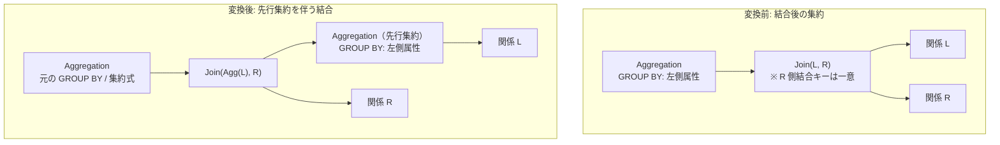

# eager_aggregation_over_join

- 状態: draft / 執筆基準リビジョン: `3880673` (2026-09-12)
- 定義位置: `plan/cascades.cpp` の `RuleSet::Default()`（登録名 `"eager_aggregation_over_join"`）

## 概要

結合演算の上に位置する集約演算 $\gamma(\Join(L, R))$ に対し、結合に先行して左側入力関係 $L$ を事前に集約する等価式 $\gamma(\Join(\gamma(L), R))$ を Memo へ導入する論理 Rule です（先行集約、Eager Aggregation）。

結合演算への入力タプル数をグループ数まで事前に削減し、結合処理（ハッシュテーブル構築や行比較）の負荷を軽減します。ただし、結合によって行の複製が生じると集約関数の多重度計算（`COUNT` や `SUM`）が狂うため、右側結合キーに対する厳密な一意性証明（Unique / Primary Key）が存在する場合に限り発火が許可されます。

## 変換前後の関係



## 適用条件

パターンは `Aggregation(Any("input"))` であり、ルートが `kAggregation` ノードであることを検査します（`plan/cascades.cpp`）。

適用判定（guard）は以下の 4 条件から成ります。

1. **内部結合限定**: 対象の結合が `kJoin`（内部結合）であること（外部結合 `kOuterJoin` は完全に除外）。
2. **右側結合キーの一意性証明**: 結合述語から右側リレーションの列を参照する等号条件を抽出し、それらの属性集合 `right_join_cols` に対してカタログ情報に基づく一意性が保証されていること。
   ```cpp
   if (right_join_cols.empty() ||
       !memo.Get(right_id).logical_properties.IsUniqueOn(right_join_cols)) {
     continue;
   }
   ```
3. **GROUP BY キーの左側局所性**: グループ化属性（`grouping_sets`）が空でなく、すべてのキーが左側リレーション $L$ の列参照であること。
4. **サイクル防止**: 生成される派生グループ（`eager_agg_left` および `eager_agg_join`）が現在のグループ自身や入力グループと一致しないこと。

## 意味論的根拠と一意性制約の必然性

### 1. 1:1 または N:1 結合における集約の可換性
集約関数（`COUNT`, `SUM`, `AVG` 等）は、タプルの多重度（重複出現回数）に敏感です。

もし結合が $1:N$ 結合であった場合、左側関係 $L$ の 1 タプルが右側関係 $R$ の複数タプルと一致して結合出力内で複製されます。結合後に集約を行った場合はこの複製されたタプル数が集約値に反映されますが、結合前に集約を行ってしまうと各グループのカウントが「$L$ 内の元タプル数」として固定され、誤った集約結果を算出します。

右側の結合属性集合に一意性制約（Primary Key または Unique 制約）が存在する場合、結合は最大でも各左側タプルに対して高々 1 つの右側タプルしか一致しない（$N:1$ 結合または $1:1$ 結合となる）ことが静的に証明されます。したがって、行の複製は発生せず、結合前後の集約値が数学的に完全一致します。

```cpp
  // D5 (docs/design.md): eager_aggregation_over_join is gated OFF.  Without
  // a proof that the join is 1:N on the aggregated side, pushing the
  // aggregate below the join multiplies COUNT/SUM results, so the rule must
  // not fire even in its nominal shape.
```

### 2. 外部結合の排除
左外部結合において不一致となった左側タプルは NULL パディングを伴って保持されますが、先行集約を施した後に内部結合を行うと不一致タプルが脱落します。また外部結合のまま保持する場合でも NULL 行の生成タイミングとグループ化の意味論が一致しなくなるため、外部結合に対しては発火が厳格に禁止されています。

## 実装の詳細

変換処理は以下のステップで Memo ノードを構築します。

1. 先行集約ノードを左側入力 $L$ に対する派生グループ `eager_agg_left` へ追加します。
   ```cpp
   memo.AddExpression(
       agg_left_group,
       LogicalExpression{.operation = LogicalOperator::kAggregation,
                         .children = {left_id},
                         .target_list = expression.target_list,
                         .grouping_sets = expression.grouping_sets});
   ```
2. 先行集約結果と $R$ を入力とする結合ノードを派生グループ `eager_agg_join` へ配置します。
3. 元のルートグループに対し、最終集約ノード $\gamma$ を配置して結果スキーマと評価の同一性を担保します。

## 最適化効果

- **結合コストの大幅削減**: 大規模テーブル $L$ のタプル数が先行集約によってユニークなグループ数（$|G_L| \ll |L|$）へと圧縮された状態で結合されるため、ハッシュ結合のプローブ回数やソートマージ結合の走査量が劇的に減少します。
- **コストベースによる採否判定**: 先行集約処理自体のオーバーヘッドが存在するため、本 Rule は無条件のヒューリスティック適用ではなく、Memo 内に代替案として保持され、コストモデルによって純利益が得られる場合のみ最終実行計画として選択されます。

## 関連 Rule との相互作用

- `aggregate_join_transpose`: 類似の変換を行う双対 Rule ですが、対象とするターゲットリストの依存属性判定範囲が異なります。
- `join_commutativity`: 結合オペランドを交換することで、左右いずれの関係に対しても先行集約の適用余地を探索可能にします。
- `push_selection_through_join`: 結合下に押し込まれた述語により先行集約の入力行数をさらに事前削減します。

## 検証テスト

`plan/cascades_test.cpp` における以下のテストケースで検証されています。

- `CascadesTest.EagerAggregationOverJoin`:
  スキーマ上で一意性が証明されていない場合、誤った結果生成を防ぐため Rule が発火しない（D5 監査の防壁）ことを確認します。
- `CascadesTest.EagerAggregationOverJoinOnUniqueKey`:
  右側結合属性に PRIMARY KEY 制約が付与されている場合に限り、先行集約を含む結合プランが Memo に生成されることを確認します。
- `CascadesTest.EagerAggregationOverJoinSkipsOuterJoin`:
  外部結合に対して本 Rule が発火を抑止することを確認します。
