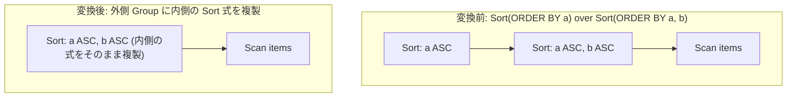

# eliminate_double_sort

- 状態: draft / 執筆基準リビジョン: `3880673` (2026-09-12)
- 定義位置: `plan/cascades.cpp` の `RuleSet::Default()` (登録名 `"eliminate_double_sort"`)

## 概要

`eliminate_double_sort` は、入れ子になった 2 段のソート演算 `Sort(Sort(X))` において、内側のソートが外側の要求するソートキー順序（キー式・昇順降順・NULLS FIRST/LAST）をプレフィックスとしてすでに満たしている場合に、冗長な外側のソート演算を解消する論理 Rule です。

ビューやインラインサブクエリの内部で指定されたソートと、外側のクエリブロックで指定されたソートが競合・重複した際、高コストな二重ソートを排除して 1 回のソート実行へと縮約することを目的とします。

## 変換前後の関係



## 適用条件

本 Rule の pattern は `Sort(Sort(Any(), "inner"))`、target ヒントは `LogicalOperator::kSort` です。

発火のためのガード条件（D5 ゲート規律）は以下の通りです。

1. 外側のソートキー数（`outer_keys`）が 0 でなく、かつ内側のソートキー数（`inner_keys`）以下であること（プレフィックス包含の前提条件）。

   ```cpp
            const size_t outer_keys = expression.target_list.size();
            const size_t inner_keys = inner.target_list.size();
            if (outer_keys == 0 || outer_keys > inner_keys) {
              continue;
            }
   ```

2. 外側のすべてのキー式が、内側のキー式プレフィックスと完全に一致すること（`keys_match`）。

   ```cpp
            bool keys_match = true;
            for (size_t i = 0; i < outer_keys; ++i) {
              if (expression.target_list[i].expression->ToString() !=
                  inner.target_list[i].expression->ToString()) {
                keys_match = false;
                break;
              }
            }
            if (!keys_match) {
              continue;
            }
   ```

3. 昇順／降順フラグ（`sort_ascending`）のプレフィックスが一致すること。

   ```cpp
            bool dir_match = true;
            for (size_t i = 0; i < outer_keys; ++i) {
              if (i >= expression.sort_ascending.size() ||
                  i >= inner.sort_ascending.size() ||
                  expression.sort_ascending[i] != inner.sort_ascending[i]) {
                dir_match = false;
                break;
              }
            }
            if (!dir_match) {
              continue;
            }
   ```

4. NULL 値の配置順（`sort_nulls_first`）のプレフィックスが一致すること。

   ```cpp
            bool nulls_match = true;
            for (size_t i = 0; i < outer_keys; ++i) {
              if (i >= expression.sort_nulls_first.size() ||
                  i >= inner.sort_nulls_first.size() ||
                  expression.sort_nulls_first[i] != inner.sort_nulls_first[i]) {
                nulls_match = false;
                break;
              }
            }
            if (!nulls_match) {
              continue;
            }
   ```

5. 内側ソート式が外側 Group 自身を子として参照していないこと（循環防止）。

## 意味論的根拠と物理実行の契約（D5 監査規律）

SQL におけるソート順序の契約（Ordering Contract）は、「要求されたすべてのキー列において、指定された順序方向と NULL 配置が満たされていること」を定めます。

- **キー式のプレフィックス一致**: 外側が `ORDER BY a`、内側が `ORDER BY a, b` の場合、内側のソート結果は「まず a 順に並び、a の同値群（Tie）の中で b 順に並ぶ」順序（Refinement）を持ちます。これは外側の要求する「a 順」という契約を包含して満たします。一方、外側が `ORDER BY b` で内側が `ORDER BY a` の場合、内側で得られた順序は外側の契約と直交するため、ソートを省略すると順序破壊を引き起こします。
- **NULLS FIRST / LAST の整合**: 三値論理において NULL の大小評価は特別な順序規則に従います。外側が `NULLS LAST` を要求しているにもかかわらず、内側が `NULLS FIRST` でソートされていた場合、NULL タプルの配置位置が入れ替わるため外側の契約違反となります。
- **方向（ASC / DESC）の一致**: 昇順と降順の不一致が許容されないことは自明です。

本 Rule は、外側のソートを取り除く代わりに「より精緻な順序を持つ内側のソート式を外側の Group に複製する」というメカニズムを取るため、順序契約を満たしつつ多重集合およびタプル順を厳密に保存します。

## 実装の詳細

条件を満たした内側の `kSort` 式を、そのまま外側 Group（`group`）の等価式として登録します。

```cpp
            bool refs_group = false;
            for (GroupId c : inner.children) {
              if (c == group) {
                refs_group = true;
                break;
              }
            }
            if (refs_group) {
              continue;
            }
            // The inner Sort provides the same ordering; remove the outer.
            memo.AddExpression(group, inner);
            return;
```

内側 Group に適合するソート式が複数存在する場合でも、最初に適合した 1 式を追加した時点で `return` して終了します。

## 最適化効果

計算量 $O(N \log N)$ を要するソート処理および全行のマテリアライズ・外部ソートディスク I/O を 1 回分完全に排除します。

特に LIMIT 句や TopN ソートが下流に控えている場合、パイプラインの途中で不要な全件ソートが実行される事態を未然に防ぎます。

## 関連 Rule との相互作用

- `sort_merge_of_compatible_orders`: 互換性のあるソート順序要求を統合する兄弟 Rule です。
- `limit_push_through_sort`: 2 段ソートが 1 段に縮約された結果、ソートに対する LIMIT の押し下げが直接適用可能になります。
- `eliminate_sort_under_unordered_consumer`: 順序を要求しない上位演算子が存在する場合、残されたソート自体を消去する Rule です。

## 検証テスト

- `plan/cascades_test.cpp`: `CompatibleNestedSortsCollapseToOneOrder`
  - プレフィックス一致（外側 1 キー / 内側 2 キー）において発火し、内側のソート式が外側 Group に複製されることを検証。
- `plan/cascades_test.cpp`: `EliminateDoubleSortRequiresSameKeyExpressions`
  - キー式が異なる場合、方向が一致していても発火しない D5 ガードレールを検証。
- `plan/cascades_test.cpp`: `EliminateDoubleSortRequiresSameNullsFirst`
  - NULLS FIRST/LAST の指定が一致しない場合に発火を阻止する挙動を検証。
