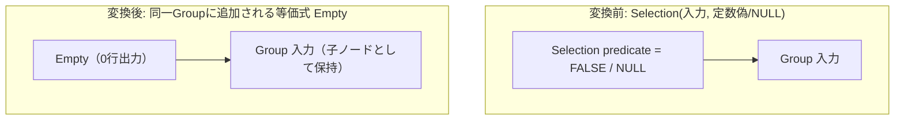

# eliminate_false_selection

- 状態: draft / 執筆基準リビジョン: `3880673` (2026-09-12)
- 定義位置: `plan/cascades.cpp` の `RuleSet::Default()`（登録名 `"eliminate_false_selection"`）

## 概要

`eliminate_false_selection` は、述語が定数の偽（または NULL）である選択演算 `Selection` を空集合ノード `Empty` に置き換える等価式をGroupに追加する論理変換Ruleです。`WHERE 1 = 2` のように実行時結果が恒偽となることが確定している部分木に対し、下位のスキャンや結合処理を一切実行しない最適な実行計画の生成を可能にします。

## 変換前後の関係

述語が偽またはNULLの選択演算式が存在するGroupに対し、行数ゼロを出力する `kEmpty` 式を等価候補として追加します。



メモ構造は追記型であるため元の式も保持されますが、後続のコスト計算において入力コストがゼロとなる `Empty` ノードが優位となり、下位演算子が実行計画から除外されます。

## 適用条件

パターンは `Selection(Any())`、対象演算子は `LogicalOperator::kSelection` です。変換ラムダ内で述語の値を評価します（`plan/cascades.cpp`）。

```cpp
    built.Add(Rule(
        "eliminate_false_selection", Selection(Any()),
        [](const Bindings&, Memo& memo, GroupId group,
           const LogicalExpression& expression) {
          if (!expression.predicate ||
              (*expression.predicate)->Type() != TypeTag::kConstantValue) {
            return;
          }
          const Value value =
              (*expression.predicate)->AsConstantValue().GetValue();
          if (!value.IsNull() && value.Truthy()) {
            return;
          }
          memo.AddExpression(
              group, LogicalExpression{.operation = LogicalOperator::kEmpty,
                                       .children = expression.children});
        },
        LogicalOperator::kSelection));
```

適用条件は以下の2点です。

1. **定数述語の存在**: 述語が存在し、かつその型が静的な定数（`TypeTag::kConstantValue`）であること。
2. **偽またはNULL**: 定数値が NULL であるか、または `Truthy()` が偽であること（真である場合は除外）。

## 意味論的根拠と三値論理

本RuleはSQLの三値論理に基づいています。選択演算 $\sigma_p(X)$ は述語 $p$ が「真」と評価されたタプルのみを通過させ、「偽」および「NULL（不明）」と評価されたタプルを破棄します。したがって、述語が静的に定数偽である場合だけでなく、定数NULLである場合も通過行数は0件となります。

```cpp
          if (!value.IsNull() && value.Truthy()) {
            return;
          }
```

このガード条件は「非NULLかつ真」の場合にのみ適用を中断し、「偽またはNULL」のケースを確実に捕捉します。述語が定数真である場合は行が脱落しないため、対となる `eliminate_true_selection` が適用されます。また、非定数の述語（列参照を含む式）の畳み込みは式書き換え層（`expression/rewrite.cpp`）が事前に担当しており、本Ruleはその簡約結果を受けて動作します。

## 実装の詳細

- **`kEmpty` 式の登録**: 変換ラムダは元の `Selection` と同じ子ノード構成を持つ `LogicalOperator::kEmpty` 式を親Groupに登録します。
- **指紋重複排除**: `Memo::AddExpression` は同一の構造を持つ `kEmpty` 式がすでに存在する場合、指紋照合によって重複登録を回避します。
- **物理計画への反映**: 物理実装段階において、`kEmpty` は一切のI/Oを行わず即座に空結果を返す `EmptyResult` オペレータへと変換されます。

## 最適化効果

スキャンや結合などの下位ツリー全体の実行コストを完全に削減します。探索エンジンは入力部分木のコストを評価することなく定数時間で実行可能な空計画を選択するため、権限チェックや動的SQLによって付加された恒偽条件クエリの実行効率が劇的に向上します。

## 関連Ruleとの相互作用

- `eliminate_true_selection`: 定数真の選択演算を除去する相補的Rule。
- `join_on_false_to_empty`: 結合条件が恒偽である結合ノードを空集合へと変形するRule。
- `setop_empty_simplification` / `join_empty_simplification`: 空集合ノードが入力となった結合や集合演算をさらに簡約し、上位ノードへ空状態を伝播させます。
- 式書き換え層: `1 = 2` や `x != x` などの式を定数 `false` へ畳み込み、本Ruleの発火契機を作ります。

## 検証テスト

- `plan/cascades_test.cpp`:
  - `FalseSelectionAddsEmptyLogicalAlternative`: 定数偽のSelectionを探索した際、Groupに `kEmpty` 式が追加されることを検証。
  - `DefaultRulesIncludePredicateAndProjectionTransforms`: 既定のRuleセットに本Ruleが登録されていることを検証。
- `plan/optimizer_test.cpp`:
  - `ConstantFalseSelectionBecomesEmptyPlan`: `WHERE false` を含むクエリの物理プランが `EmptyResult` となり、行スキャンが実行されないことを検証。

