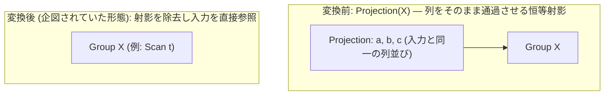

# eliminate_identity_projection

- 状態: draft / 執筆基準リビジョン: `3880673` (2026-09-12)
- 定義位置: `plan/cascades.cpp` の `RuleSet::Default()` (登録名 `"eliminate_identity_projection"` — コメントアウト、無効化済み)

## 概要

`eliminate_identity_projection` は、target list が入力スキーマの列参照をそのまま受け流すだけの恒等射影（Identity Projection）演算子 `Projection(X)` を除去することを企図した論理 Rule です。

現行の tinylamb 実装では、射影の除去が出力スキーマの列名（エイリアス）を変更し、上位の結合述語やソート処理が参照する列名を破壊するリスクがあるため、本 Rule は無効化（DISABLED）されています。

## 変換前後の関係



## 適用条件

本 Rule は現行コードベースにおいて**登録が無効化**されており、オプティマイザの探索処理中に発火することはありません。

```cpp
    // eliminate_identity_projection: Projection where all target-list columns
    //   are simple passthrough references -> remove the node.
    // DISABLED: removing projections can change output schema column names,
    // which breaks join predicates that reference projection aliases.
    // built.Add(Rule(
    //     "eliminate_identity_projection",
    //     ... );
```

`RuleSet::Default()` への登録は行われておらず、`RuleSet::Contains("eliminate_identity_projection")` は false を返します。

企図されていた発火条件は以下の通りです。

1. 演算子が `kProjection` であること。
2. target list の全要素が単純なパススルー列参照であり、列の順序・型が下位入力の出力スキーマと完全に一致すること。

## 意味論的根拠と物理実行の契約（スキーマ整合性と無効化の根拠）

値の多重集合（Multiset of Values）の観点では、恒等射影の除去は代数的等価です。しかし、関係代数システムにおいてタプルは位置だけでなく「列名（カラム識別子）」によっても束縛されます。

射影演算子がサブクエリやビュー境界において列の別名（エイリアス）を付与している場合、射影を除去すると上位の結合述語や選択述語がエイリアス名で列を解決できなくなる不具合（名前解決の破綻）が発生します。

```sql
SELECT *
FROM (SELECT id AS user_id FROM users) AS u
JOIN orders ON orders.customer_id = u.user_id;
```

上記クエリにおいて恒等射影を除去し `users` のスキャンを直結させた場合、出力スキーマから `user_id` が消失して `id` に戻るため、結合述語 `orders.customer_id = u.user_id` のバインディングが失敗します。

tinylamb では D5 規律に基づき、「前提条件を厳密に証明・保護できない最適化は適用してはならない」という設計原則に従って本 Rule を無効化しています。

## 実装の詳細

登録コードはコメントアウトされており、実行コードとしての実体は存在しません。

射影演算子の畳み込みに関しては、安全な列名置換（`RewriteThroughOutputs`）を保証する `merge_projections` および `merge_adjacent_projections` が代替として機能しています。これらの Rule は 2 段の射影を 1 段に統合する際、外側の出力スキーマ列名を厳格に保持しながら式を合成します。

## 最適化効果

本 Rule は無効化されているため、実行プランおよび探索空間に影響は与えません。

将来的に安全なガード条件（上位演算子がエイリアスに依存していないことの証明、またはスキーマ再マッピング層の導入）を設けて再有効化された場合、タプル走査時における不要な射影ステップ（列の再配置およびメモリコピー）が削減される見込みがあります。

## 関連 Rule との相互作用

- `merge_projections` / `merge_adjacent_projections`: 射影段数を削減する代替 Rule です。列名の整合性を破壊することなく安全に射影を合成します。
- `push_projection_through_join`: 射影を結合下流へ押し下げる Rule です。出力スキーマを厳密に管理して列名破壊を回避します。

## 検証テスト

- 本 Rule は無効化されているため、直接的なユニットテストは存在しません。
- 射影の健全性は `plan/cascades_test.cpp` における `MergeAdjacentProjections` 等の近縁 Rule テストによって間接的に担保されています。
