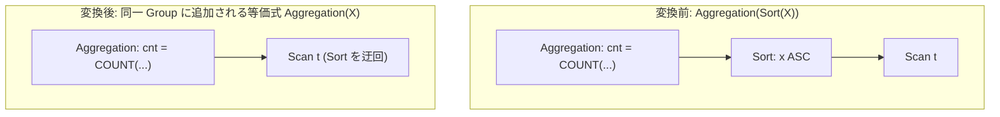

# eliminate_sort_under_unordered_consumer

- 状態: draft / 執筆基準リビジョン: `3880673` (2026-09-12)
- 定義位置: `plan/cascades.cpp` の `RuleSet::Default()` (登録名 `"eliminate_sort_under_unordered_consumer"`)

## 概要

`eliminate_sort_under_unordered_consumer` は、集約演算子 `Aggregation(Sort(X))` のように、入力の順序性に依存しない順序非感受消費者（Unordered Consumer）の下流に存在する `Sort` 演算子をバイパスする等価式を Memo に追加する論理 Rule です。

入力タプルの並び順を消費しない集約処理において、不要なソート演算の実行を回避する代替プランを生成することを目的とします。

## 変換前後の関係



## 適用条件

本 Rule の pattern は `Aggregation(Sort(Any(), "inner"))`、target ヒントは `LogicalOperator::kAggregation` です。

発火のためのガード条件は以下の通りです。

1. 内側 Group（`bindings.at("inner")`）内に演算子 `kSort` を持つ式が存在すること。
2. そのソート式が 1 つ以上の子ノードを持つこと（`!inner.children.empty()`）。
3. そのソート式の最初の子 Group が、現在の親 Group 自身と一致しないこと（循環参照防止）。

```cpp
    // eliminate_sort_under_unordered_consumer: Aggregation(Sort(X)) ->
    // Aggregation(X) when the aggregation does not have order-sensitive
    // requirements.
    built.Add(Rule(
        "eliminate_sort_under_unordered_consumer",
        Aggregation(Sort(Any(), "inner")),
        [](const Bindings& bindings, Memo& memo, GroupId group,
           const LogicalExpression& expression) {
          const Group& inner_group = memo.Get(bindings.at("inner"));
          for (const LogicalExpression& inner : inner_group.expressions) {
            if (inner.operation != LogicalOperator::kSort ||
                inner.children.empty() || inner.children[0] == group) {
              continue;
            }
            memo.AddExpression(
                group,
                LogicalExpression{.operation = LogicalOperator::kAggregation,
                                  .children = inner.children,
                                  .target_list = expression.target_list});
          }
        },
        LogicalOperator::kAggregation));
```

現行の実装コードでは、集約関数が順序依存性（例: 文字列集約 `STRING_AGG` や配列集約 `ARRAY_AGG` など）を持つか否かの個別判定ガードは存在せず、すべての `Aggregation` を順序非感受として扱います。

## 意味論的根拠と物理実行の契約

代数学において、標準的な集約演算（`COUNT`, `SUM`, `MIN`, `MAX`, `AVG`）および GROUP BY による類別操作は、可換律（Commutativity）と結合律（Associativity）を満たす多重集合演算です。したがって、入力タプルの到達順序を変更しても算出される集約結果および多重度は完全に一致します。

三値論理や浮動小数点演算の観点では以下の特性が考慮されます。

- **NULL 値の不感性**: 集約演算子における NULL の無視規則（`COUNT(*)` を除く）はタプル順序に依存しないため、ソートを解除しても計算結果に影響しません。
- **浮動小数点の加算順序**: 厳密な IEEE 754 浮動小数点演算においては丸め誤差による差異が生じ得ますが、関係モデルおよび SQL 標準の宣言的意味論では集約順序は未定義であり、ソートの省略は意味保存とみなされます。
- **循環参照防止**: `inner.children[0] == group` の検証を怠ると、Group が自分自身を直接子ノードとして参照する閉路が Memo 内に形成され、Cascades 探索エンジンの不変条件チェック（CHECK 失敗）を引き起こします。

## 実装の詳細

条件を満たした内側のソート式から子ノード ID（`inner.children`）を取得し、外側集約式の target list を保持した新しい `kAggregation` 式を生成して Memo に追加します。

```cpp
            memo.AddExpression(
                group,
                LogicalExpression{.operation = LogicalOperator::kAggregation,
                                  .children = inner.children,
                                  .target_list = expression.target_list});
```

生成された等価式はソートなしでベーススキャン等から直接集約入力を取得します。元の `Aggregation(Sort)` 式も Memo 内に保持されるため、もしソート済みストリームを利用するソート集約（`StreamAggregatePlan`）がハッシュ集約より安価であると評価された場合は、コスト比較を経てソート付きプランが選択される余地も残されます。

## 最適化効果

計算量 $O(N \log N)$ の外部ソートや中間マテリアライズ処理を削減します。

特に GROUP BY のないスカラ集約やハッシュ集約が選定される場合、不要なソート演算子の完全な刈り込みが達成されます。

## 関連 Rule との相互作用

- `eliminate_double_sort`: ソート同士の重なりを解消する Rule です。本 Rule は「ソートの上流が集約である場合」を担当します。
- `push_filter_through_sort`: ソートを跨いでフィルタを押し下げる Rule です。
- `count_star_without_group_rewrite`: GROUP BY のない COUNT 集約を直接高速リーフへ縮約する Rule です。

## 検証テスト

- `plan/cascades_test.cpp`: `EliminateSortUnderUnorderedAggregation`
  - `Aggregation(Sort(Scan))` の論理木に対して本 Rule が発火し、Sort を介さずに Scan を直結した `kAggregation` 等価式が Group に追加されることを検証。
