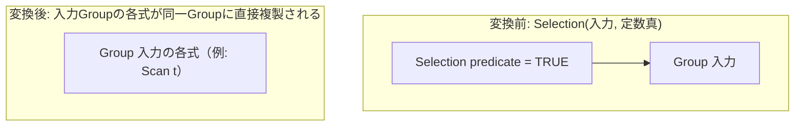

# eliminate_true_selection

- 状態: draft / 執筆基準リビジョン: `3880673` (2026-09-12)
- 定義位置: `plan/cascades.cpp` の `RuleSet::Default()`（登録名 `"eliminate_true_selection"`）

## 概要

`eliminate_true_selection` は、述語が定数の真である選択演算 `Selection(TRUE, X)` を実質的に除去し、入力ノード $X$ の各式をそのまま親Groupに等価式として複製する論理変換Ruleです。すべてのタプルを無条件で通過させる冗長なフィルタ評価を排除します。

## 変換前後の関係

親Groupにおいて、選択演算ノードを経由せずに直接入力式を参照する計画候補を生成します。



メモ構造は追記型であるため元の選択式も残存しますが、コスト評価においてフィルタ評価コストを含まない複製式が優先されます。

## 適用条件

パターンは `Selection(Any("input"))`、対象演算子は `LogicalOperator::kSelection` です。変換ラムダ内で述語の値を評価し、子式の複製を行います（`plan/cascades.cpp`）。

```cpp
    // Selection(true, X) ≡ X (FilterTrue). Copy child alternatives into this
    // group so costing can skip a residual filter.
    built.Add(Rule(
        "eliminate_true_selection", Selection(Any("input")),
        [](const Bindings& bindings, Memo& memo, GroupId group,
           const LogicalExpression& expression) {
          if (!expression.predicate || !*expression.predicate ||
              (*expression.predicate)->Type() != TypeTag::kConstantValue) {
            return;
          }
          const Value value =
              (*expression.predicate)->AsConstantValue().GetValue();
          if (value.IsNull() || !value.Truthy()) {
            return;
          }
```

適用条件は以下の2点です。

1. **定数述語の存在**: 述語ポインタが有効であり、かつ型が静的な定数（`TypeTag::kConstantValue`）であること。
2. **非NULLかつ真**: 定数値が NULL でなく、かつ `Truthy()` が真であること。

ガード条件を通過した場合、入力Group（`bindings.at("input")`）に属する各大替式を親Group（`group`）へ複製します。この際、自己参照ループを防ぐため、親Group自身を子ノードとして参照している式は複製から除外されます。

```cpp
          for (const LogicalExpression& child :
               memo.Get(bindings.at("input")).expressions) {
            bool refs_group = false;
            for (GroupId c : child.children) {
              if (c == group) {
                refs_group = true;
                break;
              }
            }
            if (refs_group) {
              continue;
            }
            memo.AddExpression(group, child);
          }
```

## 意味論的根拠と循環防止

述語が恒真である選択演算 $\sigma_{\text{TRUE}}(X) \equiv X$ は関係代数の恒等式です。述語が定数真でない場合（列参照を含む動的述語）は、行が除外される可能性があるため本Ruleを適用できません。また、三値論理においてNULL述語は0件を出力するため、`value.IsNull()` を厳密に除外し、偽およびNULLは `eliminate_false_selection` に委ねます。

複製ループ内の `refs_group` チェックは、メモ内における循環参照の発生を防止する必須の事前条件です。入力Group内の式が親Group自身を参照している場合、それを親Groupへそのまま登録すると「自分自身を子に持つ式」が形成され、`Memo::AddExpression` の契約違反アサーションが失敗します。

## 実装の詳細

- **複製による短絡化**: 本Ruleは選択演算ノードを削除するのではなく、子Group内の式群を親Groupに複製（インライン化）することで短絡経路を構築します。これにより、物理計画探索器は選択オペレータを完全にスキップして入力アクセスパスを直接採用できます。
- **指紋照合による重複排除**: 親Groupにすでに同一の式が存在する場合、`Memo::AddExpression` の指紋照合によって重複登録が阻止されます。

## 最適化効果

行ごとのフィルタ評価オーバーヘッド（CPUサイクル）が完全に排除されます。式書き換え層が `WHERE 1 = 1` などの自明な条件を定数 `TRUE` へ畳み込んだ後、本Ruleが介在することで物理計画レベルでの不要なノード生成が阻止されます。

## 関連Ruleとの相互作用

- `eliminate_false_selection`: 定数偽またはNULLの選択演算を空集合へと変換する対照的Rule。
- 式書き換え層: `WHERE x = x` などの自明な条件を `TRUE` に畳み込み、本Ruleの発火契機を作ります。
- `merge_selections`: 連続する選択演算の述語が結合された結果として `TRUE` が生じた場合にも、本Ruleが後続として機能します。

## 検証テスト

- `plan/cascades_test.cpp`:
  - `EliminateTrueSelectionCopiesChildScan`: 定数真のSelectionを探索した際、入力Groupの `kScan` 式が親Groupへ直接複製されることを検証。
  - `DefaultRulesIncludePredicateAndProjectionTransforms`: 既定Ruleセットに本Ruleが登録されていることを検証。

