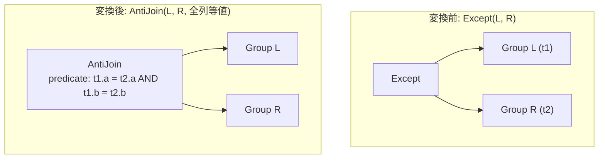

# except_to_antijoin

- 状態: draft / 執筆基準リビジョン: `3880673` (2026-09-12)
- 定義位置: `plan/cascades.cpp` の `RuleSet::Default()` (登録名 `"except_to_antijoin"`)

## 概要

`except_to_antijoin` は、集合差演算 `Except(L, R)` を、全出力列の等値比較を結合述語とする `AntiJoin(L, R, L.c1 = R.c1 AND ...)` へと変換する論理 Rule です。

「左辺のタプルのうち、右辺に同一タプルが存在しないもののみを通過させる」という EXCEPT 演算の意味論を、アンチ結合（Anti-Join）演算子へと還元することで、ハッシュ結合等の効率的な物理結合アルゴリズムの適用を可能にします。

## 変換前後の関係



## 適用条件

本 Rule の pattern は `Pattern::Op(LogicalOperator::kExcept, {})`、target ヒントは `LogicalOperator::kExcept` です。

発火のためのガード条件は以下の通りです。

1. 式の演算子が `kExcept` であり、子がちょうど 2 個であること。
2. 左右の子 Group のリレーション集合が排他的（積集合が空）であること。
3. 左右の子 Group のリレーション和集合が、現在の親 Group のリレーション集合と完全に一致すること。

   ```cpp
          if (!intersection.empty() ||
              UnionRelations(left_group.relations, right_group.relations) !=
                  memo.Get(group).relations) {
            return;
          }
   ```

4. 共通ヘルパ `BuildEqualityOnAllColumns` が全列に対する有効な等値述語を構築できること。

`kExceptAll`（重複度を考慮する多重集合差）に対しては本 Rule は発火しません。

## 意味論的根拠と多重度保存・三値論理

集合差 $L \setminus R$ は、関係代数において非相関または相関の否定存在検査（$\mathrm{NOT\ EXISTS}$）と同値であり、アンチ結合 $L \ \bar{\ltimes}_{L = R} \ R$ の意味論と合致します。

意味論の厳密な保持における留意点は以下の通りです。

- **リレーションの排他性と修飾**: 等値述語は `left_rel.col = right_rel.col` の形式で生成されます。左右のリレーション集合が重複している場合、同一列名の参照解決が曖昧になるため、積集合が空であることを必須条件とします。
- **三値論理と NULL 同値性**: SQL 規格の `EXCEPT` において、NULL 同士の比較は「同値（Distinct でない）」として扱われます。一方、通常の結合等式（`=`）は NULL 同士の比較で UNKNOWN を返すため、右辺に NULL が存在する場合にアンチ結合の判定が乖離する潜在的課題が存在します。tinylamb の現行実装では `kEquals` による等値結合式を生成しており、NULL を含むタプルにおける三値論理の挙動は物理アンチ結合の実装側に依存します。
- **左入力の重複度（D6 規律）**: 標準 SQL の `EXCEPT DISTINCT` は左入力に重複タプルが存在する場合に 1 件へ重複排除して出力しますが、通常の `AntiJoin` は右辺にマッチしない左辺タプルを重複度を保持したまま通過させます。左辺の重複排除が先行していない場合、厳密な集合意味論としての出力行数に乖離が生じ得る点に留意が必要です。

## 実装の詳細

発火処理では、左右の子ノードおよび生成された全列等値述語を引き継いだ `kAntiJoin` 式を親 Group へ追加します。

```cpp
          memo.AddExpression(
              group,
              LogicalExpression{.operation = LogicalOperator::kAntiJoin,
                                .children = {left, right},
                                .predicate = equality_predicate,
                                .target_list = expression.target_list,
                                .output_schema = expression.output_schema});
```

等値条件の構築は `BuildEqualityOnAllColumns` を用いて、`output_schema` の各列に対応する左右リレーションの列参照等式（`BinaryOperation::kEquals`）を連言（AND）で結合します。

```cpp
      conjuncts.push_back(BinaryExpressionExp(ColumnValueExp(left_col),
                                              BinaryOperation::kEquals,
                                              ColumnValueExp(right_col)));
```

## 最適化効果

`Except` 専用のソートベース集合演算アルゴリズムに縛られることなく、右辺（ビルド側）のインメモリハッシュテーブルを用いた `anti_hash_join` などの結合実行系が選択可能になります。

右辺リレーションのサイズが小さく左辺が大きい場合、両入力のソートを必要とする集合演算に比べ、実行時間を大幅に短縮できます。

## 関連 Rule との相互作用

- `intersect_to_semijoin`: 集合積（INTERSECT）をセミ結合（Semi-Join）へ変換する対称 Rule です。
- `intersect_except_cost_based_lowering`: コストベースで集合演算の物理展開を指示する Rule です。
- `outer_to_anti_join`: 外部結合と IS NULL 述語の組み合わせからアンチ結合を導出する Rule です。

## 検証テスト

- `plan/cascades_test.cpp`: `CascadesTest.ExceptToAntiJoinRewrite`
  - `kExcept` 式に対して本 Rule が適用され、同一の子ノードを持つ `kAntiJoin` 式が Memo 内に登録されることを検証。
