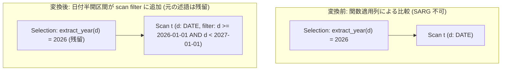

# extract_year_sargable

- 状態: draft / 執筆基準リビジョン: `3880673` (2026-09-12)
- 定義位置: `plan/cascades.cpp` の `RuleSet::Default()` (登録名 `"extract_year_sargable"`)

## 概要

`extract_year_sargable` は、`EXTRACT(YEAR FROM date_col) <op> year` 形式の非 SARGable（Search Argument Able でない）な述語を検出し、DATE 型列に対する半開区間 `[year-01-01, (year+1)-01-01)` を用いた範囲比較述語へと変換して対象テーブルの scan filter に追加する論理 Rule です。

列値に関数を適用した比較はインデックス走査の探索キーとして利用できません。等価な日付リテラルの範囲条件を生成してベーステーブルの走査プロパティに注入することで、インデックス範囲走査（B+Tree Range Scan）やストレージ層のゾーンマップによるブロック枝刈りを可能にします。

## 変換前後の関係



## 適用条件

本 Rule の pattern は `Selection(Any("input"))`、target ヒントは `LogicalOperator::kSelection` です。

連言（AND）の各項を走査し、以下のすべてのガード条件を満たす述語に対して発火します。

1. 式が `kSelection` であり、子が 1 個、かつ述語を保持していること。
2. オプティマイザのカタログ内に 1 つ以上のテーブルスキーマが存在すること。
3. 述語が二項比較であり、片辺が関数呼び出し式（`kFunctionCallExp`）、他辺が定数値（`kConstantValue`）であること（左右の被演算子の順序は問わない）。
4. 関数名が `"extract_year"` であり、引数が厳密に 1 個、かつその引数が列参照（`kColumnValue`）であること。
5. 定数値が非 NULL の `kInt64` であり、西暦 $1 \le year \le 9998$ の妥当な年範囲に収まっていること。
6. 列がテーブル修飾されており、カタログ上で **DATE 型**（TIMESTAMP ではない）として定義されていること。
7. `year-01-01` および `(year+1)-01-01` の 2 つの日付文字列が `Value::TryDate` により有効な Date 値として構築可能であること。
8. 比較演算子が `=`, `<`, `<=`, `>`, `>=` のいずれかであること。

条件を満たした場合、`memo.MergeScanFilter(memo.EnsureGroup({column.schema}), bounds)` を呼び出し、対象テーブル Group の scan filter に境界条件を結合します。

## 意味論的根拠と三値論理・単一リレーション契約

関数適用述語を範囲条件へ変換する際、単一リレーショングループ特有の物理実行契約および三値論理の整合性が要求されます。

- **単一リレーショングループにおける正確性契約**:
  Cascades 実装において、単一リレーション Group では scan filter が物理スキャン時に唯一評価される述語となるケースがあり、ルートの SelectionPlan による再評価（フィルタラップ）が存在しない場合があります。そのため、不正確に緩い範囲を設定して「後で残留フィルタで絞る」という二段構えは許容されず、scan filter に注入する境界条件は元の `extract_year` 述語と数学的に完全同値でなければなりません。
- **8 通りの厳密な境界写像**:
  被演算子の左右順序（正規形および鏡像形）に応じた境界変換テーブルを厳密に定義し、不等号の逆転と境界日の対応関係を保持します。

  | 式の形状 | 変換後の範囲境界条件 |
  | :--- | :--- |
  | `extract < year` | `col < Jan1(year)` |
  | `year < extract` | `col >= Jan1(year + 1)` |
  | `extract <= year` | `col < Jan1(year + 1)` |
  | `year <= extract` | `col >= Jan1(year)` |
  | `extract > year` | `col >= Jan1(year + 1)` |
  | `year > extract` | `col < Jan1(year)` |
  | `extract >= year` | `col >= Jan1(year)` |
  | `year >= extract` | `col < Jan1(year + 1)` |
  | `extract = year` | `col >= Jan1(year) AND col < Jan1(year + 1)` |

- **DATE 型の厳格化と TIMESTAMP の除外**:
  TIMESTAMP 型は時刻成分およびタイムゾーン補正を内包するため、単純な日付区間 `[Jan1, Jan1)` では正確な切り捨て・境界判定を再現できません。したがって DATE 型に限定して発火させます。
- **三値論理（NULL セマンティクス）の保持**:
  `d` が NULL の場合、`extract_year(d)` は NULL となり比較結果は UNKNOWN（偽扱い）となります。変換後の日付比較 `d >= lower AND d < upper` においても NULL に対する比較結果は UNKNOWN となり、フィルタの通過可否は完全に一致します。

## 実装の詳細

境界値の構築と scan filter へのマージ処理は `plan/cascades.cpp` 内で以下のように実装されています。

```cpp
            const StatusOr<Value> lower_status =
                Value::TryDate(std::to_string(year) + "-01-01");
            const StatusOr<Value> upper_status =
                Value::TryDate(std::to_string(year + 1) + "-01-01");
            if (!lower_status.HasValue() || !upper_status.HasValue()) {
              continue;
            }
            const Expression col = ColumnValueExp(column);
            const Expression lower = ConstantValueExp(lower_status.Value());
            const Expression upper = ConstantValueExp(upper_status.Value());
            std::vector<Expression> bounds;
            // ... switch 文による 8 通りの境界条件組み立て ...
            memo.MergeScanFilter(memo.EnsureGroup({column.schema}),
                                 CombineConjuncts(bounds));
```

本 Rule は元の Selection 式そのものを除去・破壊するのではなく、scan filter を更新します。Memo 内部で正規化された連言が scan filter に蓄積され、スキャン演算子の物理化時にインデックス境界条件として抽出されます。

## 最適化効果

テーブルフルスキャンと行ごとの関数評価（`extract_year` の CPU オーバーヘッド）を完全に排除し、B+Tree インデックスの範囲走査（$O(\log N + K)$）への切り替えを実現します。

年間データや特定期間のトランザクションを抽出する分析系クエリにおいて、アクセス対象ページ数を数桁規模で削減する決定的な効果をもたらします。

## 関連 Rule との相互作用

- `cast_pushdown_on_comparison`: 列に対する型キャストを定数側へ押し下げる SARGable 化兄弟 Rule です。
- `push_selection_into_scan`: Selection 述語をベーステーブルの scan filter へ統合する基本 Rule です。
- `scan_zone_map_filter_integration`: scan filter に登録された範囲条件を活用してストレージブロックをスキップします。

## 検証テスト

- `plan/cascades_test.cpp`: `CascadesTest.ExtractYearSargableAddsScanRange`
  - `EXTRACT(YEAR FROM d) = 2026` を持つ論理プランにおいて、対象テーブルの scan filter に `d >= 2026-01-01` かつ `d < 2027-01-01` の境界条件が追加されることを検証。
- `query/query_test.cpp`: `QueryTest.SqlEngineExtractYearPredicateUsesDateRange`
  - SQL クエリ実行において、年抽出フィルタが日付範囲インデックス走査として評価され、正確な結果タプルを返すことを end-to-end で検証。
