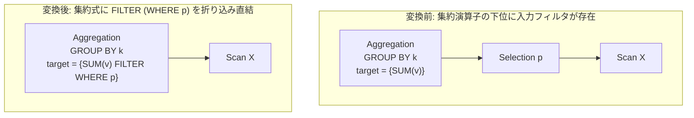

# filter_aggregate_pushdown

- 状態: draft / 執筆基準リビジョン: `3880673` (2026-09-12)
- 定義位置: `plan/cascades.cpp` の `RuleSet::Default()` (登録名 `"filter_aggregate_pushdown"`)

## 概要

`filter_aggregate_pushdown` は、集約演算子の直下に位置する選択フィルタ `Aggregation(Selection(X, p))` の述語 $p$ を、集約関数の `FILTER (WHERE p)` 句（`WhereFilter`）へと折り込み、集約演算子が下位入力 $X$ を直接走査する等価式を Memo に追加する論理 Rule です。

行のフィルタリング処理を集約演算子の内部評価ループへ吸収し、中間タプル集合のマテリアライズや演算子間パイプラインのオーバーヘッドを削減することを目的とします。

## 変換前後の関係



## 適用条件

本 Rule の pattern は `Aggregation(Selection(Any("input"), "sel"))`、target ヒントは `LogicalOperator::kAggregation` です。

発火のためのガード条件は以下の通りです。

1. 演算子が `kAggregation` であり、target list が空でないこと。
2. 下位の `sel` Group が現在の集約 Group 自身と一致しないこと（循環参照防止）。
3. `sel` Group 内の各式を走査し、最初に見出された「`kSelection` かつ子を持ち、有効な述語を保持する式」を抽出できること。
4. Selection の子 Group が現在の親 Group および `sel` Group のいずれとも一致しないこと。
5. target list 内に 1 つ以上の集約関数（`AggregateExpression`）が存在し、実際に `WhereFilter` の注入変換が行われたこと（`transformed == true`）。集約関数以外の列参照等は無変換で引き継がれます。

```cpp
                agg_copy->SetInnerOrderBy(orig.InnerOrderBy());
                agg_copy->SetWhereFilter(*sel_expr.predicate);
                new_targets.emplace_back(target.name, agg_copy);
                transformed = true;
```

## 意味論的根拠と多重度保存・グループ化セマンティクス

集約値そのものの算出において、「述語を満たす行のみを入力として集約する」ことと、「全行を入力とし、各集約関数が述語を満たす行のみを積算対象とする（FILTER 句）」ことは代数的に同一の結果をもたらします。

実行時例外および多重集合意味論に関する留意点は以下の通りです。

- **三値論理と例外消去**: 述語 $p$ の評価において UNKNOWN または FALSE と判定されたタプルは集約から除外されます。これは元の Selection 演算子の三値論理セマンティクスと完全に合致し、集約関数内部でのゼロ除算や型エラーを等価に防護します。
- **GROUP BY における空グループの生成挙動**:
  標準 SQL において、入力行全体に対してフィルタを適用した後に GROUP BY を行う場合、述語を満たす行が 1 件も存在しないグループキー値は出力されません。一方、FILTER 句付き集約を全入力に対して実行する場合、グループ化自体は全行を対象に行われ、述語に合致しないグループに対しても「空の集約値（例: `COUNT` なら 0、`SUM` なら NULL）」を持つ行が出力され得るセマンティクス差が存在します。現行の tinylamb 実装では、このグループ生存性の差分に関するガードは設けられておらず、スカラ集約または同一グループ空間を前提とした変換として動作します。

## 実装の詳細

集約式の複製を作成し、元の `Distinct`、HAVING 修飾、`InnerOrderBy` 属性を完全に維持した状態で `SetWhereFilter` を設定します。

```cpp
              memo.AddExpression(
                  group,
                  LogicalExpression{.operation = LogicalOperator::kAggregation,
                                    .children = {input_id},
                                    .target_list = std::move(new_targets),
                                    .output_schema = expression.output_schema,
                                    .partition_by = expression.partition_by,
                                    .grouping_sets = expression.grouping_sets});
```

物理実行層（`executor/parallel_aggregation.cpp` 等）では、`WhereFilter` を持つ集約関数は行ごとに述語を評価する汎用実行パスを選択する契約となっており、高速型専用スキャン（Row Count Fast Path 等）の誤適用による過剰カウントを防止する安全機構が組み込まれています。

## 最適化効果

Selection 演算子ノードの実行コスト、および Selection と Aggregation 間のタプル受け渡しオーバーヘッドが排除されます。

特に同一テーブルに対して異なる条件を持つ複数の集約（例: `SUM(v) FILTER (WHERE c1), SUM(v) FILTER (WHERE c2)`）を同時に計算する場合、共通のスキャンストリーム上で一括処理を行う基盤を整えます。

## 関連 Rule との相互作用

- `having_to_filter_rewrite`: HAVING 句の述語を集約上位の Selection へ引き抜く Rule です。
- `push_selection_into_scan`: 述語をストレージスキャン層まで一気に押し下げる基本 Rule です。本 Rule は「スキャンへ落とせない複雑な述語を集約式内部で吸収する」代替経路として機能します。
- `count_distinct_expansion` / `aggregate_union_transpose`: `WhereFilter` を持つ集約式を分配変換の対象から除外するガードを持っており、本 Rule の適用順序が影響を与えます。

## 検証テスト

- `plan/cascades_test.cpp`: `CascadesTest.FilterAggregatePushdown`
  - `Selection` を下位に持つ `SUM(v)` 集約に対して本 Rule が適用され、Selection をバイパスしてスキャン Group を直接参照し、集約式に `WhereFilter` が設定された `kAggregation` 等価式が生成されることを検証。
