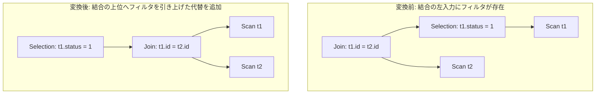

# filter_pull_up_for_extreme_selectivity

- 状態: draft / 執筆基準リビジョン: `3880673` (2026-09-12)
- 定義位置: `plan/cascades.cpp` の `RuleSet::Default()` (登録名 `"filter_pull_up_for_extreme_selectivity"`)

## 概要

`filter_pull_up_for_extreme_selectivity` は、内側結合の左入力側に存在する選択フィルタ `Join(Selection(L, p), R)` を、結合演算の上位へと引き上げた `Selection(Join(L, R), p)` の代替プランを Memo に生成・追加する論理 Rule です。

クエリオプティマイザにおいては一般にフィルタの押し下げ（Pushdown）が有利とされますが、結合によって行数が極端に絞り込まれる場合や高コストなフィルタ評価を結合後へ遅延させた方が有利となる局面において、探索空間へ「引き上げ形」の候補を提示することを目的とします。

## 変換前後の関係



## 適用条件

本 Rule の pattern は `Join(Selection(Any("inner_left"), "sel_left"), Any("right"))`、target ヒントは `LogicalOperator::kJoin` です。

発火のためのガード条件は以下の通りです。

1. 式が `kJoin` であり、子がちょうど 2 個であること。
2. キャプチャされた 3 つの Group ID（`sel_left`、`inner_left`、`right`）のいずれも、現在の親 Group 自身と一致しないこと（循環参照防止）。
3. 左子 Group（`sel_left`）内に演算子 `kSelection` かつ有効な述語を保持する代替式が 1 つ以上存在すること。
4. 派生 Group `unfil_join`（タグ `"unfiltered_join"`）が現在の親 Group および `sel_left` のいずれとも一致しないこと。

```cpp
          if (expression.operation != LogicalOperator::kJoin ||
              expression.children.size() != 2) {
            return;
          }
          const GroupId sel_left_id = bindings.at("sel_left");
          const GroupId inner_left_id = bindings.at("inner_left");
          const GroupId right_id = bindings.at("right");
          if (sel_left_id == group || inner_left_id == group ||
              right_id == group) {
            return;
          }
```

左子 Group 内で最初に見出された有効な Selection 式に対してのみ処理を行い、`break` します。

## 意味論的根拠と代数的一致・ガードレール

関係代数において、内側結合と選択フィルタの間には以下の交換律が成立します。

$$\sigma_p(L) \bowtie R \equiv \sigma_p(L \bowtie R) \quad (\mathrm{where\ } \mathrm{refs}(p) \subseteq \mathrm{attr}(L))$$

意味論的保証の根拠および設計上のガードレールは以下の通りです。

- **内側結合における多重度保存**: フィルタ $p$ は左入力 $L$ の列のみを参照します。内側結合 $L \bowtie R$ の出力に含まれる各タプルの左側属性は $L$ のタプルそのものであるため、結合前に行をフィルタしても結合後に行をフィルタしても、最終的に三値論理で TRUE と評価されるタプルの多重集合は厳密に一致します。
- **外部結合の除外（ガードレール）**: 外部結合（LEFT/RIGHT/FULL OUTER JOIN）においてフィルタを引き上げると、NULL 補完行の生成タイミングとフィルタ評価の順序が入れ替わり、意味論が破壊されます。NULL 排除性（Null-Rejection）の証明機構を持たない本 Rule では、対象を厳格に `kJoin`（内側結合）のみに限定しています。
- **例外消去と評価順序**: 述語 $p$ に複雑な計算や潜在的な例外（ゼロ除算など）が含まれる場合、結合によって右側から合致タプルが得られず出力行がゼロとなれば、引き上げ後のプランでは例外評価そのものがスキップされる可能性があります。これは SQL の宣言的意味論において許容される範囲の変換です。

## 実装の詳細

タグ `"unfiltered_join"` を付与した派生 Group を生成し、フィルタを適用していない生のリレーション結合を登録します。その後、親 Group にその派生結合式を入力とする `kSelection` 式を追加します。

```cpp
            const GroupId unfil_join = memo.EnsureDerivedGroup(
                memo.Get(group).relations, "unfiltered_join");
            if (unfil_join != group && unfil_join != sel_left_id) {
              memo.AddExpression(
                  unfil_join,
                  LogicalExpression{.operation = LogicalOperator::kJoin,
                                    .children = {inner_left_id, right_id},
                                    .predicate = expression.predicate,
                                    .target_list = expression.target_list,
                                    .output_schema = expression.output_schema});
              memo.AddExpression(
                  group,
                  LogicalExpression{.operation = LogicalOperator::kSelection,
                                    .children = {unfil_join},
                                    .predicate = sel_expr.predicate,
                                    .target_list = expression.target_list,
                                    .output_schema = expression.output_schema});
            }
            break;
```

登録コメントにある "when selectivity is extreme" は設計思想を示したものであり、Rule の発火判定自体は選択率に依存せず静的に代替式を生成します。最終的な選択は Cascades のコストエンジンに委ねられます。

## 最適化効果

右側リレーション $R$ がインデックスルックアップ等により極めて少数（あるいは 0 件）のタプルしか返さない場合、左側 $L$ の大量タプルに対して重い述語 $p$ を事前に全件評価する無駄を回避できます。

押し下げ形と引き上げ形が同一 Group 内で競合・共存することで、オプティマイザは統計情報に基づく最善の実行コストプランを選択できます。

## 関連 Rule との相互作用

- `push_selection_through_join`: 本 Rule と逆方向の変換（押し下げ）を担当する対照 Rule です。双方が適用されることで Memo 内に対称的な探索空間が構成されます。
- `split_selection_over_join`: 結合上の複合選択述語を分解して各枝へ押し下げる Rule です。
- `push_filter_through_left_join_left_side`: 外部結合において安全にフィルタを押し下げる個別特化 Rule です。

## 検証テスト

- `plan/cascades_test.cpp`: `CascadesTest.FilterPullUpForExtremeSelectivity`
  - 左枝に Selection を持つ結合プランに対して本 Rule が発火し、元の Group に結合を子とする `kSelection` 代替式が追加されることを検証。
