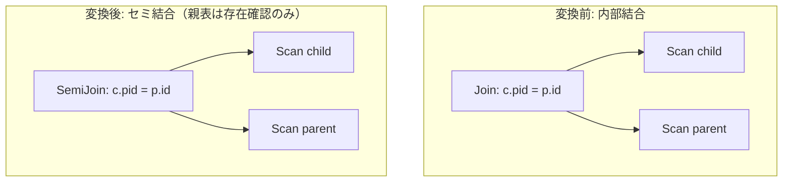

# fk_join_elimination

- 状態: draft / 執筆基準リビジョン: `3880673` (2026-09-12)
- 定義位置: `plan/cascades.cpp` の `RuleSet::Default()`（登録名 `"fk_join_elimination"`）

## 概要

`fk_join_elimination` は、親表と子表の内部結合 `Join(child, parent)` において、出力射影が子表の列のみに限定され、かつ結合条件が一意制約列と外部キー（またはNOT NULL）列の等値比較である場合に、内部結合をセミ結合 `SemiJoin(child, parent)` へと置き換える論理変換Ruleです。親表側を参照行の「存在判定」のみに限定することで、結合処理に伴う親行の複製生成を抑制します。

## 変換前後の関係

射影が子表側に閉じている内部結合から、同一述語を持つセミ結合候補を導出します。



名称に「elimination」を含みますが、親表のスキャン自体を完全に削除するのではなく、内部結合からセミ結合への演算子縮退を行います。

## 適用条件

パターンは `Join(Any("left"), Any("right"))` です。以下のガード条件をすべて満たす必要があります（`plan/cascades.cpp`）。

```cpp
          // The proof must be about the JOIN COLUMNS, not "any column of
          // the relation happens to be NOT NULL / UNIQUE": an inner join on
          // a non-unique key rewritten to a semi join silently collapses
          // duplicate matches.
```

1. **単一関係性**: 左右の子Groupがそれぞれ単一の関係（テーブル）のみを含むこと。
2. **単一列の等値結合**: 結合述語の連言分解がちょうど1項であり、かつ「列参照 = 列参照」の形式であること。
3. **射影の局所性**: 結合ノードのターゲットリストが参照する関係集合（`proj_rels`）が、左辺関係を含み、かつ右辺関係を一切含まないこと。
4. **子側の非NULL性**: 左辺（子表）の結合列が `kNotNull` または `kForeign` 制約を持つこと。
5. **親側の一意性**: 右辺（親表）の結合列が `IsUnique()` または `kPrimaryKey` 制約を持つこと。
6. **親側の無フィルタ**: 右辺Groupにスキャンフィルタが存在しないこと（`!right_group.filter`）。
7. **自己参照の排除**: 左右の子Groupが親Group自身と一致しないこと。

## 意味論的根拠と多重度保存

内部結合からセミ結合への置き換えは、結合結果の多重度（行数）を変化させないことが厳密に保証されなければなりません。

- **親結合列の一意性**: 親表側の結合列が一意でない場合、内部結合では親表側の重複行数に応じて子表のタプルが複製されます。セミ結合はマッチの有無のみを判定してタプルの複製を行わないため、一意性が担保されていない列でセミ結合化を行うと、重複すべき行が暗黙に圧縮されてクエリ結果が破壊されます。したがって、スキーマ定義から当該列の一意性が証明できなければ適用できません。
- **外部キー制約と参照整合性**: 子表側が外部キー制約を持つことで、子表に存在する非NULL外部キー値は親表側に必ず1件のみ存在することが保証されます。この関係性により、内部結合とセミ結合の結果行集合が厳密に一致します。
- **右辺列の非出力**: 出力ターゲットリストに親表側の列が含まれている場合、親表の列値を上位へ供給する必要があるため、存在確認のみを行うセミ結合への置き換えは不可能です。

## 実装の詳細

左右の列制約の取得は、ローカルラムダ `column_constraint` を介して子ノードの `output_schema` を検索して行われます（`plan/cascades.cpp`）。

```cpp
          const Constraint fk_constraint =
              column_constraint(left_group, fk_side);
          const Constraint pk_constraint =
              column_constraint(right_group, pk_side);
          const bool left_is_fk = fk_constraint.ctype == Constraint::kNotNull ||
                                  fk_constraint.ctype == Constraint::kForeign;
          const bool right_is_pk =
              pk_constraint.IsUnique() ||
              pk_constraint.ctype == Constraint::kPrimaryKey;
```

制約条件が充足された場合、セミ結合演算子を持つ式を生成して親Groupへ登録します。

```cpp
            memo.AddExpression(
                group,
                LogicalExpression{.operation = LogicalOperator::kSemiJoin,
                                  .children = {left_id, right_id},
                                  .predicate = expression.predicate,
                                  .target_list = expression.target_list,
                                  .output_schema = expression.output_schema});
```

ターゲットリストおよび出力スキーマは元の内部結合式からそのまま引き継がれます。

## 最適化効果

セミ結合へと変換されることにより、物理実装段階において `semi_hash_join` などのセミ結合専用オペレータが選択可能になります。セミ結合物理オペレータは、親表側のハッシュテーブルと最初にマッチした時点で直ちにプローブを終了できるため、重複キーの走査コストや中間タプル生成のメモリ消費が大幅に低減されます。

## 関連Ruleとの相互作用

- `unused_join_elimination`: 出力で参照されない結合を削除・縮退させる同系列のRule。
- `foreign_key_outer_join_elimination`: 外部結合（LEFT JOIN）において外部キー制約を利用して結合そのものを完全に除去するRule。
- `unique_semi_to_inner`: 一意な親表に対するセミ結合を内部結合へと戻す逆方向のRule。コストモデルの評価に基づき相互に競合します。

## 検証テスト

- `plan/cascades_test.cpp`:
  - `FkJoinElimination`: 親子関係にあるテーブル結合において、条件を満たす内部結合がセミ結合候補へと変形されることを検証。

