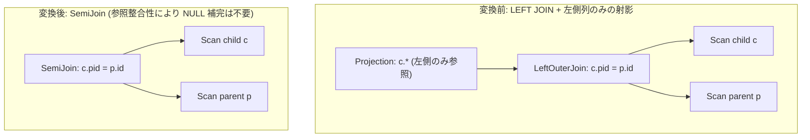

# foreign_key_outer_join_elimination

- 状態: draft / 執筆基準リビジョン: `3880673` (2026-09-12)
- 定義位置: `plan/cascades.cpp` の `RuleSet::Default()` (登録名 `"foreign_key_outer_join_elimination"`)

## 概要

`foreign_key_outer_join_elimination` は、左外部結合を包含する射影 `Projection(LeftOuterJoin(L, R))` において、射影が右側リレーション $R$ の列を参照せず、かつ外部キー制約（参照整合性）と一意性制約により $R$ のタプルが $L$ のタプルを増幅・フィルタしないことが証明できる場合に、LEFT OUTER JOIN をセミ結合 `SemiJoin(L, R)` へと書き換える論理 Rule です。

外部結合に伴う NULL 補完タプルの生成処理や追跡オーバーヘッドを排除し、早期マッチ判定が可能なセミ結合アルゴリズムへの切り替えを可能にします。

## 変換前後の関係



## 適用条件

本 Rule の pattern は `Projection(Any("input"))` です。

発火のためのガード条件は以下の通りです。

1. 式が `kProjection` であり、target list が空でないこと。
2. target list に集約式を含まないこと（`!ContainsAggregate(...)`）。
3. 入力 Group 内に `join_type == 0`（LEFT OUTER JOIN）かつ子が 2 個、述語を保持する `kOuterJoin` 式が存在すること。
4. 射影の target list が右側リレーション $R$ の列を一切参照していないこと（列の `schema` 属性が $R$ に属さないこと）。
5. 結合等値述語から抽出された右側結合キー列集合が、右側リレーションの一意性制約を満たすこと（`logical_properties.IsUniqueOn`）。
6. 左側結合キー列集合のすべてが非 NULL であること（`logical_properties.IsNotNull`）。
7. **左側結合キー列に外部キー制約が存在し、その参照先テーブルが右側リレーションと一致すること**。

```cpp
            // NOT NULL alone does not stop R from FILTERING L: a left row
            // whose join key has no match survives the outer join but not
            // the semi join.  The rewrite is only sound under referential
            // integrity, i.e. when a left join column is a foreign key
            // referencing the right table (from fix_rules).
```

外部キー制約が確認できない場合、または右側結合キーが一意でない場合は発火しません。

## 意味論的根拠と多重度保存（D6 規律・参照整合性）

本変換が成立するためには、「結合によって左側タプルの多重度が増加しないこと」および「結合によって左側タプルが脱落しないこと」の双方が数学的に証明される必要があります。

- **多重度増幅の抑止（右側一意性）**:
  右側結合キーが候補キーまたは一意インデックスを構成しているため、左側タプル 1 件に対して右側タプルが 2 件以上マッチして行数が増加する事態（1:N 結合）は発生しません。
- **タプル脱落の抑止（外部キー制約の必須性）**:
  NOT NULL 制約のみでは、左辺キー値が右辺テーブルに存在しないケースを排除できません。もし右辺に一致する親タプルが存在しない場合、LEFT JOIN では NULL 補完行として生き残りますが、Semi-Join では一致タプルが存在しないため脱落してしまいます。データベースのスキーマ制約として外部キー制約（Foreign Key Constraint）が定義されている場合に限り、「左辺の全タプルについて対応する右辺タプルが厳密に 1 件存在する」ことが保証され、LEFT JOIN と Semi-Join の多重集合出力が完全に一致します。
- **右側列の非参照**:
  射影が右辺列を一切出力しないため、右辺の属性値が何であるかは最終結果に影響を与えません。

## 実装の詳細

外部キー制約の検証は、左側子式の `output_schema` を走査し、制約種別 `Constraint::kForeign` の参照先テーブル名を取得して右側リレーション集合と比較します。

```cpp
                  if (col.GetConstraint().ctype == Constraint::kForeign) {
                    std::string ref_table =
                        (col.GetConstraint().value.type == ValueType::kVarChar)
                            ? std::string(
                                  col.GetConstraint().value.value.varchar_value)
                            : col.GetConstraint().value.AsString();
                    if (ref_table.starts_with('"') &&
                        ref_table.ends_with('"') && ref_table.size() >= 2) {
                      ref_table = ref_table.substr(1, ref_table.size() - 2);
                    }
                    for (const auto& r_rel : right_rels) {
                      if (ref_table == r_rel) {
                        has_fk = true;
                        break;
                      }
                    }
                  }
```

すべての条件が成立した場合、射影式自体の演算子を `kSemiJoin` に書き換えた式を親 Group に追加します。

```cpp
            LogicalExpression semi = expression;
            semi.children = {left_id, right_id};
            semi.operation = LogicalOperator::kSemiJoin;
            semi.predicate = ojoin.predicate;
            memo.AddExpression(group, std::move(semi));
            return;
```

## 最適化効果

外部結合の物理実行（結合不成立時の NULL パディング処理やマッチフラグ配列のメモリ管理）が不要となり、右辺を 1 件検出した瞬間にプローブを打ち切る高速なセミ結合実行（Early-out Semi Join）が可能となります。

さらに下流の Rule において、セミ結合からさらなる不要結合除去（Unused Join Elimination）へと段階的に展開される契機を作ります。

## 関連 Rule との相互作用

- `fk_join_elimination`: 内側結合に対して外部キー制約を用いてテーブル走査そのものを消去する Rule です。
- `outer_to_anti_join`: 外部結合と IS NULL 述語からアンチ結合を導出する Rule です。
- `unused_join_elimination`: 射影で参照されない不要な結合演算子を安全に除去する基幹 Rule です。

## 検証テスト

- `plan/cascades_test.cpp`: `ForeignKeyOuterJoinElimination`
  - 外部キー制約および一意性制約が設定されたテーブル間の `LeftOuterJoin` を含む射影に対し、`kSemiJoin` 式が生成されることを検証。
