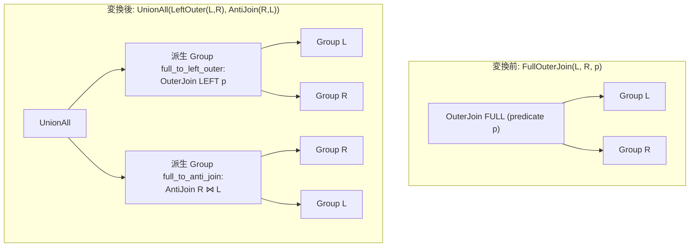

# full_outer_join_decomposition

- 状態: draft / 執筆基準リビジョン: `3880673` (2026-09-12)
- 定義位置: `plan/cascades.cpp` の `RuleSet::Default()` (登録名 `"full_outer_join_decomposition"`)

## 概要

`full_outer_join_decomposition` は、完全外部結合 `FullOuterJoin(L, R, p)` を、左外部結合とアンチ結合の多重集合和 `UnionAll(LeftOuterJoin(L, R, p), AntiJoin(R, L, p))` へと代数的に分解する論理 Rule です。

物理実行エンジンにおいて実装難易度が高くバッファリング負荷の大きい完全外部結合の専用アルゴリズムを要求せず、既存の左外部結合およびアンチ結合の組み合わせによって計画・実行可能にします。

## 変換前後の関係



## 適用条件

本 Rule の pattern は `OuterJoin(Any("left"), Any("right"))`、target ヒントは `LogicalOperator::kOuterJoin` です。

発火のためのガード条件は以下の通りです。

1. 演算子が `kOuterJoin` であり、子がちょうど 2 個であること。
2. `join_type == 2`（FULL OUTER JOIN）であること。
3. 生成される 2 つの派生 Group（`"full_to_left_outer"` および `"full_to_anti_join"`）のいずれも、現在の親 Group 自身と一致しないこと（循環参照防止）。

```cpp
          if (expression.join_type == 2) {  // 2 = FullOuter
            const GroupId left_id = bindings.at("left");
            const GroupId right_id = bindings.at("right");
            const std::vector<std::string> cur_relations =
                memo.Get(group).relations;
            const GroupId left_outer_group =
                memo.EnsureDerivedGroup(cur_relations, "full_to_left_outer");
            const GroupId anti_join_group =
                memo.EnsureDerivedGroup(cur_relations, "full_to_anti_join");
            if (left_outer_group == group || anti_join_group == group) {
              return;
            }
```

## 意味論的根拠と多重度保存（代数的分割）

完全外部結合 $L \ \mathbb{X}_p \ R$ の出力タプル多重集合は、重複なく以下の 3 つの素集合に分割できます。

1. $p$ を満たして結合したペア $(l, r)$
2. $R$ にマッチしなかった $L$ のタプル $(l, \mathrm{NULL})$
3. $L$ にマッチしなかった $R$ のタプル $(\mathrm{NULL}, r)$

左外部結合 $L \ \leftouter_p \ R$ は厳密に（1）と（2）のタプル集合を出力します。また、右辺を入力とするアンチ結合 $R \ \bar{\ltimes}_p \ L$ は、左辺に一致タプルが存在しない $R$ のタプル集合（3）を過不足なく抽出します。

`UnionAll` は多重集合の加算（Bag Union）を行うため、両演算結果を結合することで元の完全外部結合と同一の多重度を持つタプル集合が復元されます。三値論理における UNKNOWN 評価時の振る舞い（マッチ失敗扱い）も左右対称に保たれるため、代数的等価性が保証されます。

## 実装の詳細

変換処理は、元の Group と同一のリレーション集合 `cur_relations` を持つ 2 つの派生 Group を確保し、それぞれの Group に対応する論理演算式を登録した上で、親 Group に `kUnionAll` 式を追加します。

```cpp
            memo.AddExpression(
                left_outer_group,
                LogicalExpression{.operation = LogicalOperator::kOuterJoin,
                                  .children = {left_id, right_id},
                                  .predicate = expression.predicate,
                                  .target_list = expression.target_list,
                                  .join_type = 0,  // 0 = LeftOuter
                                  .output_schema = expression.output_schema});

            memo.AddExpression(
                anti_join_group,
                LogicalExpression{.operation = LogicalOperator::kAntiJoin,
                                  .children = {right_id, left_id},
                                  .predicate = expression.predicate,
                                  .target_list = expression.target_list,
                                  .output_schema = expression.output_schema});

            memo.AddExpression(
                group, LogicalExpression{
                           .operation = LogicalOperator::kUnionAll,
                           .children = {left_outer_group, anti_join_group},
                           .target_list = expression.target_list,
                           .output_schema = expression.output_schema});
```

アンチ結合枝では入力順序を反転させ、右側テーブル（`right_id`）をプローブ側、左側テーブル（`left_id`）をビルド側として配置します。

## 最適化効果

完全外部結合を実行するための特殊な状態機械や双方向追跡用ビットマップの実装を必須とせず、既存の高性能なハッシュ外部結合およびハッシュアンチ結合実装を活用してクエリを実行可能にします。

また、各分岐（Left Outer 側と Anti 側）が独立したサブプランとなるため、それぞれの枝に対して個別のインデックススキャンや走査プルーニングが適用される最適化機会を提供します。

## 関連 Rule との相互作用

- `right_to_left_outer_join`: 右外部結合を左外部結合へ反転・正規化する Rule です。
- `outer_to_anti_join`: 外部結合からアンチ結合への変換を行う Rule です。
- `union_all_merge`: 分解によって生成された UnionAll を、隣接する他の集合演算と統合します。

## 検証テスト

- `plan/cascades_test.cpp`: `CascadesTest.FullOuterJoinDecomposition`
  - `join_type = 2` の `OuterJoin` 式が、`full_to_left_outer` および `full_to_anti_join` タグを持つ 2 つの派生 Group を子とする `kUnionAll` 式へと分解されることを検証。
