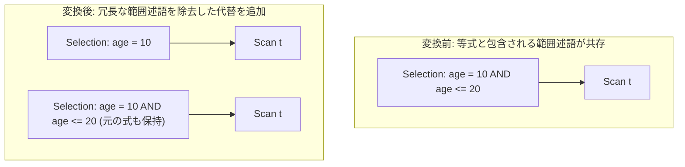

# functional_dependency_filter_reduction

- 状態: draft / 執筆基準リビジョン: `3880673` (2026-09-12)
- 定義位置: `plan/cascades.cpp` の `RuleSet::Default()` (登録名 `"functional_dependency_filter_reduction"`)

## 概要

`functional_dependency_filter_reduction` は、選択述語内に `x = 10` のような定数等式が存在するとき、その定数値から論理的に包含・含意される冗長な範囲比較述語（例: `x <= 20`, `x > 5` など）を連言から除去した簡約 Selection 代替式を Memo に追加する論理 Rule です。

等値キーによる値の固定（自明な関数従属性）を利用してフィルタ述語を簡素化し、タプル走査時の比較評価コストを削減することを目的とします。

## 変換前後の関係



## 適用条件

本 Rule の pattern は `Selection(Any("child"))`、target ヒントは `LogicalOperator::kSelection` です。

発火のためのガード条件は以下の通りです。

1. 演算子が `kSelection` であり、述語を保持していること。
2. 述語の連言要素が 2 個以上存在すること（`conjuncts.size() >= 2`）。
3. 連言の中から「列名 = 定数」形式の等値述語が 1 つ以上抽出でき、定数マップ `eq_constants` が空でないこと。
4. 等値以外の比較述語（`<`, `<=`, `>`, `>=`）において、同一列の定数値 $k$ を代入した結果、比較が静的に真（Tautology）となること。
5. 冗長連言の除去が行われ（`reduced == true`）、かつ残余の連言が 1 つ以上存在すること（`!kept.empty()`）。

```cpp
                    if ((bin.Op() == BinaryOperation::kLessThanEquals &&
                         k <= bound) ||
                        (bin.Op() == BinaryOperation::kGreaterThanEquals &&
                         k >= bound) ||
                        (bin.Op() == BinaryOperation::kLessThan && k < bound) ||
                        (bin.Op() == BinaryOperation::kGreaterThan &&
                         k > bound)) {
                      reduced = true;
                      continue;
                    }
```

等値キーが存在しない場合、あるいは範囲述語が等式と矛盾している場合（例: `age = 10 AND age > 20`）は本 Rule による除去の対象外となります（矛盾の検出は `CanonicalizeConjuncts` による恒偽化処理が担当します）。

## 意味論的根拠と代数的一致・三値論理

命題論理および一階述語論理において、$(x = k) \land (x \le b)$ において $k \le b$ が真であるならば、$(x = k) \implies (x \le b)$ が成立します。したがって、以下の同値関係が成り立ちます。

$$(x = k) \land (x \le b) \equiv (x = k)$$

意味論の厳密な保全理由は以下の通りです。

- **三値論理（NULL の振る舞い）**:
  列 $x$ が NULL の場合、元の述語 `(x = 10 AND x <= 20)` は `UNKNOWN AND UNKNOWN = UNKNOWN` となりフィルタを通過しません。簡約後の述語 `x = 10` も同様に UNKNOWN となるため、NULL タプルの排除動作は完全に一致します。
- **副作用および実行時例外の不存在**:
  除去対象となるのは単純な定数と列の比較演算子のみであり、ゼロ除算やユーザー定義関数の副作用を消失させる（Error Erasure）リスクはありません。
- **多重度保存**:
  Selection 演算子の述語評価結果が真・偽・未定のすべてのケースで元と同一となるため、通過するタプル集合およびその多重度は完全に保存されます。

## 実装の詳細

まず連言を走査して等式から `eq_constants`（列名 $\to$ 定数値）を構築します。

```cpp
          std::unordered_map<std::string, Value> eq_constants;
          for (const auto& conj : conjuncts) {
            if (conj && conj->Type() == TypeTag::kBinaryExp) {
              const auto& bin = conj->AsBinaryExpression();
              if (bin.Op() == BinaryOperation::kEquals) {
                if (bin.Left()->Type() == TypeTag::kColumnValue &&
                    bin.Right()->Type() == TypeTag::kConstantValue) {
                  eq_constants
                      [bin.Left()->AsColumnValue().GetColumnName().ToString()] =
                          bin.Right()->AsConstantValue().GetValue();
                } else if (bin.Right()->Type() == TypeTag::kColumnValue &&
                           bin.Left()->Type() == TypeTag::kConstantValue) {
                  // 定数が左辺の場合の抽出処理
                }
              }
            }
          }
```

続いて範囲比較項を評価し、既知の等値定数によって自明に充足される項を除外して `kept` リストを構築します。簡約が成立した場合、`CanonicalizeConjuncts` で正規化した述語を用いて新たな Selection 式を登録します。

```cpp
          if (reduced && !kept.empty()) {
            memo.AddExpression(
                group,
                LogicalExpression{
                    .operation = LogicalOperator::kSelection,
                    .children = expression.children,
                    .predicate = CanonicalizeConjuncts(CombineConjuncts(kept)),
                    .target_list = expression.target_list,
                    .output_schema = expression.output_schema});
          }
```

## 最適化効果

行ごとの述語評価処理において、不要な二項比較演算の CPU 命令数を削減します。

また、下流のインデックス走査変換や動的フィルタ生成において、冗長な範囲述語が排除されることで、インデックス走査範囲（Lower / Upper Bound）の算定が単純化され、オプティマイザのコスト見積もり精度が向上します。

## 関連 Rule との相互作用

- `merge_selections`: 複数の Selection 演算子を 1 つにマージし、本 Rule が連言から関数従属性を検出するための機会を増やします。
- `eliminate_false_selection`: 等値と範囲条件が矛盾して述語全体が常に偽となるケースを検出し、空テーブルへ変換します。
- `push_selection_into_scan`: 簡約された述語をベーステーブルのスキャン条件へと押し下げます。

## 検証テスト

- `plan/cascades_test.cpp`: `CascadesTest.FunctionalDependencyFilterReduction`
  - `age = 10 AND age <= 20` を含む Selection 式から、冗長な `<=` 比較が除去され `age = 10` のみを持つ等価式が Memo に追加されることを検証。
