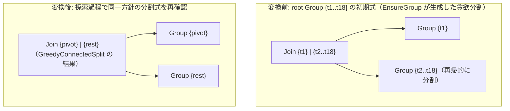

# greedy_join_order_fallback

- 状態: draft / 執筆基準リビジョン: `3880673` (2026-09-12)
- 定義位置: `plan/cascades.cpp` の `RuleSet::Default()`（登録名 `"greedy_join_order_fallback"`）

## 概要

`greedy_join_order_fallback` は、関係数が16を超える大規模結合クエリにおいて、二分割の全列挙（`join_enumeration`）を停止し、接続性に基づく貪欲分割 `GreedyConnectedSplit` を用いて結合順序を生成するフォールバック用の論理変換Ruleです。探索空間の組合せ爆発を防ぎつつ、実行可能な結合計画を確実にメモへ供給します。

## 変換前後の関係

18表 `{t1..t18}` を含むGroupを例にとります。初期木として生成された貪欲分割に対し、探索過程においても同方針に基づく結合式を追加します。



## 適用条件

パターンは `Join(Any("left"), Any("right"))` です。関係数が16を超える場合にのみ適用されます（`plan/cascades.cpp`）。

```cpp
    // greedy_join_order_fallback: When relations count > 16, use greedy
    // minimum-cardinality join ordering fallback.
    built.Add(Rule(
        "greedy_join_order_fallback", Join(Any("left"), Any("right")),
        [](const Bindings&, Memo& memo, GroupId group,
           const LogicalExpression&) {
          const auto& relations = memo.Get(group).relations;
          if (relations.size() <= 16) {
            return;
          }
          auto [left, right] = GreedyConnectedSplit(memo, relations);
          const GroupId left_group = memo.EnsureGroup(std::move(left));
          const GroupId right_group = memo.EnsureGroup(std::move(right));
          if (left_group != group && right_group != group) {
            memo.AddExpression(group, memo.NewJoin(left_group, right_group));
          }
        },
        LogicalOperator::kJoin));
```

適用条件は以下の2点です。

1. **関係数の下限**: 対象Groupの関係数が17以上であること。16以下の結合は `join_enumeration` が担当します。
2. **自己参照の回避**: `EnsureGroup` が返却した左右の子Groupが、親Group自身と一致しないこと。

## 意味論的根拠と分割方針

関係数16は `kMaxJoinEnumerationRelations` と等しい境界値です。16表以下では $2^{N-1}$ 通りの二分割を全探索しますが、17表以上では $2^{16} = 65,536$ 通りを超えるマスク走査と中間Group生成が発生し、オプティマイザの処理時間とメモリ消費が許容範囲を超過します。本Ruleはこの境界を契機として探索を全列挙から貪欲法へと切り替えます。

分割アルゴリズムである `GreedyConnectedSplit` は、接続グラフ上で他関係と連接詞を共有する関係を1つ選択し、それを左オペランド（ピボット）として残りの全関係を右オペランドに配置します。

```cpp
std::pair<std::vector<std::string>, std::vector<std::string>>
GreedyConnectedSplit(const Memo& memo,
                     const std::vector<std::string>& relations) {
  const uint64_t within = memo.RelationMask(relations);
  std::string best_pivot = relations.front();
  for (const std::string& pivot : relations) {
    const uint64_t pivot_mask = memo.RelationMask({pivot});
    if (memo.CutConnected(pivot_mask, within)) {
      best_pivot = pivot;
      break;
    }
  }
```

`CutConnected(pivot_mask, within)` が成立するピボットは、自身と他の関係との間に少なくとも1つの結合述語を持つ関係を表します。これを左側に単独配置することで、直積結合の生成を回避し、結合述語を持つ `kJoin` 式を構築します。すべてのピボットが接続性を持たない（純粋な非連結グラフ）場合は、先頭の関係がフォールバックとして採用されます。

この16表の閾値は探索Ruleだけでなく、`Memo::EnsureGroup` の初期木構築ロジックでも共有されています。

```cpp
  auto [left, right] = relations.size() > 16
                           ? GreedyConnectedSplit(*this, relations)
                           : ConnectedSplit(*this, relations);
```

したがって、17表以上の結合では、メモ初期化時に生成された初期式と本Ruleが生成する式が同一形状となります。生成された同一式は `Memo::AddExpression` の指紋照合によって破棄されるため、探索空間が無駄に拡大することはありません。

## 実装の詳細

- **分割の非対称性**: 左関係リストにはピボットとなる単一の関係（`{best_pivot}`）のみが格納され、右関係リストに残りのすべての関係が格納されます。右Groupが17表以上残存している場合、その内部でも再帰的に貪欲分割が行われ、結果として全体が左深木として構成されます。
- **結合述語の付与**: 新規式は `memo.NewJoin(left_group, right_group)` によって作成され、`JoinConditionFor` により左右両Groupを跨ぐ連接詞が自動的に結合条件として割り当てられます。
- **健全性チェック**: `left_group != group && right_group != group` の判定により、空関係リストや同一関係リストによる循環参照式の登録を防止します。

## 最適化効果

本Ruleは探索空間を拡大するためではなく、大規模結合において最低1本の有効な結合計画を確実に保証するためのセーフティネットとして機能します。17表以上の結合では `join_enumeration` がスキップされるため、本Ruleが存在することで、極端に複雑なクエリであってもオプティマイザが停止することなく実行計画の生成を完了できます。

## 関連Ruleとの相互作用

- `join_enumeration`: 16表以下の結合を担当する相補的Rule。定数 `kMaxJoinEnumerationRelations` を境界として住み分けます。
- `star_join_reorder`: 3〜16表を対象としたヒューリスティック結合順序Rule。
- `Memo::EnsureGroup`: 初期木の生成においても同一の `GreedyConnectedSplit` を呼び出すため、出力式が合流します。

## 検証テスト

- `plan/cascades_test.cpp`:
  - `GreedyJoinOrderFallback`: 18表の結合クエリにおいて、初期式および生成式が左側1関係、右側17関係の貪欲分割となることを検証。

