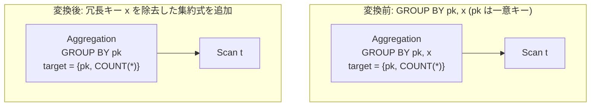

# group_by_functional_dependency_reduction

- 状態: draft / 執筆基準リビジョン: `3880673` (2026-09-12)
- 定義位置: `plan/cascades.cpp` の `RuleSet::Default()` (登録名 `"group_by_functional_dependency_reduction"`)

## 概要

`group_by_functional_dependency_reduction` は、`GROUP BY K, X` を持つ集約演算において、残余のキー集合 $K$ のみで入力タプルの一意性が保証（関数従属性 $K \to X$ が成立）され、かつ列 $X$ が集約関数の外側の出力（裸の出力列）として要求されていない場合に、GROUP BY 句から冗長なキー $X$ を除去した `GROUP BY K` の集約等価式を Memo に追加する論理 Rule です。

主キーや一意キーがグループ化キーに含まれている状況下で、不要な多重グループ化キーを刈り込み、ハッシュ集約やソート集約の計算負荷を軽減することを目的とします。

## 変換前後の関係



## 適用条件

本 Rule の pattern は `Aggregation(Any("input"))`、target ヒントは `LogicalOperator::kAggregation` です。

発火のためのガード条件は以下の通りです。

1. 子が 1 個であり、`grouping_sets` の要素数が 2 個以上であること（削減候補のキーが存在すること）。かつ入力 Group が現在の親 Group 自身でないこと。
2. `grouping_sets` に含まれるすべてのキー式が単純な列参照（`TypeTag::kColumnValue`）であること。式ベースのキーが含まれる場合は即座に return します。

   ```cpp
          for (const Expression& key : expression.grouping_sets) {
            if (!key || key->Type() != TypeTag::kColumnValue) {
              return;
            }
   ```

3. 各削除候補キー $X$ に対し、以下の 3 条件をすべて満たすこと。

   ```cpp
            const bool needed =
                selected.contains(drop_name) ||
                selected.contains(
                    kept[drop]->AsColumnValue().GetColumnName().name);
            if (!needed && !rest.empty() &&
                input_group.logical_properties.IsUniqueOn(rest)) {
   ```

   - **非参照性（`!needed`）**: 集約関数を含まない target list（裸のグルーピング出力列）において、列 $X$ が参照されていないこと（修飾名および非修飾名の双方で検証）。
   - **残余キーの存在（`!rest.empty()`）**: $X$ を除いた残りのキー集合 `rest` が 1 つ以上存在すること（スカラ集約への縮退は行わない）。
   - **関数従属性の証明（`IsUniqueOn(rest)`）**: 入力 Group の論理プロパティにおいて、残余キー集合 `rest` が一意性（候補キーまたは一意インデックスの包含）を満たすこと。

1 回の探索で複数の冗長キーが繰り返し削減可能であり、キー数が減少した場合（`changed == true`）に新しい `kAggregation` 式を Memo に追加します。

## 意味論的根拠と多重度保存（関数従属性）

リレーショナルデータベース理論において、関係 $R$ 上で関数従属性 $K \to X$ が成立するとき、$K$ の値が決定されれば $X$ の値は一意に定まります。特に $K$ が一意キー（Superkey）である場合、各グループにおいて $X$ の値は厳密に定数となります。

多重度保存および意味論的妥当性の根拠は以下の通りです。

- **グループ分割の不変性**: $K$ だけで入力タプルが一意に識別されるため、キーに $X$ を加えてもグループが細分化されることはなく、生成されるグループの総数および各グループに属するタプル集合は完全に一致します。したがって、`COUNT(*)`, `SUM`, `AVG` などの集約計算結果および出力行の多重度は厳密に保存されます。
- **出力列の整合性**: 集約関数の引数として使用されている列（例: `SUM(x)`）は入力タプル単位で計算されるため、GROUP BY 句から $X$ が除外されても計算は成立します。しかし、`SELECT x` のように裸で射影される列である場合、GROUP BY キーから除外すると物理実行時にタプルから値を取り出せなくなるため、`needed` チェックによって削除を禁止します。

## 実装の詳細

集約演算子の target list を走査し、集約関数を含まない裸の出力列参照を `selected` 集合に収集します。

```cpp
          for (const NamedExpression& target : expression.target_list) {
            if (!target.expression || ContainsAggregate(target.expression)) {
              continue;
            }
            for (const ColumnName& column :
                 target.expression->TouchedColumns()) {
              selected.insert(column.ToString());
              selected.insert(column.name);
            }
          }
```

一意性判定には入力 Group の `logical_properties.IsUniqueOn(rest)` を使用します。これはカタログの一意キー情報や上流の DISTINCT 演算等から伝播した `candidate_keys` を照合します。条件を満たしたキーを除外した新しい `grouping_sets` を設定し、集約式を生成します。

## 最適化効果

GROUP BY キーの個数が削減されることで、ハッシュ集約におけるハッシュ値計算およびキー比較の CPU オーバーヘッドが直接的に削減されます。

また、ソート集約（`StreamAggregatePlan`）が採用される場合、ソート演算子に要求されるソートキー長が短縮され、メモリ比較処理の効率化および外部ソート実行時の I/O 削減に寄与します。

## 関連 Rule との相互作用

- `unique_group_key_aggregate_elimination`: 残余キー $K$ そのものが一意である場合に、集約演算全体を単なる射影演算へと解消する極限形 Rule です。
- `functional_dependency_filter_reduction`: 同様に関数従属性を用いて選択述語を簡約する兄弟 Rule です。
- `distinct_and_group_by_interchange`: DISTINCT から GROUP BY へ変換された後の式に対し、本 Rule が適用されて余剰キーが刈り込まれます。

## 検証テスト

- `plan/cascades_test.cpp`: `CascadesTest.GroupByFunctionalDependencyReduction`
  - `t(pk PRIMARY KEY, x)` に対する `GROUP BY pk, x`（集約出力は `pk` と `COUNT(*)` のみ）において、`grouping_sets` が `pk` の 1 列のみに縮約された `kAggregation` 式が生成されることを検証。
