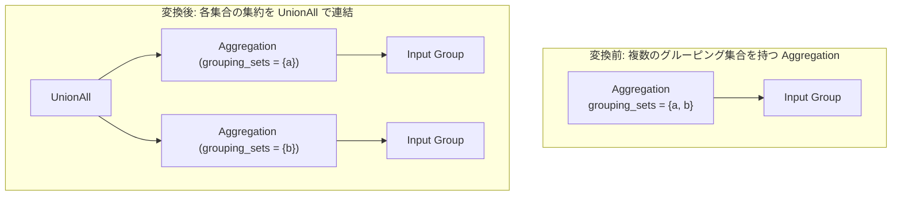

# grouping_sets_expansion

- 状態: draft / 執筆基準リビジョン: `3880673` (2026-09-12)
- 定義位置: `plan/cascades.cpp` の `RuleSet::Default()` (登録名 `"grouping_sets_expansion"`)

## 概要

`grouping_sets_expansion` は、`GROUPING SETS`、`ROLLUP`、または `CUBE` 句によって指定された複数のグルーピング集合を持つ集約式を展開し、集合ごとの集約演算子を `UnionAll` で連結した等価表現を Memo に追加する論理 Rule です。

複合的なグルーピングセットの実行に対応した専用の物理集約演算子を持たない実行エンジンにおいて、基本的な GROUP BY 集約と UNION ALL 演算の組み合わせによる実行計画を可能にします。

## 変換前後の関係



## 適用条件

本 Rule の pattern は `Pattern::Any()`、target ヒントは `std::nullopt` です。処理ルーチン内部で演算子種別に応じて以下の 2 系統の分岐を持ちます。

- **分岐 1 (`kExpand` 演算子)**:
  1. 演算子が `kExpand` であり、子が 1 個であること。
  2. 派生 Group `expand_sub_1`（元の `grouping_sets` を保持する集約）と `expand_sub_2`（空の `grouping_sets` を持つ全体集約）を生成。
- **分岐 2 (`kAggregation` 演算子)**:
  1. 演算子が `kAggregation` であり、子が 1 個であること。
  2. `grouping_sets.size() > 1` であること（展開可能なグルーピング集合が 2 個以上存在すること）。
  3. 最初の 2 つのグルーピングキー集合を取り出し、それぞれのキー集合のみを持つ 2 つの `kAggregation` 式を派生 Group へ登録。

```cpp
              memo.AddExpression(
                  agg1, LogicalExpression{
                            .operation = LogicalOperator::kAggregation,
                            .children = {input_id},
                            .target_list = expression.target_list,
                            .grouping_sets = {expression.grouping_sets[0]}});
```

いずれの分岐においても、派生 Group が現在の親 Group や入力 Group と一致せず、かつ派生 Group 同士が重複しない（循環参照および自己結合防止）ことが必須条件となります。

## 意味論的根拠と多重度保存

SQL 標準規格において、`GROUP BY GROUPING SETS (S1, S2, ...)` のセマンティクスは、各グルーピング集合 $S_i$ に対する集約クエリの結果を `UNION ALL` で結合した多重集合と厳密に同値であると定義されています。

多重度および NULL セマンティクスに関する特性は以下の通りです。

- **多重度の加算性**: 各グルーピング集合に対する集約は独立したキー空間で計算され、`UnionAll` によって単純連結されるため、タプルの多重度は規格通り保存されます。
- **NULL 補完列の振る舞い**: グルーピング集合に含まれない列は、SQL 規格上 NULL として出力される必要があります。現行の展開コードでは、共通の `target_list` を両集約式にそのまま渡しているため、出力スキーマにおける非所属列の NULL 補完は物理層のプロジェクションまたは集約エンジンの責務となります。
- **2 要素への限定（現行実装の特性）**: 分岐 2 において `grouping_sets` が 3 個以上存在する場合であっても、現行コードは先頭の 2 つの集合（`set[0]` と `set[1]`）のみを抽出して `UnionAll` を構成します。完全な $N$ 集合の再帰的展開は行われず、部分的な代替表現の生成にとどまる点に留意が必要です。

## 実装の詳細

分岐 1 では、`EnsureDerivedGroup` により派生 Group を確保し、集合付き集約と全体集約を登録します。

```cpp
              memo.AddExpression(
                  agg2,
                  LogicalExpression{.operation = LogicalOperator::kAggregation,
                                    .children = {input_id},
                                    .target_list = expression.target_list,
                                    .grouping_sets = {}});
```

分岐 2 では、2 つの派生 Group `expand_sub_1`, `expand_sub_2` に対し、それぞれ `expression.grouping_sets[0]` および `expression.grouping_sets[1]` のみを設定した `kAggregation` 式を構築します。その後、親 Group にこれら 2 つの派生 Group を子とする `kUnionAll` 式を追加します。

## 最適化効果

GROUPING SETS をネイティブに処理する単一パスの集約演算子が利用できない場合でも、標準的なハッシュ集約やソート集約を用いてクエリを物理実行可能にします。

一方で、同一の入力テーブルに対して複数回のスキャン（または共通サブツリーのキャッシュ）が発生するため、入力データサイズが小さくハッシュ集約の並列展開が有利なケースにおいてコストモデルにより選択されます。

## 関連 Rule との相互作用

- `push_aggregation_through_union_all` / `aggregate_union_transpose`: 本 Rule と逆方向に作用し、UNION ALL の下位へ集約を押し下げる、あるいは統合する Rule 群です。
- `having_to_filter_rewrite`: 展開後の各集約式に対して個別に HAVING 述語の引き抜きが行われます。
- `union_all_merge`: 展開によって生じた UnionAll が他の集合演算子と連鎖する場合にフラット化します。

## 検証テスト

- `plan/cascades_test.cpp`: `CascadesTest.GroupingSetsExpansion`
  - 2 つの列を持つ `grouping_sets` を備えた集約演算子から、各列ごとの集約を子とする `kUnionAll` 式が生成されることを検証。
