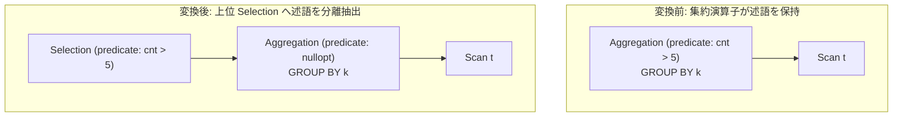

# having_to_filter_rewrite

- 状態: draft / 執筆基準リビジョン: `3880673` (2026-09-12)
- 定義位置: `plan/cascades.cpp` の `RuleSet::Default()` (登録名 `"having_to_filter_rewrite"`)

## 概要

`having_to_filter_rewrite` は、集約演算子自身が保持している HAVING 述語（`expression.predicate`）を分離し、「述語なしの集約演算子」と「その直上に位置する選択フィルタ `Selection`」の 2 つの演算子へと分解した等価プランを Memo に生成・追加する論理 Rule です。

集約演算子のペイロードとして埋め込まれた HAVING 述語を標準的な `Selection` 演算子へと正規化することにより、選択述語の押し下げや簡約を司る汎用最適化 Rule 群の適用対象とすることを目的とします。

## 変換前後の関係



## 適用条件

本 Rule の pattern は `Aggregation(Any("input"))`、target ヒントは `LogicalOperator::kAggregation` です。

発火のためのガード条件は以下の通りです。

1. 演算子が `kAggregation` であり、有効な述語（`expression.predicate`）を保持していること。
2. 入力 Group ID が現在の親 Group 自身と一致しないこと。
3. 派生 Group `inner_agg`（タグ `"agg_no_having"`）が現在の親 Group および入力 Group のいずれとも一致しないこと（循環参照防止）。

```cpp
          if (expression.operation != LogicalOperator::kAggregation ||
              !expression.predicate || !*expression.predicate) {
            return;
          }
          const GroupId input_id = bindings.at("input");
          if (input_id == group) {
            return;
          }
          const GroupId inner_agg = memo.EnsureDerivedGroup(
              memo.Get(group).relations, "agg_no_having");
          if (inner_agg != group && inner_agg != input_id) {
```

## 意味論的根拠と代数的一致・例外保護

SQL 規格における HAVING 句のセマンティクスは、「GROUP BY によるグループ化および集約関数の評価が完了した中間テーブルに対して適用されるフィルタリング」として定義されています。

代数的一致および三値論理に関する特性は以下の通りです。

- **評価タイミングと同値性**: 集約処理の完了直後に集約演算子内部で述語を評価することと、集約完了後のタプルストリームに対して直上の `Selection` 演算子で述語を評価することは、タプルの多重集合および三値論理（TRUE のみ通過、FALSE/UNKNOWN は排除）において完全に一致します。
- **例外保護**: 集約関数の出力値に対するゼロ除算や型エラーなどの潜在的例外は、集約演算の完了後に評価される点で変更されず、例外発生の有無・タイミングは保存されます。
- **派生 Group の分離**: 述語なし集約を直接元の Group に追加するのではなく、専用タグ `"agg_no_having"` を持つ派生 Group に隔離することで、Memo 内部における論理演算子の属性整合性を保持し、探索エンジンの収束性を担保します。

## 実装の詳細

タグ `"agg_no_having"` を持つ派生 Group を生成し、述語を除外した集約式を登録します。その後、親 Group にその派生 Group を入力とし、元の述語を保持する `kSelection` 式を追加します。

```cpp
            memo.AddExpression(
                inner_agg,
                LogicalExpression{.operation = LogicalOperator::kAggregation,
                                  .children = expression.children,
                                  .target_list = expression.target_list,
                                  .output_schema = expression.output_schema,
                                  .partition_by = expression.partition_by,
                                  .grouping_sets = expression.grouping_sets});

            memo.AddExpression(
                group,
                LogicalExpression{.operation = LogicalOperator::kSelection,
                                  .children = {inner_agg},
                                  .predicate = expression.predicate,
                                  .target_list = expression.target_list,
                                  .output_schema = expression.output_schema});
```

`target_list`、`output_schema`、`partition_by`、`grouping_sets` の各属性は欠落なく完全に引き継がれます。

## 最適化効果

本 Rule 単体では実行ステップ数を削減しませんが、HAVING 述語を独立した `Selection` ノードとして露出させることで、後続の強力な最適化パスを解き放ちます。

特に、HAVING 句内に含まれる「GROUP BY キーのみに依存するフィルタ条件」（例: `HAVING k > 10 AND COUNT(*) > 1` の `k > 10`）が露出することで、後続の `push_selection_through_aggregation` を介して集約前のベーステーブルスキャンまで押し下げられる契機を作ります。

## 関連 Rule との相互作用

- `push_selection_through_aggregation`: 本 Rule の直後に連鎖する主要 Rule です。上位に抽出された Selection 述語のうち、グループ化キーに該当する部分を集約下流へ押し下げます。
- `filter_aggregate_pushdown`: 集約下流のフィルタを集約式の `FILTER` 句へ折り込む逆方向の Rule です。
- `eliminate_true_selection` / `eliminate_false_selection`: 分離された Selection 述語が定数畳み込みにより静的に決定可能となった場合に簡約します。

## 検証テスト

- `plan/cascades_test.cpp`: `CascadesTest.HavingToFilterRewrite`
  - `cnt > 5` 述語を持つ集約式に対して本 Rule が発火し、元の Group に同一の述語を持つ `kSelection` 式が追加され、下位に述語なし集約が配置されることを検証。
