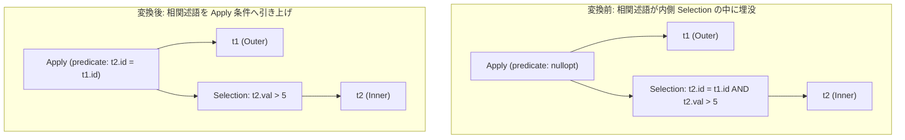

# hoist_correlated_selection_to_apply

- 状態: draft / 執筆基準リビジョン: `3880673` (2026-09-12)
- 定義位置: `plan/cascades.cpp` の `RuleSet::Default()` (登録名 `"hoist_correlated_selection_to_apply"`)

## 概要

`hoist_correlated_selection_to_apply` は、相関サブクエリを評価する `Apply` 演算子の右枝（内側リレーション）に存在する選択フィルタ `Selection` から、外側と内側の双方のリレーションを参照する相関述語（Correlated Predicate）を抽出し、`Apply` 演算子自身の結合述語へと引き上げる（Hoist）論理 Rule です。

内側の選択フィルタから外側依存性を除去して局所的な述語のみを残すことで、後続の `apply_to_join` Rule による標準結合（Join）への変換を可能にし、サブクエリの相関解除（Decorrelation）を推進することを目的とします。

## 変換前後の関係



## 適用条件

本 Rule の pattern は `Apply(Any("outer"), Selection(Any("inner_sub"), "inner_sel"))`、target ヒントは `LogicalOperator::kApply` です。

発火のためのガード条件は以下の通りです。

1. 式が `kApply` であり、子がちょうど 2 個であること。
2. 内側 Group（`inner_sel`）内に、単一入力かつ有効な述語を保持する `kSelection` 式が存在すること。
3. 内側 Selection の述語を連言（AND）に分解したとき、外側リレーションと内側リレーションの双方の列を参照する相関項（`correlated`）が 1 つ以上存在すること。

   ```cpp
              if (touches_outer && touches_inner) {
                correlated.push_back(conjunct);
              } else {
                local_inner.push_back(conjunct);
              }
   ```

4. `correlated` リストが空でないこと（引き上げるべき相関述語が存在すること）。
5. 局所述語 `local_inner` を保持する派生 Group を生成する際、循環参照が発生しないこと。

## 意味論的根拠と代数的一致・例外保護

Apply 演算子の意味論において、外側のタプル $o \in Outer$ に対し、内側のサブクエリはパラメータ $o$ が束縛された状態で評価されます。

内側で評価される述語が $P_{local}(i) \land P_{corr}(o, i)$ であるとき、この 2 つの条件を満たす内側タプル $i \in Inner$ を抽出することと、まず $P_{local}(i)$ で内側タプルをフィルタした上で、$P_{corr}(o, i)$ を Apply 演算子の結合条件としてタプル対 $(o, i)$ をフィルタすることは、三値論理およびタプルの多重集合において厳密に同値です。

- **参照リレーションの厳格な分離**:
  外側と内側の双方を参照する述語のみを Apply 条件へ引き上げます。内側のみを参照する局所述語（`local_inner`）は内側 Selection に残存させることで、内側テーブルの単独インデックススキャンや早期枝刈りの機会を保全します。
- **三値論理と短絡評価**:
  述語の評価場所が内側から Apply 条件へ移動しても、外側行と内側行の組み合わせに対して AND 条件として評価される関係は不変であり、例外消去や三値論理の真偽判定に差異は生じません。

## 実装の詳細

局所述語 `local_inner` が存在する場合、その述語文字列表現をタグに含めた派生 Group を生成し、残余の Selection 式を登録します。

```cpp
            GroupId new_inner_id = inner_child_id;
            if (!local_inner.empty()) {
              new_inner_id = memo.EnsureDerivedGroup(
                  inner_rels, "hoisted_local_sel:" +
                                  CombineConjuncts(local_inner)->ToString());
              if (new_inner_id == inner_child_id || new_inner_id == group) {
                continue;
              }
              memo.AddExpression(
                  new_inner_id,
                  LogicalExpression{
                      .operation = LogicalOperator::kSelection,
                      .children = {inner_child_id},
                      .predicate = CombineConjuncts(local_inner)});
            }
```

その後、元の Apply 条件に相関述語 `correlated` を連言結合した述語を設定し、親 Group へ新しい `kApply` 式を追加します。

```cpp
            memo.AddExpression(
                group, LogicalExpression{
                           .operation = LogicalOperator::kApply,
                           .children = {outer_id, new_inner_id},
                           .predicate = CombineConjuncts(new_apply_conjuncts),
                           .target_list = expression.target_list,
                           .join_type = expression.join_type,
                           .output_schema = expression.output_schema});
```

## 最適化効果

内側のサブクエリから外側リレーション依存性が完全に排除され、独立した関係式となります。

これにより、直接の後続 Rule である `apply_to_join` が発火可能となり、Nested Loops 実行を強いられる Apply 演算子がハッシュ結合やマージ結合へと変換され、実行計算量が劇的に削減されます。

## 関連 Rule との相互作用

- `apply_to_join`: 本 Rule によって相関条件が引き上げられた Apply 演算子を、標準の内側結合や外部結合へと物理展開・論理変換する直接の連動先です。
- `decorrelate_aggregate_apply`: 集約サブクエリに対して相関キーを GROUP BY に繰り込むデコリレーション Rule です。
- `push_selection_through_apply`: Apply 演算子の外側から内側または外側枝へフィルタを押し下げる関連 Rule です。

## 検証テスト

- `plan/cascades_test.cpp`: `CascadesTest.HoistCorrelatedSelectionToApply`
  - `t2.id = t1.id AND t2.val > 5` を内側 Selection に持つ Apply 演算子に対し、本 Rule と `apply_to_join` の連鎖によって最終的に `kJoin` 式が生成されることを検証。
