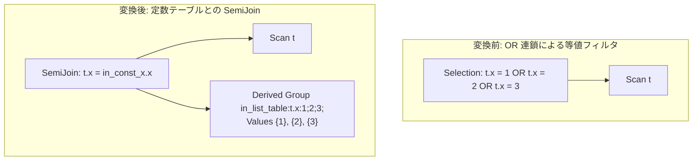

# in_list_to_semi_join

- 状態: draft / 執筆基準リビジョン: `3880673` (2026-09-12)
- 定義位置: `plan/cascades.cpp` の `RuleSet::Default()` (登録名 `"in_list_to_semi_join"`)

## 概要

`in_list_to_semi_join` は、同一列に対する多数の「列 = 定数」等値述語が論理和（OR）で結合されたフィルタ式（IN リストの展開形）を検出し、定数値のインメモリテーブル（`kValues`）を構築して対象リレーションと `SemiJoin` を行う等価プランを Memo に追加する論理 Rule です。

多数の定数比較演算が連鎖する $O(N)$ の行ごと述語評価を、定数集合のインメモリハッシュテーブルに対する $O(1)$ のキー存在判定へと置換することを目的とします。

## 変換前後の関係



## 適用条件

本 Rule の pattern は `Selection(Any("child"))`、target ヒントは `LogicalOperator::kSelection` です。

発火のためのガード条件（D5 監査規律）は以下の通りです。

1. 式が `kSelection` であり、有効な述語を保持していること。かつ子 Group が親 Group 自身と一致しないこと。
2. 述語の OR 木を再帰的に走査した際、**すべての葉ノード**が「列 = 定数」または「定数 = 列」の等式（`kEquals`）であり、かつそれらがすべて**同一の列名**を参照していること（`collected_all_branches == true`）。
3. 収集された定数値の個数が 3 個以上であること（`in_values.size() >= 3`）。
4. 定数テーブルを配置する派生 Group が親 Group 自身と一致しないこと。

```cpp
          // D5 gate ("IN-list semi join: 収集できなかったOR枝を捨てず、全枝を
          // 保持する"): if ANY branch of the OR tree is not a col=const
          // equality on the same column, the constant table would silently
          // drop that branch's rows.  Track completeness and refuse to fire
          // instead of rewriting to a smaller row set.
```

OR 木の中に異なる列の参照（例: `x = 1 OR y = 2`）や、非等値述語（例: `x = 1 OR x > 10`）が 1 つでも混入している場合、安全機構により発火が完全に拒否されます。

## 意味論的根拠と D5 規律（枝脱落防止・フィンガープリント）

本 Rule における意味論的等価性の証明と安全性の根拠は以下の通りです。

- **OR 枝の完全収集と行消失の防止（No Dropped Branches）**:
  セミ結合 $T \ltimes Values$ は、「$T.x$ の値が $Values$ に含まれるタプルのみを通過させる」操作です。もし OR 木の一部に収集不可能な条件（不等号や別列の述語）が存在する状態で残りの等値定数のみを抽出して $Values$ を構成すると、収集から漏れた条件を満たすはずの正当なタプルがセミ結合によって除外されてしまい、出力行数が過小となります。このため、OR 木の全枝が同一列の等値定数であることを厳格に検査します。
- **三値論理と NULL セマンティクス**:
  元の OR 述語において $x$ が NULL の場合、各等式は UNKNOWN となり行は脱落します。セミ結合においても結合キーが NULL であるタプルはハッシュプローブでマッチせず脱落するため、三値論理上の挙動は一致します。
- **派生 Group のフィンガープリント一意化**:
  定数テーブルを格納する派生 Group のタグには、参照列名とすべての定数値を直列化したフィンガープリント（例: `in_list_table:t.x:1;2;3;`）を付与します。これにより、同一列に対する異なる値リスト（例: `{1, 2, 3}` と `{4, 5, 6}`）が誤って同一の派生 Group を共有・衝突することを防ぎます。

## 実装の詳細

内部補助関数 `collect_in_values` を用いて OR 結合された二項比較式を再帰走査し、定数値を `in_values` 配列に蓄積します。

```cpp
              if (bin.Op() == BinaryOperation::kEquals) {
                const bool left_col =
                    bin.Left()->Type() == TypeTag::kColumnValue &&
                    bin.Right()->Type() == TypeTag::kConstantValue;
                const bool right_col =
                    bin.Right()->Type() == TypeTag::kColumnValue &&
                    bin.Left()->Type() == TypeTag::kConstantValue;
                if (left_col || right_col) {
                  const ColumnName col = (left_col ? bin.Left() : bin.Right())
                                             ->AsColumnValue()
                                             .GetColumnName();
                  const Value constant = (left_col ? bin.Right() : bin.Left())
                                             ->AsConstantValue()
                                             .GetValue();
                  if (!target_col) {
                    target_col = col;
                  }
                  if (*target_col == col) {
                    in_values.push_back(constant);
                    return;
                  }
                }
              }
```

すべての枝が収集された場合、`EnsureDerivedGroup` により定数テーブル用の派生 Group を作成して `kValues` 式を登録し、親 Group に結合条件 `t.x = in_const_x.x` を持つ `kSemiJoin` 式を追加します。

## 最適化効果

定数値の個数が数十〜数百件に及ぶクエリにおいて、タプルごとに多数の比較木をトラバースする CPU オーバーヘッドを解消します。

ビルド側の `Values` はクエリ開始時に 1 回だけインメモリハッシュテーブル（`SemiJoinPlan`）に格納されるため、プローブ側の各タプルは 1 回のハッシュルックアップで高速にフィルタリングされます。

## 関連 Rule との相互作用

- `dedupe_in_list` / `fold_in`: 式書き換え層において IN 式の重複値排除や定数畳み込みを行う先行 Rule です。
- `push_selection_into_scan`: 定数値が 1〜2 個で本 Rule が発火しなかった場合、Selection 述語がスキャンフィルタへ押し下げられます。
- `push_semi_join_through_inner_join`: 生成されたセミ結合を他の結合演算子の下流へ押し下げる後続 Rule です。

## 検証テスト

- `plan/cascades_test.cpp`: `CascadesTest.InListToSemiJoin`
  - `x = 1 OR x = 2 OR x = 3` に対し、定数テーブルとの `SemiJoin` 式が生成されることを検証。
- `plan/cascades_test.cpp`: `CascadesTest.InListToSemiJoinRejectsMixedColumnOr`
  - 列が混在する OR 述語（`x = 1 OR y = 2`）に対して本 Rule が発火を拒絶することを検証。
- `plan/cascades_test.cpp`: `CascadesTest.InListToSemiJoinRejectsUncollectableBranch`
  - 等値以外の範囲述語が混ざった OR 述語に対して発火を拒絶することを検証。
- `plan/cascades_test.cpp`: `CascadesTest.DerivedGroupFingerprintSeparatesDifferentInLists`
  - 異なる定数リストが別々の派生 Group として隔離されることを検証。
