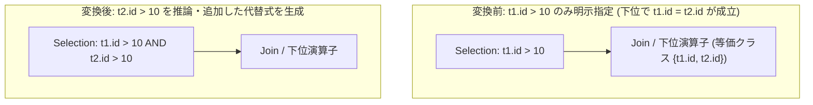

# infer_filter_from_equivalence_class

- 状態: draft / 執筆基準リビジョン: `3880673` (2026-09-12)
- 定義位置: `plan/cascades.cpp` の `RuleSet::Default()` (登録名 `"infer_filter_from_equivalence_class"`)

## 概要

`infer_filter_from_equivalence_class` は、入力リレーションの論理プロパティから得られる等価クラス（Equivalence Class: 列同士の等値結合により同値関係にある列の集合）を利用し、Selection 演算子の述語 `T1.c OP 常数` から同値な列に対する述語 `T2.d OP 常数` を推論して、述語を補強した新しい Selection 代替式を同一 Group に追加する論理 Rule です。

片方のテーブルに対してのみ明示的に指定された範囲条件や等値条件を結合相手のテーブル側へ伝播させ、下流の述語押し下げ最適化やインデックススキャン選択の契機を創出することを目的とします。

## 変換前後の関係



## 適用条件

本 Rule の pattern は `Selection(Any("input"))`、target ヒントは `LogicalOperator::kSelection` です。

発火のためのガード条件は以下の通りです。

1. 式が `kSelection` であり、子が 1 個、かつ有効な述語を保持していること。
2. 入力 Group の `logical_properties.equivalence_classes` が空でないこと。
3. 選択述語の連言要素のうち、二項比較演算子（`kEquals`, `kNotEquals`, `kGreaterThan`, `kGreaterThanEquals`, `kLessThan`, `kLessThanEquals`）かつ「列と定数」の組み合わせである項が存在すること。
4. その列を含む等価クラス内の他のメンバ列（自分自身を除く）に対し、同一の演算子と定数を用いた推論述語を生成した結果、既存の連言や既に推論済みの式と重複しないこと（`ToString()` による一意性検証）。
5. 1 つ以上の新たな推論述語が生成されたこと（`!new_inferred.empty()`）。

```cpp
              for (const auto& member : ec) {
                if (member == col_str || ColumnName(member) == col_name) {
                  continue;
                }
                Expression inferred_bin =
                    col_on_left ? BinaryExpressionExp(
                                      ColumnValueExp(ColumnName(member)), op,
                                      *const_expr)
                                : BinaryExpressionExp(
                                      *const_expr, op,
                                      ColumnValueExp(ColumnName(member)));
```

## 意味論的根拠と代数的一致・三値論理

等価関係の推移律（Transitivity of Equivalence）に基づき、$T_1.c = T_2.d$ が下流で保証されている場合、任意の二項比較演算 $\theta \in \{=, \neq, <, \le, >, \ge\}$ に対して以下の関係論理同値が成り立ちます。

$$(T_1.c = T_2.d) \land (T_1.c\ \theta\ k) \implies (T_2.d\ \theta\ k)$$

意味論の保全および三値論理上の振る舞いは以下の通りです。

- **多重度および行集合の不変性**: 推論された述語 $T_2.d\ \theta\ k$ は、元のクエリが通過させる行集合に対して恒真（Tautology）となります。$T_1.c = T_2.d$ かつ $T_1.c\ \theta\ k$ であるにもかかわらず $T_2.d\ \theta\ k$ が偽または UNKNOWN となる行は数学的に存在しないため、新たなフィルタを追加しても出力行の多重度は完全に一致します。
- **NULL 値の伝播（三値論理）**: $T_1.c$ または $T_2.d$ のいずれかが NULL である行は、結合条件 $T_1.c = T_2.d$ が UNKNOWN となるため元々内側結合を通過しません。したがって、推論述語が NULL に対して UNKNOWN を返すことによる副作用は発生しません。
- **同一 Group への代替登録**: 本 Rule は直接スキャンフィルタへ押し下げるのではなく、現在の Selection Group 内に「述語が濃縮された代替式」を追加します。これにより、述語の安全な正規化と後続の押し下げ Rule への受け渡しが分離されます。

## 実装の詳細

入力 Group の論理プロパティ（`LogicalProperties`）に保持されている等価クラス集合を参照します。等価クラスは、結合演算子の述語に含まれる「列 = 列」等式からボトムアップに収集・伝播されたものです。

推論述語を元の連言リストに結合し、新しい `kSelection` 式を親 Group へ追加します。

```cpp
          if (!new_inferred.empty()) {
            std::vector<Expression> combined = existing_conjuncts;
            for (const auto& inf : new_inferred) {
              combined.push_back(inf);
            }
            memo.AddExpression(
                group,
                LogicalExpression{.operation = LogicalOperator::kSelection,
                                  .children = {input_id},
                                  .predicate = CombineConjuncts(combined)});
          }
```

被演算子の左右順序（`col_on_left`）を維持して推論式を構築するため、`10 < t1.id` という逆順の指定に対しても `10 < t2.id` の形式で正しく推論されます。

## 最適化効果

明示的にフィルタが記述されていないテーブル側の結合キーに対しても、等値または範囲フィルタが付与されます。

後続の `push_selection_through_join` および `push_selection_into_scan` と連動することにより、結合相手のテーブル走査時にインデックス範囲走査やゾーンマップ枝刈りが発動可能となり、結合処理の前段で読み出しタプル数を劇的に削減します。

## 関連 Rule との相互作用

- `infer_join_predicates`: 結合述語とスキャンフィルタから直接 scan filter へ推論を行う Rule です。本 Rule は等価クラスから Selection 演算子へ推論する点で相補的に機能します。
- `join_predicate_transitivity`: 結合述語間の推移関係から新たな等値結合条件を導出し、等価クラスを拡充する先行 Rule です。
- `push_selection_through_join`: 本 Rule が生成した推論述語を結合演算子の下流へ押し下げます。

## 検証テスト

- `plan/cascades_test.cpp`: `CascadesTest.InferFilterFromEquivalenceClass`
  - 結合条件 `t1.id = t2.id` と選択述語 `t1.id > 10` が存在する論理プランにおいて、`t2.id > 10` を含む合成 Selection 式が生成されることを検証。
