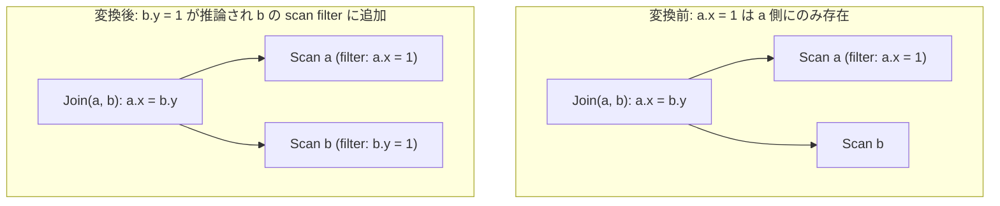

# infer_join_predicates

- 状態: draft / 執筆基準リビジョン: `3880673` (2026-09-12)
- 定義位置: `plan/cascades.cpp` の `RuleSet::Default()`（登録式。変換はヘルパー `InferJoinConstants` および `EqualityConstant` に委譲）

## 概要

`infer_join_predicates` は、内側結合の結合条件に含まれる等式 `a.x = b.y` と、一方のスキャングループ（例: 表 `a`）の scan filter に存在する定数等式 `a.x = 1` から、他方の表に対する定数等式 `b.y = 1` を演繹し、そのスキャングループ（表 `b`）の scan filter へ追加する述語推論（predicate inference / transitive closure）Ruleです。

結合のプローブ側表に対して事前スキャンフィルタを早期に適用させることで、ハッシュ結合のビルド表・プローブ表の双方で行数を削減し、結合処理全体の実行コストを低減させます。

## 変換前後の関係

論理プランの結合木構造そのものは書き換えません。推論された等式述語を対象関係の単一表グループが保持する `scan filter`（`Group.filter`）へ合流させます。



元の結合述語 `a.x = b.y` はそのまま保持されます。追加された述語はスキャンのインデックス探索引数（SARG）として消費されるか、冗長な残差フィルタとして安全に二重評価されます。

## 適用条件

パターン照合は `Join()` であり、対象演算子は `LogicalOperator::kJoin` に限定されます。

```cpp
        [](const Bindings&, Memo& memo, GroupId,
           const LogicalExpression& expression) {
          if (expression.predicate) {
            InferJoinConstants(memo, *expression.predicate);
          }
        },
        LogicalOperator::kJoin));
```

ヘルパー関数 `InferJoinConstants` 内で、以下の条件を満たす連言が処理対象となります。

1. **内側結合の限定**: 対象演算子が `kJoin` であり、外部結合（`kOuterJoin`）にはマッチしません。
2. **対象連言の形式**: 連言が修飾名を持つ「列 = 列」の等号二項式（`kEquals`）であること。定数等式や不等号は対象外です。
3. **完全修飾名の要求**: 結合述語の左右の列双方が空でない修飾名（`schema`）を持つこと。
4. **関係集合の存在確認**: メモが参照先リレーションを保持していること（`memo.ContainsRelation({from.schema, to.schema})` が真）。

## 意味論的根拠と三値論理・代数的一致

本変換の健全性は、等式の代入律と関係代数における選択演算の可換性に基づきます。

内側結合の出力行において、結合条件 `a.x = b.y` は必ず真（TRUE）でなければなりません。三値論理において、どちらかが NULL の場合、比較結果は UNKNOWN となり内側結合の出力から除去されます。同時に `a.x = 1` が真である行のみが `a` 側のフィルタを通過するため、出力行において `b.y` が 1 以外の値または NULL を取ることはあり得ません。したがって、`b.y = 1` を `b` のスキャンフィルタに追加しても、元々結合結果に残るはずだった行は一切除外されず、行集合の同値性が厳密に保たれます。

本Ruleが内側結合に厳密に制限される理由は以下の通りです。外部結合（例: `a LEFT JOIN b ON a.x = b.y`）では、`b` 側にマッチする行が存在しない場合、`b.y` は NULL で補完されて出力されます。このとき誤って `b.y = 1` を `b` のスキャンへプッシュダウンすると、本来 NULL 補完として残るべき行の結合候補自体が変質し、正しい外部結合結果が得られなくなります。tinylamb では null-rejection 解析が未整備なため、パターンレベルで `kJoin` に限定するガードレールを採用しています。

また、`memo.ContainsRelation({from.schema, to.schema})` によるガードは、相関サブクエリ（`Apply` 演算子配下の式）などにおいて外部参照列が混入した際に、未定義な表グループを生成して `RelationMask` の表明違反（CHECK）を引き起こすことを防ぐ契約上の制約です。

## 実装の詳細

推論の主処理は `plan/cascades.cpp` の `InferJoinConstants` に実装されています。等式の対称性に基づき、左右双方向へ同一の処理を行います。

```cpp
    const auto push = [&](const ColumnName& from, const ColumnName& to) {
      if (from.schema.empty() || to.schema.empty()) {
        return;
      }
      if (!memo.ContainsRelation({from.schema, to.schema})) {
        return;
      }
      const std::optional<Value> constant = EqualityConstant(
          memo.Get(memo.EnsureGroup({from.schema})).filter, from);
      if (!constant) {
        return;
      }
      memo.MergeScanFilter(
          memo.EnsureGroup({to.schema}),
          BinaryExpressionExp(ColumnValueExp(to), BinaryOperation::kEquals,
                              ConstantValueExp(*constant)));
    };
    push(left, right);
    push(right, left);
```

1. **定数の抽出**: `EqualityConstant` は `from` 側の単一表グループの `filter` を走査し、`from = 定数` または `定数 = from` の形式を持つ連言から定数値を取り出します。
2. **述語の合成と合流**: 抽出された定数を用いて `to = 定数` の二項式を構築し、`memo.MergeScanFilter` を呼び出して `to` 側グループのフィルタへ合併します。
3. **冪等性の担保**: `MergeScanFilter` 内部で `CanonicalizeConjuncts` を経由するため、連言のソートと重複排除が行われ、複数回の同一推論によってフィルタ式が無制限に肥大化することはありません。

## 最適化効果

本Ruleの適用により、結合の両辺に定数等式述語が伝播します。これにより以下の最適化機会が生じます。

- **インデックススキャンの誘発**: 従来フルスキャンを要していたプローブ側表に対して、インデックス等値探索（IndexScan / Point Lookup）が選択可能になります。
- **結合中間行数の削減**: 結合演算子に入力される前段階で不要な行が刈り取られ、ハッシュ結合のメモリ消費量および比較回数が大幅に減少します。

結合述語自体の削除は行わずスキャンフィルタへの追加のみを行うため、探索空間における代数構造を損なうことなく物理アクセスの質を向上させます。

## 関連 Rule との相互作用

- `inferred_inequality_pushdown`: 不等号条件を対象とする対照的な推論Ruleです。同一のガードレールとフィルタ経路を共有します。
- `join_predicate_transitivity`: 結合条件内の「列 = 列」同士から新しい「列 = 列」を推論するRuleであり、列対列の推移閉包を扱います。
- `push_selection_into_scan` / `split_selection_over_join`: 上位の選択演算から定数等式をスキャンフィルタへ運ぶ上流Ruleです。本Ruleの前提条件を整えます。
- `redundant_join_predicate_elimination`: 推論や推移閉包によって冗長化した等式連言を事後的に整理する逆方向のRuleです。

## 検証テスト

- `plan/cascades_test.cpp`:
  - `CascadesTest.InferJoinPredicatesCopiesConstantsAcrossEquals`: `a.x = 1` および `a.x = b.y` から、`b` グループの filter に `b.y = 1` が導出・登録されることを検証。
  - `CascadesTest.DefaultRulesIncludePredicateAndProjectionTransforms`: 既定の RuleSet 内に `infer_join_predicates` が正しく登録されていることを検証。
