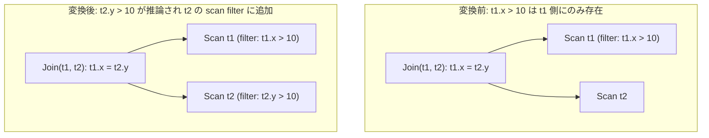

# inferred_inequality_pushdown

- 状態: draft / 執筆基準リビジョン: `3880673` (2026-09-12)
- 定義位置: `plan/cascades.cpp` の `RuleSet::Default()`（登録式。変換はヘルパー `InferJoinInequalities` に委譲）

## 概要

`inferred_inequality_pushdown` は、内側結合の結合条件に含まれる等式 `t1.x = t2.y` と、一方のスキャングループ（例: 表 `t1`）の scan filter に存在する不等号条件（例: `t1.x > 10`）から、他方の表に対する不等号条件 `t2.y > 10` を演繹し、そのスキャングループ（表 `t2`）の scan filter へ追加する述語推論Ruleです。

等式推論Rule（`infer_join_predicates`）の不等号拡張であり、結合の対向側に対して範囲走査（RangeScan）の適用機会を創出します。

## 変換前後の関係

論理プランのノードトポロジは変更せず、対向側の単一表スキャングループが保持する `scan filter`（`Group.filter`）に推論された不等号述語を合流させます。



元の結合述語 `t1.x = t2.y` はそのまま保持されます。追加された不等号述語はスキャンのインデックス範囲条件として消費されるか、安全な残差フィルタとして評価されます。

## 適用条件

パターン照合は `Join()` であり、対象演算子は `LogicalOperator::kJoin` に限定されます。

```cpp
        [](const Bindings&, Memo& memo, GroupId,
           const LogicalExpression& expression) {
          if (expression.predicate) {
            InferJoinInequalities(memo, *expression.predicate);
          }
        },
        LogicalOperator::kJoin));
```

ヘルパー関数 `InferJoinInequalities` 内において、以下のガード条件が評価されます。

1. **等式連言の検出**: 結合述語の連言のうち、両辺が `kColumnValue` である等号式（`kEquals`）を推論の伝播路として抽出します。
2. **不等号連言の抽出**: `from` 側の単一表グループの scan filter を走査し、「列 OP 定数」または「定数 OP 列」（`OP` は `kEquals` 以外の二項演算子）である連言を対象とします。等号式は明示的にスキップされます。
3. **修飾名の存在と関係集合の包含**: `from.schema.empty() || to.schema.empty()` を拒絶し、さらに `memo.ContainsRelation({from.schema, to.schema})` が真であることを要求します。

## 意味論的根拠と三値論理・代数的一致

本変換の健全性は、等式制約下での不等式の順序代入律に基づきます。

内側結合の出力行は結合述語 `t1.x = t2.y` を必ず満たします。三値論理において、どちらかが NULL の場合、比較結果は UNKNOWN となり内側結合の出力から除外されます。また、`t1` 側スキャンを通過する行は `t1.x > 10` を満たす必要があります（NULL の場合は除外済み）。したがって、結合出力行において `t2.y = t1.x > 10` が成立するため、`t2.y > 10` を `t2` 側のスキャンフィルタに追加しても、元々出力されるはずだった行が不当に除外されることはなく、代数的一致性が保たれます。

本Ruleにおいて等号式をスキップする理由は、等式からの定数推論は `infer_join_predicates` が専任で担っており、最適化Rule間の責務分担を明確にするためです。

外部結合に対する適用禁止（`kJoin` 限定）の理由は、外部結合における NULL 補完行の存在に起因します。`t1 LEFT JOIN t2 ON t1.x = t2.y` において、`t2` 側にマッチする行が存在しない場合、`t2.y` は NULL として保持される必要があります。推論された不等号を `t2` のスキャンへ適用すると、本来 NULL 補完行として残るべき結合候補が消失し、結果が壊れます。

また、`ContainsRelation` による検査は、相関サブクエリ等において結合グラフ外の表を参照する述語が混入した際、不正な関係集合を持つグループへのアクセスによる表明違反を未然に防止します。

## 実装の詳細

不等号述語の導出と合流は、`plan/cascades.cpp` の `InferJoinInequalities` で行われます。等式の対称性に基づき、左右双方向へ処理が適用されます。

```cpp
      for (const Expression& filter_conjunct : SplitConjuncts(from_filter)) {
        if (!filter_conjunct ||
            filter_conjunct->Type() != TypeTag::kBinaryExp) {
          continue;
        }
        const auto& f_bin = filter_conjunct->AsBinaryExpression();
        if (f_bin.Op() == BinaryOperation::kEquals) {
          continue;
        }
        if (f_bin.Left()->Type() == TypeTag::kColumnValue &&
            f_bin.Right()->Type() == TypeTag::kConstantValue) {
          if (f_bin.Left()->AsColumnValue().GetColumnName() == from) {
            memo.MergeScanFilter(
                memo.EnsureGroup({to.schema}),
                BinaryExpressionExp(ColumnValueExp(to), f_bin.Op(),
                                    f_bin.Right()));
          }
        } else if (f_bin.Right()->Type() == TypeTag::kColumnValue &&
                   f_bin.Left()->Type() == TypeTag::kConstantValue) {
          if (f_bin.Right()->AsColumnValue().GetColumnName() == from) {
            memo.MergeScanFilter(
                memo.EnsureGroup({to.schema}),
                BinaryExpressionExp(f_bin.Left(), f_bin.Op(),
                                    ColumnValueExp(to)));
          }
        }
      }
```

- **演算子とオペランド順序の保存**: `f_bin.Op()` をそのまま維持し、`from` 列のみを `to` 列に置換します。「列 OP 定数」および「定数 OP 列」の双方向の形式に対応し、不等号の向きの整合性を崩さずに述語を再構築します。
- **フィルタの合流と正規化**: 再構築された述語は `memo.MergeScanFilter` を経由して `to` 側グループの `filter` に追加され、`CanonicalizeConjuncts` によるソート・重複排除が行われます。

## 最適化効果

対向側のスキャンフィルタに不等号述語が追加されることで、以下の効果が得られます。

- **範囲スキャン（RangeScan）の適用**: `t2.y` に対する B+Tree インデックスが存在する場合、テーブルフルスキャンからインデックス範囲走査への切り替えが可能になります。
- **結合プローブ行数の削減**: 結合前に入力データが絞り込まれるため、ハッシュ表のプローブ回数および中間メモリ消費量が低減します。

## 関連 Rule との相互作用

- `infer_join_predicates`: 等式条件を対象とする推論Ruleです。同一のアーキテクチャを共有します。
- `join_predicate_transitivity`: 結合述語の等式鎖を拡張するRuleです。等式ペアが増加することで、本Ruleの推論路が拡張されます。
- `extract_year_sargable` / `cast_pushdown_on_comparison`: スキャンフィルタに登録された不等号述語を、SARG可能な形式へ変形する後続の式書き換えRuleです。

## 検証テスト

- `plan/cascades_test.cpp`:
  - `CascadesTest.InferredInequalityPushdown`: `t1.x > 10` と `t1.x = t2.y` から、`t2` グループの filter に `t2.y > 10` が推論・登録されることを検証。
