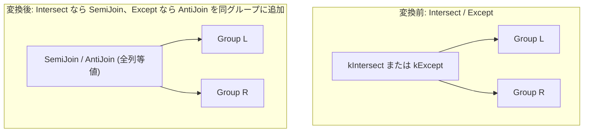

# intersect_except_cost_based_lowering

- 状態: draft / 執筆基準リビジョン: `3880673` (2026-09-12)
- 定義位置: `plan/cascades.cpp` の `RuleSet::Default()`（登録名 `"intersect_except_cost_based_lowering"`。ヘルパー関数 `BuildEqualityOnAllColumns` / `UnionRelations` を使用）

## 概要

`intersect_except_cost_based_lowering` は、集合演算 `Intersect(L, R)` を全列等値条件による半結合 `SemiJoin(L, R, equality_on_all_columns)` へ、`Except(L, R)` を全列等値条件による反結合 `AntiJoin(L, R, equality_on_all_columns)` へとそれぞれ降格（lowering）する論理変換Ruleです。

物理的な集合演算実装（ハッシュ集合演算やソート集合演算）と、結合系物理実装（SemiHashJoin、AntiHashJoin 等）を同一 Memo 内の等価な選択肢として共存させ、探索エンジンがコストベースで最適な実装を選択できるようにします。

## 変換前後の関係

同一グループ内に、集合演算ノードと等価な半結合または反結合の論理式を追加します。



変換後も元の集合演算式は破棄されずに維持され、物理展開フェーズにおいて双方の実装コストが比較されます。

## 適用条件

パターン照合には `Pattern::Any()` を使用し、変換ラムダ内で演算子種別および構造的制約を検証します。

```cpp
          if ((expression.operation != LogicalOperator::kIntersect &&
               expression.operation != LogicalOperator::kExcept) ||
              expression.children.size() != 2) {
            return;
          }
```

発火には以下のガード条件をすべて満たす必要があります。

1. **対象演算子と入力数**: 対象演算子が `LogicalOperator::kIntersect` または `LogicalOperator::kExcept` であり、正確に2つの子グループを持つこと（bag 意味論の `kIntersectAll` / `kExceptAll` は対象外）。
2. **非循環性**: 左右の子グループが自己グループ自身でないこと（`left == group || right == group` の除外）。
3. **関係集合の排他性と網羅性**: 左右の子グループの関係集合が互いに素（排他）であり、かつ両者の和集合が親グループの関係集合と完全に一致すること。
4. **全列等値条件の導出成功**: ヘルパー関数 `BuildEqualityOnAllColumns` により、全列に対する等値結合述語が正常に構築できること。

```cpp
          const LogicalOperator join_op =
              expression.operation == LogicalOperator::kIntersect
                  ? LogicalOperator::kSemiJoin
                  : LogicalOperator::kAntiJoin;
```

## 意味論的根拠と多重度・代数的同値性

INTERSECT は「右入力に同一行が存在する左入力行」を抽出し、EXCEPT は「右入力に同一行が存在しない左入力行」を抽出する操作です。これらは関係代数上、全属性を結合キーとする SemiJoin（半結合）および AntiJoin（反結合）の選択意味論と直接対応します。

ガード条件の根拠は以下の通りです。

- **関係集合の排他性**: 全列等値条件は `left_rel.col = right_rel.col` の形式で修飾名を付与して組み立てられます。左右が同一のリレーションを共有している場合、修飾名が衝突して等値条件の一意性が失われるため、排他性を必須とします。
- **和集合の一致**: メモの整合性契約上、導出される結合式が親グループと同一の関係集合を持たなければなりません。
- **等値述語の捏造防止**: 参照可能な属性情報が不足している場合、架空のキー等式を捏造せず `BuildEqualityOnAllColumns` が null を返し、変換を安全に中断します。

なお、tinylamb の集合演算における DISTINCT 意味論（重複排除）と、SemiJoin / AntiJoin による多重度（左入力の重複行の扱い）の整合性については、左入力の一意性保証の有無に応じた調整が必要となる場合がありますが、現状の実装では全列等値による降格式を無条件に探索空間へ提示し、コスト比較に委ねる契約となっています。

## 実装の詳細

変換処理の本体では、判別された `join_op`（`kSemiJoin` または `kAntiJoin`）を用いて新たな論理式を構築し、メモへ登録します。

```cpp
          memo.AddExpression(
              group,
              LogicalExpression{.operation = join_op,
                                .children = {left, right},
                                .predicate = equality_predicate,
                                .target_list = expression.target_list,
                                .output_schema = expression.output_schema});
```

- **全列等値述語の構築**: `BuildEqualityOnAllColumns` は、まず元の集合演算式に明示的な述語が存在すればそれを採用します。存在しない場合は `output_schema` や左右の入力スキーマを走査し、対応する属性同士を `kEquals` で結んだ連言式を合成して `CanonicalizeConjuncts` により正規化します。
- **ALL変種の除外**: `kIntersectAll` および `kExceptAll` は行の重複度に応じたカウントベースの bag 演算であり、二値の存在判定に基づく SemiJoin / AntiJoin では意味を保存できないため、本Ruleの対象外としています。

## 最適化効果

本Ruleの適用により、以下のトレードオフをコストベースで最適化できます。

- **アクセスパスの柔軟性**: 集合演算専用の物理オペレータ（`intersect` / `except`）は双方の入力をソートまたはマテリアライズする必要があります。一方、SemiJoin / AntiJoin への降格により、右入力が小さい場合のインデックスルックアップ結合やインメモリハッシュ結合が選択可能になります。
- **結合順序の再配置**: 結合形式となることで、他の結合リオーダリングRule（`push_semi_join_through_inner_join` 等）の適用候補となり、大域的な最適化が可能になります。

## 関連 Rule との相互作用

- `intersect_to_semijoin` / `except_to_antijoin`: それぞれの演算子に特化した専用Ruleです。本Ruleと同一の論理代替を生成しますが、`Memo::AddExpression` の指紋照合により同一式は単一に集約されます。
- `push_filter_past_setop`: 集合演算の上位に存在する選択演算を押し込むRuleです。
- `semi_hash_join` / `anti_hash_join`（実装Rule）: 本Ruleによって導入された SemiJoin / AntiJoin を物理実行プランへと具体化します。

## 検証テスト

- `plan/cascades_test.cpp`:
  - `CascadesTest.IntersectExceptCostBasedLowering`: `kIntersect` の式から `kSemiJoin` 代替が、`kExcept` の式から `kAntiJoin` 代替が同一グループ内に正しく追加されることを検証。
