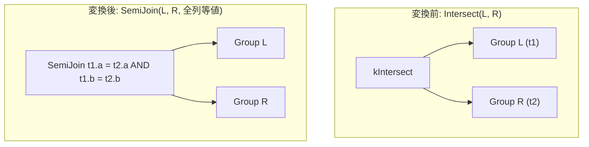

# intersect_to_semijoin

- 状態: draft / 執筆基準リビジョン: `3880673` (2026-09-12)
- 定義位置: `plan/cascades.cpp` の `RuleSet::Default()`（登録名 `"intersect_to_semijoin"`。ヘルパー関数 `BuildEqualityOnAllColumns` / `UnionRelations` を使用）

## 概要

`intersect_to_semijoin` は、集合演算 `Intersect(L, R)` を、全属性の等値を結合述語とする半結合 `SemiJoin(L, R, equality_on_all_columns)` へ書き換える論理変換Ruleです。

INTERSECT 演算を「左入力の各行について、右入力に対応する行が少なくとも1つ存在するものを残す」という半結合の意味論へ還元することで、結合アルゴリズム（SemiHashJoin、インデックス半結合等）および結合順序最適化の適用を可能にします。

## 変換前後の関係

同一グループ内に、集合演算ノードと等価な半結合の論理式を追加します。



元の `kIntersect` 式と並列して `kSemiJoin` 式が同一グループに保持され、物理計画生成時のコスト評価対象となります。

## 適用条件

パターン照合には `Pattern::Op(LogicalOperator::kIntersect, {})` を用い、対象演算子は `LogicalOperator::kIntersect` に限定されます。

```cpp
    // intersect_to_semijoin: Intersect(L, R) -> SemiJoin(L, R,
    // equality_on_all_columns)
```

変換ラムダ内で以下の3つのガード条件を検証します。

1. **子ノード数**: 子ノードの要素数が正確に2つであること。
2. **関係集合の排他性と網羅性**:
   左右の子グループの関係集合が互いに素（排他）であり、かつそれらの和集合が親グループの関係集合と完全に一致すること。

   ```cpp
          std::vector<std::string> intersection;
          std::ranges::set_intersection(left_group.relations,
                                        right_group.relations,
                                        std::back_inserter(intersection));
          if (!intersection.empty() ||
              UnionRelations(left_group.relations, right_group.relations) !=
                  memo.Get(group).relations) {
            return;
          }
   ```

3. **結合述語の構築可能性**: `BuildEqualityOnAllColumns(memo, expression, left, right)` が有効な結合述語を生成できること（空返却時は不発）。

## 意味論的根拠と多重度・代数的同値性

INTERSECT 演算は、集合論的に両入力の共通部分を抽出します。これは関係代数において、全列を照合キーとする半結合（SemiJoin）の意味論と一致します。

各ガード条件の必要性は以下の通りです。

- **関係集合の排他性**: `BuildEqualityOnAllColumns` は `左rel.col = 右rel.col` の形式で結合述語を生成します。左右の入力が同一リレーションを共有している場合、修飾名が衝突して等値条件の同一性が保てなくなるため、排他であることが必須となります。
- **和集合の完全一致**: メモの整合性不変条件（Invariants）により、導出される結合式は親グループと同一のリレーション集合を代表しなければなりません。
- **等値述語の捏造防止**: スキーマ情報から等値可能な列対を同定できない場合、架空の列等式（例: 根拠のない `id` 等式）を捏造することなく処理を安全に中断します。

```cpp
  if (conjuncts.empty()) {
    // No equatable columns are known. A previous revision invented an `id`
    // equality here without checking that such a column exists; that
    // fabricated predicate silently joined on the wrong key (or failed
    // downstream). Return null so callers skip the rewrite instead.
    return memo.JoinConditionFor(left_group, right_group);
  }
```

なお、多重度保存に関する留意事項として、SQL の `INTERSECT`（DISTINCT 集合演算）は左入力内の重複行を1行に集約しますが、`SemiJoin` はマッチした左行をそのまま通過させるため、左入力に重複行が含まれる場合は多重度が一致しません。tinylamb の現行実装では `kIntersect` のみを対象とし、bag 演算である `kIntersectAll` は除外されています。

## 実装の詳細

変換処理では、構築された全列等値述語を伴う `kSemiJoin` 論理式を親グループへ登録します。

```cpp
          memo.AddExpression(
              group,
              LogicalExpression{.operation = LogicalOperator::kSemiJoin,
                                .children = {left, right},
                                .predicate = equality_predicate,
                                .target_list = expression.target_list,
                                .output_schema = expression.output_schema});
```

- **述語の優先度**: `BuildEqualityOnAllColumns` は、元の式に述語が存在すればそれを採用し、存在しない場合は `output_schema` の各列から `left_rel.col = right_rel.col` を導出します。さらにそれが得られない場合は `target_list` または左右の子グループの出力スキーマから列情報を補完します。
- **正規化**: 生成された全列等値述語は `CanonicalizeConjuncts` を経由し、連言のソートおよび重複排除が行われます。

## 最適化効果

本Ruleの適用により、以下の最適化機会が得られます。

- **物理実装の多様化**: 集合演算の専用実装（`intersect`）は右入力の完全なマテリアライズを要求しますが、`SemiJoin` へ降格させることで、ビルド側のインデックスを用いた走査やパイプライン処理が可能なハッシュ半結合（`semi_hash_join`）を選択可能になります。
- **結合順序最適化の適用**: 集合演算の境界を越えて、結合リオーダリングなどの大域的な探索空間を拡張します。

## 関連 Rule との相互作用

- `except_to_antijoin`: EXCEPT 演算を AntiJoin へ変換する対照的なRuleです。同一の判定基盤および述語構築ロジックを共有します。
- `intersect_except_cost_based_lowering`: `Pattern::Any()` を用いて INTERSECT と EXCEPT の双方を一括処理するRuleです。本Ruleと同一の論理代替を導出しますが、`Memo::AddExpression` により重複は排除されます。
- `semi_hash_join` / `semi_merge_join`（実装Rule）: 本Ruleが生成した `kSemiJoin` 式を物理プランへ具体化します。

## 検証テスト

- `plan/cascades_test.cpp`:
  - `CascadesTest.IntersectToSemiJoinRewrite`: `kIntersect` 式に対して探索を実行した際、同一の子グループを持つ `kSemiJoin` 代替がグループ内に追加されることを検証。
