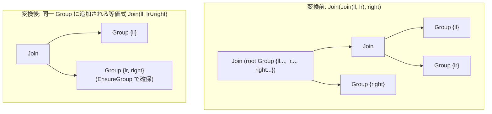

# join_associativity_left

- 状態: draft / 執筆基準リビジョン: `3880673` (2026-09-12)
- 定義位置: `plan/cascades.cpp` の `RuleSet::Default()`（登録名 `"join_associativity_left"`）

## 概要

`join_associativity_left` は、左深結合 `Join(Join(ll, lr), right)` を右回転させて `Join(ll, Join(lr, right))` へ変形する論理変換Ruleです。部分集合 $lr \cup right$ に対応するGroupを新たに確保し、親Groupに $ll$ とその新規Groupとの結合式を等価式として追加します。

## 変換前後の関係

変形前の親Groupに含まれる左深結合から、部分結合の右オペランドと外側結合の右オペランドを束ねた新しい部分Groupを生成し、右深側の結合構造を導出します。



メモ構造は追記型であるため、元の式は保持され、回転後の式が親Groupに新たな探索候補として追加されます。

## 適用条件

パターン照合では、外側 `Join` の左子ノードが `kJoin` 演算子であることを要求します（右子ノードは任意ノード）。

```cpp
    built.Add(Rule(
        "join_associativity_left",
        Join(
            Pattern::Op(LogicalOperator::kJoin, {Any("ll"), Any("lr")}, "left"),
            Any("right")),
```

変換ラムダ内の処理は以下のとおりです（`plan/cascades.cpp`）。

```cpp
        [](const Bindings& bindings, Memo& memo, GroupId group,
           const LogicalExpression&) {
          const GroupId inner = memo.EnsureGroup(
              UnionRelations(memo.Get(bindings.at("lr")).relations,
                             memo.Get(bindings.at("right")).relations));
          memo.AddExpression(group, memo.NewJoin(bindings.at("ll"), inner));
        },
        LogicalOperator::kJoin));
```

適用条件は以下のとおりです。

1. **左子ノードの演算子**: 左子ノードのGroup内に `LogicalOperator::kJoin` を持つ式が存在すること。
2. **関係の和集合**: $lr$ と $right$ の関係リストの和集合（`UnionRelations`）をもとに `EnsureGroup` を呼び出し、中間Group `inner` を取得できること。

`UnionRelations` は、ソート済みの2つの関係名ベクトルから `std::ranges::set_union` により和集合を生成するヘルパー関数です。

```cpp
std::vector<std::string> UnionRelations(const std::vector<std::string>& left,
                                        const std::vector<std::string>& right) {
  std::vector<std::string> result;
  std::ranges::set_union(left, right, std::back_inserter(result));
  return result;
}
```

## 意味論的根拠と重複制御

内部結合の結合則 $((ll \bowtie lr) \bowtie right) \equiv (ll \bowtie (lr \bowtie right))$ は代数的に常に成立するため、述語の整合性を保つ追加のガード条件は不要です。意味論の保存は以下の2つの設計によって保証されます。

1. **結合述語の再導出**: 追加される `NewJoin(ll, inner)` の結合述語は、`JoinConditionFor` によって「$ll$ の関係集合」と「$inner$ の関係集合」を跨ぐ連接詞から自動導出されます（第20章 20-6節）。結合木の回転前後で参照される関係の総集合は不変であるため、各述語は過不足なく適切な結合ノードに再配置されます。単一関係に閉じたフィルタ述語はスキャン側に保持されるため影響を受けません。
2. **中間Groupの自動初期化**: 新規に作成される中間Group（$lr \cup right$）が未登録であった場合、`EnsureGroup` は関係グラフの連結性に基づいて初期の結合木を構築します（第20章 20-5.2節）。これにより、回転後の部分問題に対しても探索の入口が自動的に用意されます。

結合則は `join_associativity_right` と探索領域が重複するため、同一の結合形状が複数回生成される可能性があります。tinylambでは、ガード条件を複雑にするのではなく、`Memo::AddExpression` における指紋照合（`Fingerprint`）によって重複式を登録直前に排除します。

```cpp
    // Two complementary associativity rotations (§6.10). They look redundant,
    // but the worklist applies each rule once per expression occurrence, so
    // neither direction alone sees every child-group state in time; together
    // they derive every join shape. Their overlapping OUTPUTS are duplicates
    // by fingerprint, and Memo::AddExpression rejects those for free (before
    // the cap), so the pair no longer pollutes the expression budget.
```

ワークリスト探索では式が生成された契機でRuleが評価されるため、片方向の回転だけでは子Groupの最適化進行状態を捉えきれない場合があります。左右両方向の回転Ruleを導入し、重複する出力は指紋照合で速やかに破棄することで、探索の網羅性とメモリ予算の保護を両立させています。

## 実装の詳細

- **入れ子パターンの照合**: `Pattern::Op(LogicalOperator::kJoin, {...}, "name")` を用いることで、左子Groupに結合ノードが存在するかをパターン評価エンジンが判定します（第30章）。ラムダ式側では `bindings.at("lr")` や `bindings.at("ll")` を直接参照できるため、手動での型検査が不要です。
- **`EnsureGroup` による冪等な管理**: `EnsureGroup` は関係集合を一意キーとして管理するため、他のRule（`join_enumeration` など）がすでに同一の部分結合Groupを生成していた場合は既存の `GroupId` を返却し、探索空間の合流を促します。
- **指紋照合による重複排除**: `Memo::AddExpression` は登録対象の式と既存式の `Fingerprint()` を比較し、同一の構造を持つ式を破棄します。この棄却は探索上限（`expression_cap_`）のカウント対象外となるため、探索の質を損ないません。

## 最適化効果

左深木をブッシー木（bushy tree）や右深木へと変形させる契機を与えます。親Groupに回転後の式が追加されると同時に、中間Groupに対しても再帰的な最適化が行われます。`join_enumeration` が親Groupレベルでの二分割を一括列挙するのに対し、本Ruleは既存の結合木の下位構造を局所的に再編するため、関係数が多く全列挙の対象外となる結合においても効果的な探索空間を提供します。

## 関連Ruleとの相互作用

- `join_associativity_right`: 対をなす右回転Rule。重複生成物は指紋照合により排除され、相互補完的に全トポロジを導出します。
- `join_commutativity`: 結合の左右を反転。回転処理の前後で適用されることで、順序の異なる結合順序を網羅します。
- `join_enumeration`: 二分割の全列挙Rule。本Ruleと同一の式を生成した場合は、`Memo::AddExpression` の指紋照合により片方が破棄されます。

## 検証テスト

- `plan/cascades_test.cpp`:
  - `AssociativityRulesEnumerateJoinOrdersWithoutEnumeration`: `join_enumeration` を無効化した状態で、結合交換則と2方向の結合結合則のみで全6通りの結合順序が導出されることを検証。
  - `JoinEnumerationPrunesDisconnectedBipartitions`: 枝刈り効果の検証において、本Ruleを除外した環境での挙動を評価。
  - `RuleCanBeRemovedWithoutOptimizerChanges`: 冗長なRuleセットから本Ruleを単独除外してもオプティマイザの決定性に異常が生じないことを検証。
- `plan/optimizer_test.cpp`:
  - `JoinChainMatchesGoldenResultUnderRuleSubsets`: 順序系Ruleの構成を変更してもクエリ結果の正確性が保たれることを検証。

