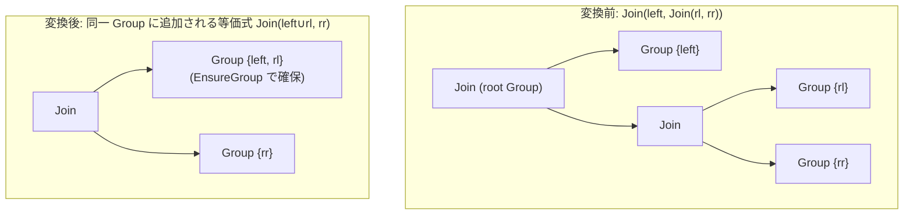

# join_associativity_right

- 状態: draft / 執筆基準リビジョン: `3880673` (2026-09-12)
- 定義位置: `plan/cascades.cpp` の `RuleSet::Default()`（登録名 `"join_associativity_right"`）

## 概要

`join_associativity_right` は、右深結合 `Join(left, Join(rl, rr))` を左回転させて `Join(Join(left, rl), rr)` へ変形する論理変換Ruleです。`join_associativity_left` と対をなす鏡像Ruleであり、両方向の結合則を併用することで、探索空間におけるすべての結合トポロジを網羅します。生成される重複式はメモ構造の指紋照合によって排除されます。

## 変換前後の関係

親Group内の右深結合から、外側結合の左オペランドと部分結合の左オペランドを結合する中間Groupを生成し、左深側の結合式を導出します。



## 適用条件

パターン照合では、外側 `Join` の右子ノードが `kJoin` 演算子であることを要求します（左子ノードは任意ノード）。

```cpp
    built.Add(Rule(
        "join_associativity_right",
        Join(Any("left"), Pattern::Op(LogicalOperator::kJoin,
                                      {Any("rl"), Any("rr")}, "right")),
        [](const Bindings& bindings, Memo& memo, GroupId group,
           const LogicalExpression&) {
          const GroupId inner = memo.EnsureGroup(
              UnionRelations(memo.Get(bindings.at("left")).relations,
                             memo.Get(bindings.at("rl")).relations));
          memo.AddExpression(group, memo.NewJoin(inner, bindings.at("rr")));
        },
        LogicalOperator::kJoin));
```

適用条件は以下のとおりです。

1. **右子ノードの演算子**: 右子ノードのGroup内に `LogicalOperator::kJoin` を持つ式が存在すること。
2. **中間Groupの確保**: $left$ と $rl$ の関係リストの和集合（`UnionRelations`）をもとに `EnsureGroup` を呼び出し、中間Group `inner` を取得できること。

式がメモに追加されない条件は以下の2点に限られます。

- 右子ノードのGroup内に結合式が存在しない（パターン不一致）。
- 追加対象の式が指紋照合で重複と判定されたか、または式の登録上限（`expression_cap_`）に達して棄却された場合（第20章 20-7節）。

## 意味論的根拠と重複制御

内部結合の結合則 $left \bowtie (rl \bowtie rr) \equiv (left \bowtie rl) \bowtie rr$ に基づく変形であるため、追加のガード条件なしに意味論が保存されます。新しく生成される `NewJoin(inner, rr)` の結合述語は、`JoinConditionFor` によって各関係集合を跨ぐ連接詞から自動再導出されます。

本Ruleが左回転と並行して必要な理由は、ワークリスト探索の適用順序に起因します（`plan/cascades.cpp`）。

```cpp
    // Two complementary associativity rotations (§6.10). They look redundant,
    // but the worklist applies each rule once per expression occurrence, so
    // neither direction alone sees every child-group state in time; together
    // they derive every join shape. Their overlapping OUTPUTS are duplicates
    // by fingerprint, and Memo::AddExpression rejects those for free (before
    // the cap), so the pair no longer pollutes the expression budget.
```

ワークリストは個々の式ノードに対して一度だけRuleを適用するため、左回転（`join_associativity_left`）単独では、右子Group側で生じた新たな結合形状の変化に即座に追従できない場合があります。右回転を併用することで、探索の遅延を生じさせずに全結合形状を導出します。

両方向の回転によって生じる同一の結合式は、`Memo::AddExpression` の指紋照合によって登録前に破棄されます。

```cpp
  const std::string fingerprint = expression.Fingerprint();
  const bool duplicate =
      std::ranges::any_of(target.expressions, [&](const auto& existing) {
        return existing.Fingerprint() == fingerprint;
      });
```

この重複排除は式上限カウントの前に実行されるため、探索予算を浪費することなく安全に冗長な変形を処理できます。

## 実装の詳細

- **入れ子パターンの照合**: `Pattern::Op(LogicalOperator::kJoin, {Any("rl"), Any("rr")}, "right")` により、右子ノードに結合ノードが存在することを保証します。ラムダ式内では孫ノードの束縛名（`bindings.at("rl")`、`bindings.at("rr")`）を直接取り出して利用します。
- **和集合の生成**: `UnionRelations`（`std::ranges::set_union`）によって $left$ と $rl$ の関係集合をマージし、`EnsureGroup` に渡して中間Groupを検索または作成します。
- **指紋の一意性判定**: `LogicalExpression::Fingerprint` は演算子、テーブル参照、子Group識別子、結合条件式などを正規化して文字列化します。同一の部分関係と結合条件を持つ式は完全に一致する指紋を持つため、確実に重複判定されます。

## 最適化効果

右深結合を左深結合へと回転させ、`join_associativity_left` と協調して左深・右深・ブッシー（bushy）のあらゆる結合木トポロジを導出します。`join_enumeration` が無効化された環境においても、結合交換則とこの2方向の結合則が存在すれば、すべての有効な結合順序を網羅できることが保証されます。

## 関連Ruleとの相互作用

- `join_associativity_left`: 鏡像関係にある左回転Rule。重複出力は指紋照合で棄却しつつ、相互補完的に結合順序空間を探索します。
- `join_commutativity`: 回転の前後で左右オペランドを交換し、順序付けられた結合列を完成させます。
- `join_enumeration`: 二分割全列挙Rule。探索領域が重なる場合は、指紋照合により後続の重複式が自動的に排除されます。
- `Memo::AddExpression`: 重複排除と式上限の管理（第20章 20-7節）。

## 検証テスト

- `plan/cascades_test.cpp`:
  - `AssociativityRulesEnumerateJoinOrdersWithoutEnumeration`: `join_enumeration` を除外した環境において、本Ruleを含む結合則・交換則のみで3表の全6通りの結合順序が導出されることを検証。
  - `JoinEnumerationPrunesDisconnectedBipartitions`: 刈り込み効果の単離テストにおいて、本Ruleを除外した構成での動作を検証。
- `plan/optimizer_test.cpp`:
  - `JoinChainMatchesGoldenResultUnderRuleSubsets`: 結合順序系Ruleの一部を無効化しても最終結果の一貫性が保持されることを検証。

