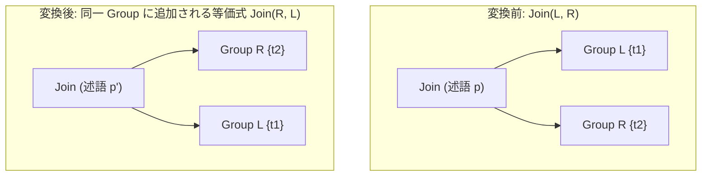

# join_commutativity

- 状態: draft / 執筆基準リビジョン: `3880673` (2026-09-12)
- 定義位置: `plan/cascades.cpp` の `RuleSet::Default()`(登録名 `"join_commutativity"`)

### 概要

`Join(L, R)` に対し、左右の入力を交換した等価式 `Join(R, L)` を同一 Group に追記する規則である。内側結合における左右の役割が入れ替わることで、後段の物理実装規則（`nested_loop_join` や `hash_join` など）において、どちらの入力を build 側（ハッシュ表構築側）とし、どちらを probe 側（探索側）とするかの選択肢が提供される。

## 変換前後の関係



Memo は追記型のデータ構造であるため、元の `Join(L, R)` は保持される。同一の Group 内に `Join(R, L)` が等価な選択肢として追加され、その後のコスト評価において両者の推定コストが比較される。

## 適用条件

パターンは `Join(Any("left"), Any("right"))` であり、子ノードを 2 つ持つ任意の `kJoin` 式に一致する。事前条件ガード（guard）は設定されていない。

```cpp
    built.Add(Rule(
        "join_commutativity", Join(Any("left"), Any("right")),
        [](const Bindings&, Memo& memo, GroupId group,
           const LogicalExpression& expression) {
          memo.AddExpression(group, memo.NewJoin(expression.children[1],
                                                 expression.children[0]));
        },
        LogicalOperator::kJoin));
```

この規則が実質的に新しい式を追加しないケースは以下の 2 通りに限られる。

1. Memo の登録上限（`expression_cap_`）に達し、`Memo::AddExpression` が追加を拒否した場合（縮退モードへの移行）。
2. 交換後の式が既存の式と指紋（fingerprint）一致した場合。左右が同一の Group を参照する自己結合 `Join(L, L)` では、交換後の指紋が元の式と同一になるため、`AddExpression` の指紋検査によって重複排除される。

## 意味論的根拠と述語の導出

事前条件ガードが存在しない理由は、内側結合（inner join）の交換操作が無条件に関係代数の恒等式 $L \bowtie R = R \bowtie L$ を満たし、行集合および重複度を完全に保存するためである。

実装上の注意点は、変換処理が元の式の述語を直接コピーしていない点である。ヘルパー関数 `memo.NewJoin`（`plan/cascades.cpp`）は、子グループの関係集合に基づいて適切な結合条件を再導出する。

```cpp
LogicalExpression Memo::NewJoin(GroupId left, GroupId right) const {
  LogicalExpression join{.operation = LogicalOperator::kJoin,
                         .children = {left, right}};
  const Expression condition = JoinConditionFor(Get(left), Get(right));
  if (condition) {
    join.predicate = condition;
  }
  return join;
}
```

`JoinConditionFor` は、左辺グループと右辺グループの境界をまたぐ連言述語のみを抽出して結合条件を構成する。したがって、左右を交換した場合でも、`t1.a = t2.b` のようなまたがり述語は自動的に新たな結合式へ付与される。述語の配置判断を一元化することで、木構造を組み替える規則が述語の移動や複製を誤る余地を排除している。

なお、本規則は `kOuterJoin`（外部結合）には適用されない。外部結合は一般に交換律が成立しないため（$L \text{ LOJ } R \neq R \text{ LOJ } L$）、左右交換には別途 `right_to_left_outer_join` による結合型の変換が要求される。

## 実装の詳細

規則の処理本体は `memo.AddExpression(group, memo.NewJoin(expression.children[1], expression.children[0]))` の呼び出しである。

1. **探索エンジンとの連携**: 探索エンジンのワークリストから Group 内の各大替式に対して順次規則が評価される。`expression.children` に格納された左右の子 GroupId を反転させて `NewJoin` に渡す。
2. **重複排除の動作**: `Memo::AddExpression` は式を追加する前に指紋を計算し、グループ内に既に同一指紋が存在する場合は登録を破棄する。

```cpp
  const std::string fingerprint = expression.Fingerprint();
  const bool duplicate =
      std::ranges::any_of(target.expressions, [&](const auto& existing) {
        return existing.Fingerprint() == fingerprint;
      });
```

自己結合のように交換後も構造が変わらない式はここで即座に破棄される。この重複破棄は探索の失敗ではなく正当な重複排除であるため、縮退フラグ（`degraded_`）を誘発しないよう設計されている。

## 最適化効果

本規則の適用により、対象 Group には元の順序と交換後の順序の双方が物理化候補として登録される。

- **ハッシュ結合におけるメモリ消費の抑制**: ハッシュ結合は一般に build 側の行数・データサイズに比例してメモリを消費する。左右の順序を選択可能にすることで、より行数の少ない関係を build 側に配置する物理計画を選択できる。
- **インデックス結合の適用可能性拡大**: インデックス走査を内側とする IndexJoin では、内側となる関係が適切なインデックスを保持している必要がある。交換によってインデックスを持つ関係を内側へ配置できる。

## 他の規則との相互作用

- `join_enumeration`: 関係集合のすべての 2 分割を列挙する規則である。列挙系が有効である場合、`join_commutativity` が生成する左右交換形は列挙結果と指紋重複し、重複排除される。
- `join_associativity_left` / `join_associativity_right`: 結合木の結合律に基づく回転規則である。これらの回転規則と `join_commutativity` を組み合わせることで、列挙規則を用いずに任意の結合順序を Memo 内で網羅できる。
- `join_to_cross_if_no_predicate`: 述語を持たない `kJoin` を `kCrossJoin` へ置き換える規則である。交換によって生成された式にもこの規則が伝播する。
- `right_to_left_outer_join`: 外部結合における左右交換を、演算子種別の変換を伴って安全に実現する。

## テスト

- `plan/cascades_test.cpp` の `DefaultRulesEnumerateEquivalentJoinTreesInMemo`
  — 3 表の Group を探索すると `ExpressionCount(root) >= 4` となり、
  元の順・交換した順の式が揃うことを検査します。
- `plan/cascades_test.cpp` の `AppliedRuleNamesTrackFiredRules` —
  `search.AppliedRuleNames().contains("join_commutativity")` で実際に
  発火したことを記録ベースで検査します。
- `plan/optimizer_test.cpp` の `JoinChainMatchesGoldenResultUnderRuleSubsets`
  — `join_commutativity` を含む 4 つの順序系 Rule を組み合わせで
  無効化しても結果行(golden)が変わらないことを検査します。
