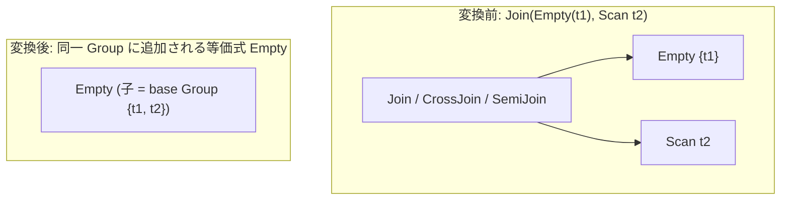

# join_empty_simplification

- 状態: draft / 執筆基準リビジョン: `3880673` (2026-09-12)
- 定義位置: `plan/cascades.cpp` の `RuleSet::Default()`（登録名 `"join_empty_simplification"`）

## 概要

`join_empty_simplification` は、入力子ノードのいずれかに空集合（`Empty`）を持つ結合演算を空集合 `Empty` へと簡約する論理変換Ruleです。

内側結合、クロス結合、半結合において、入力のいずれか一方が空集合（0行）であれば結果の組も恒等的に0行となります。一方、反結合（AntiJoin）においては、右側入力が空集合であっても左側入力の全行が生存するため、右入力が空の場合の発火を制限する安全ガードレールを備えています。

## 変換前後の関係

親グループの関係集合を維持した基本グループ（base Group）を生成し、その上に空集合演算子 `LogicalOperator::kEmpty` を配置した論理式を同一グループに追加します。



元の結合式は残存しますが、追加された `Empty` 式により物理実行フェーズで全入力の走査・評価を完全にバイパス可能となります。

## 適用条件

パターン照合には `Pattern::Any()` を使用し、変換ラムダ内で演算子種別および空状態の検査を行います。

```cpp
    built.Add(Rule(
        "join_empty_simplification", Pattern::Any(),
        [](const Bindings&, Memo& memo, GroupId group,
           const LogicalExpression& expression) {
          if (expression.operation != LogicalOperator::kJoin &&
              expression.operation != LogicalOperator::kCrossJoin &&
              expression.operation != LogicalOperator::kSemiJoin &&
              expression.operation != LogicalOperator::kAntiJoin) {
            return;
          }
          if (expression.children.size() < 2) {
            return;
          }
```

発火条件および非発火のガード条件は以下の通りです。

1. **対象演算子**: `LogicalOperator::kJoin`、`LogicalOperator::kCrossJoin`、`LogicalOperator::kSemiJoin`、`LogicalOperator::kAntiJoin` のいずれかであること（外部結合 `kOuterJoin` は対象外）。
2. **子ノード数**: 子グループ数が2以上であること。
3. **空集合の存在条件**:
   - 左側の子グループが `kEmpty` 式を持つ場合。
   - または、演算子が `kAntiJoin` **以外** であり、かつ右側の子グループが `kEmpty` 式を持つ場合。

   ```cpp
          if (is_empty(expression.children[0]) ||
              (expression.operation != LogicalOperator::kAntiJoin &&
               is_empty(expression.children[1]))) {
            const GroupId base = memo.EnsureGroup(memo.Get(group).relations);
            if (base != group) {
              memo.AddExpression(
                  group, LogicalExpression{.operation = LogicalOperator::kEmpty,
                                           .children = {base}});
            }
          }
   ```

4. **非循環性**: `EnsureGroup` によって返された `base` グループが `group` 自身でないこと（自己循環参照の防止）。

子グループが空集合であるかの判定 `is_empty` は、グループ内の各式の中に `LogicalOperator::kEmpty` が1つでも登録されているかを検証します。

## 意味論的根拠と多重度・代数的同値性

各結合演算子における空集合の吸収律は、以下のように代数学的に定義されます。

- **内側結合・クロス結合**: 出力行は左右の直積部分集合であるため、$|L \times R| = |L| \times |R| = 0$ となり、左右いずれかの空集合によって結果は必ず空集合となります。
- **半結合（$R \ltimes S$）**: 「$S$ にマッチする行が存在する $R$ の行」を出力するため、$R$ が空であれば 0 行、$S$ が空であればマッチ行が存在せず 0 行となり、双方の空集合を吸収します。
- **反結合（$R \triangleright S$）**: 「$S$ にマッチする行が存在**しない** $R$ の行」を出力します。したがって $R$ が空であれば 0 行ですが、$S$ が空の場合は $R$ の全行がそのまま出力されます。もし右側空集合で $R \triangleright \emptyset \to \emptyset$ と簡約すると、本来出力されるべき $R$ の行が消失し意味論が破綻します。そのため、右側空集合における簡約は厳格に除外されます。
- **左外部結合（LOJ）**: 右側が空集合であっても左側の行が NULL 補完されて出力されるため、結果は空集合になりません。本Ruleでは `kOuterJoin` を対象演算子から排除することで安全性を担保しています。

また、`base` グループを挟んで `Empty` を配置する理由は、親グループが保持する関係集合（Relations）のメタデータ整合性を損なわずに空集合を表現するためです（`Memo::AddExpression` の関係集合バリデーション契約）。

## 実装の詳細

本Ruleは空集合情報の伝播（propagation）を担います。

1. **空集合の起点**: `eliminate_false_selection`（定数 FALSE によるフィルタ空化）、`join_on_false_to_empty`（結合述語 FALSE による空化）等の先行Ruleが基底となる `kEmpty` 式を Memo 内に注入します。
2. **多段伝播**: `is_empty` 判定により子グループの `kEmpty` 式を検知すると、結合関係全体をカバーする `base` グループを `EnsureGroup` 経由で取得し、その直上に `kEmpty` 式を追加します。
3. **冪等性**: `Memo::AddExpression` は同一の演算子・子ノード構成を持つ式を自動的に重複排除（fingerprint 重複除外）するため、探索ループ内で同一の `Empty` 式が多重登録されることはありません。

## 最適化効果

本Ruleの適用により、以下の多大なコスト削減が達成されます。

- **不要な入力実行の完全除去**: 結合の対向入力がどれほど巨大なテーブルスキャンや複雑な集約サブクエリであっても、一切の物理実行がスキップされます。
- **上位演算子への空伝播**: 導出された `kEmpty` は、さらに上位の結合（`join_empty_simplification`）や集合演算（`setop_empty_simplification`）の入力となり、クエリツリー全体を根に向かって連鎖的に刈り取ります。

## 関連 Rule との相互作用

- `eliminate_false_selection` / `join_on_false_to_empty`: 空集合の起点となる式を生成する先行Ruleです。
- `setop_empty_simplification`: 集合演算において空集合入力を簡約する兄弟Ruleです。
- `one_row_cross_join_elimination`: 空集合ではなく「1行関係」を単位元として結合を除去するRuleです。

## 検証テスト

- `plan/cascades_test.cpp`:
  - `CascadesTest.JoinEmptySimplification`: 左入力グループに `kEmpty` を持つ `kJoin` 式を探索した際、結合グループ内に `kEmpty` 式が正しく追加されることを検証。
