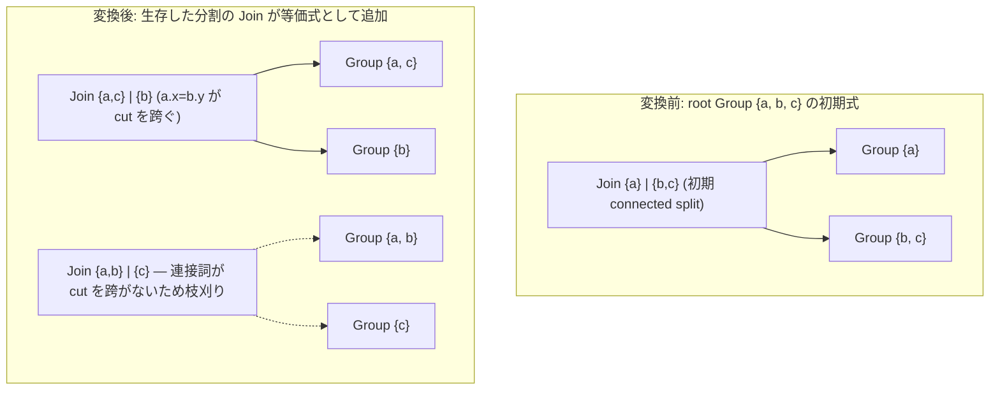

# join_enumeration

- 状態: draft / 執筆基準リビジョン: `3880673` (2026-09-12)
- 定義位置: `plan/cascades.cpp` の `RuleSet::Default()`（登録名 `"join_enumeration"`）

## 概要

`join_enumeration` は、Groupに属する関係集合のすべての二分割（bipartition）を生成し、`Join(左集合, 右集合)` を列挙する論理変換Ruleです。3表以上の結合において探索空間の大半を供給します。分割面（cut）を結合述語（連接詞）が跨がない純粋な直積分割は `CutConnected` により枝刈りし、16表を超える大規模結合では組合せ爆発を防ぐために列挙を停止します。

## 変換前後の関係

例として、3表 `{a, b, c}` を含むGroupに対し、連接詞 `a.x = b.y`（関係 `{a, b}` を参照）のみが存在する場合を取り上げます。このとき、分割面を連接詞が跨ぐ分割のみが等価式として追加されます。



## 適用条件

パターンは `Join()`（子ノード制約なしの任意結合）です。DSLの既定引数により `Join(Any(), Any())` と等価に扱われます。ガード条件は変換ラムダの冒頭で評価されます（`plan/cascades.cpp`）。

```cpp
          const std::vector<std::string> relations = memo.Get(group).relations;
          if (relations.size() < 3) {
            return;
          }
          // Fallback for very large joins: keep the initial connected-split
          // join order instead of walking 2^n bipartitions.
          if (relations.size() > kMaxJoinEnumerationRelations) {
            return;
          }
```

適用条件は以下の3点です。

1. **関係数が3以上**: 関係集合のサイズが2以下の場合は適用されません。2表の左右入替は `join_commutativity` が担当します。
2. **関係数が上限以下**: 関係数が `kMaxJoinEnumerationRelations`（定数値16）以下である必要があります。$2^{16}$ 通りのマスク走査と再帰的なグループ生成による探索空間の爆発を防ぎます。
3. **有効な二分割マスク**: 分割ループ内で、最下位ビットが立っていないマスク、片側が空集合となるマスク、および非連結なマスクはスキップされます。

## 意味論的根拠と刈り込み方針

16表上限は探索効率とメモリ消費を両立させる境界です。関係数 $N$ に対して二分割の組合せは $2^{N-1}$ 通り存在し、各分割で `EnsureGroup` が部分Groupを生成するため、16表を超える結合では列挙を行わず、貪欲法を用いる `greedy_join_order_fallback` に処理を委ねます。

最下位ビットが0のマスクをスキップする処理（`(mask & 1U) == 0`）は、二分割の対称性を利用した冗長性排除です。マスクとその補集合は左右を入れ替えた同一の二分割を表すため、最下位ビット（最初の関係）を常に左側に固定することで、`{a}|{b,c}` と `{b,c}|{a}` の一方のみを生成します。左右を反転させた形状は `join_commutativity` によって網羅されます。

分割面が連結かどうかの判定（`CutConnected` による枝刈り）は、探索空間の質を保つ重要な機構です（`plan/cascades.cpp`）。

```cpp
          const uint64_t within = memo.Get(group).relation_mask;
          // Phase 7: with a connected join graph, bipartitions whose cut is
          // not crossed by any conjunct are pure cross products and can be
          // pruned; a fully disconnected graph keeps exhaustive enumeration.
          const bool prune = !memo.JoinGraphDisconnected();
```

結合グラフ全体が連結である場合、分割面を跨ぐ連接詞が存在しない分割は実質的なクロス積（直積結合）となります。このような結合順序は一般にコストが高く、最適解となる可能性が低いため列挙から除外されます。ただし、クエリ自体に結合述語が存在しない非連結グラフの場合は、枝刈りを行うと計画が生成できなくなるため、すべての二分割を網羅的に列挙します。

## 実装の詳細

二分割を列挙するメインループは以下のとおりです（`plan/cascades.cpp`）。

```cpp
          const uint64_t limit = uint64_t{1} << relations.size();
          for (uint64_t mask = 1; mask + 1 < limit; ++mask) {
            if ((mask & 1U) == 0) {
              continue;
            }
            if (prune && !memo.CutConnected(mask, within)) {
              continue;
            }
```

`mask` の各ビットは、対応する関係を左側の子Groupに含めるかどうかを示します。0（左側が空）および全ビット点灯（右側が空）を除く範囲を走査します。

`Memo::CutConnected` は、登録済みの連接詞マスク集合（`conjunct_masks_`）のうち、左側と右側の双方にまたがる述語が1つ以上存在するかを検査します。

```cpp
bool Memo::CutConnected(uint64_t left_mask, uint64_t within_mask) const {
  const uint64_t right_mask = within_mask & ~left_mask;
  if (left_mask == 0 || right_mask == 0) {
    return false;
  }
  return std::ranges::any_of(
      conjunct_masks_, [left_mask, right_mask](uint64_t mask) {
        return (mask & left_mask) != 0 && (mask & right_mask) != 0;
      });
}
```

枝刈りを通過したマスクに対しては、左右の関係リストを構築してGroupを確保します。

```cpp
            std::vector<std::string> left;
            std::vector<std::string> right;
            for (size_t i = 0; i < relations.size(); ++i) {
              ((mask >> i) & 1U ? left : right).push_back(relations[i]);
            }
            if (left.empty() || right.empty()) {
              continue;
            }
            const GroupId left_group = memo.EnsureGroup(std::move(left));
            const GroupId right_group = memo.EnsureGroup(std::move(right));
            memo.AddExpression(group, memo.NewJoin(left_group, right_group));
```

`EnsureGroup` は関係の集合を一意キーとしてGroupを検索または生成するため、異なるマスクから同一の部分関係集合が得られた場合でも単一のGroupに統合されます。また `NewJoin` は、左右のGroup間にまたがる連接詞を `JoinConditionFor` により自動的に結合条件として付与します（第20章 20-6節）。

## 最適化効果

`join_enumeration` を適用することで、親Groupには分割面を跨ぐ連接詞を持つすべての二分割結合式が登録されます。左深木だけでなく右深木やブッシー木（bushy tree）の形状が1回の適用で網羅されるため、結合結合則（associativity）の多段適用を待つことなく多様なトポロジが即座に探索候補に入ります。これにより、コストベース探索において有望な計画への早期収束が可能になります。

## 関連Ruleとの相互作用

- `join_commutativity`: 左右反転の鏡像ペアを生成。メモへの登録時に指紋照合（`Expression::Fingerprint`）によって重複が排除されます。
- `join_associativity_left` / `join_associativity_right`: 部分Groupの内部で局所的な結合順序を組み替えます。`join_enumeration` が無効化された場合でも、結合則と交換則の組合せによって全順序を探索可能な冗長設計となっています。
- `greedy_join_order_fallback`: 16表を超える結合において、貪欲法により初期結合順序を補正します。
- `join_to_cross_if_no_predicate`: 連接詞を持たない結合に対し、物理実装のためのCrossJoin代替式を供給します。

## 検証テスト

- `plan/cascades_test.cpp`:
  - `JoinEnumerationPrunesDisconnectedBipartitions`: 連結グラフにおいて非連結な分割が枝刈りされ、非連結グラフでは網羅的に列挙されることを検証。
  - `AssociativityRulesEnumerateJoinOrdersWithoutEnumeration`: `join_enumeration` を除外した状態でも結合則により全結合順序が導出可能であることを検証。
  - `ExploreConvergesOnWideJoinGraphsWithoutPassCap`, `ExpressionCapDegradesGracefully`: 多表結合における探索収束性と式上限による縮退動作を検証。
- `plan/optimizer_test.cpp`:
  - `JoinChainMatchesGoldenResultUnderRuleSubsets`: 結合順序系Ruleの一部を無効化しても最終的な出力結果が一致することを検証。

