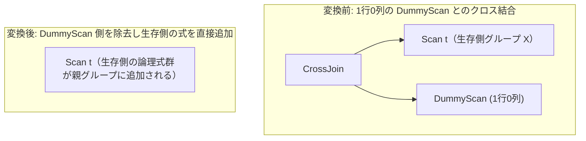

# join_identity_dummy

- 状態: draft / 執筆基準リビジョン: `3880673` (2026-09-12)
- 定義位置: `plan/cascades.cpp` の `RuleSet::Default()`（登録名 `"join_identity_dummy"`）

## 概要

`join_identity_dummy` は、クロス結合 `CrossJoin(X, DummyScan)` のいずれか一方の入力が `DummyScan`（1行0列の仮想リレーション）であるとき、結合演算を除去して対向側の入力 `X` の論理式で置き換える単位元除去Ruleです。

1行0列の仮想リレーションとの直積は行数・列数ともに元の関係 `X` を完全に保存するため、不要な結合処理オーバーヘッドを解消して直接 `X` を評価する代替案を提供します。

## 変換前後の関係

クロス結合演算子を取り除き、生存側グループが保持する各式を親グループに直接複製（インポート）します。



述語を持たない内部結合は先行する `join_to_cross_if_no_predicate` により `CrossJoin` 形式へと正規化されるため、本Ruleはクロス結合のパターンのみを対象とします。

## 適用条件

パターン照合には `CrossJoin(Any("left"), Any("right"))` を使用します。

```cpp
    // join_identity_dummy: CrossJoin(X, DummyScan) -> X. DummyScan yields
    // exactly one row with no columns, so the cross product preserves X
    // row-for-row (and symmetrically for a leading DummyScan). Inner joins
    // without a predicate reach this shape through
    // join_to_cross_if_no_predicate, so only the CrossJoin form is needed.
```

以下のガード条件をすべて満たす場合にのみ発火します。

1. **子ノード数**: 式が `LogicalOperator::kCrossJoin` であり、正確に2つの子ノードを持つこと。
2. **片側限定の DummyScan**: 左右の入力のうち**片方のみ**が `DummyScan` であること（`left_dummy == right_dummy` の場合は不発。XOR 条件）。
3. **関係集合の完全一致**: 生存側グループのリレーション集合が、親グループのリレーション集合と完全に等しいこと。
4. **非循環性の担保**: 生存側グループの各代替式のうち、子グループとして親グループ自身を参照する循環式は除外してインポートすること。

子グループが `DummyScan` であるかの判定は、グループ内の各式の中に `LogicalOperator::kDummyScan` が存在するかどうかを検証します。

```cpp
          const auto is_dummy = [&](GroupId id) {
            return std::ranges::any_of(memo.Get(id).expressions,
                                       [](const LogicalExpression& candidate) {
                                         return candidate.operation ==
                                                LogicalOperator::kDummyScan;
                                       });
          };
```

## 意味論的根拠と多重度・代数的同値性

`DummyScan` はスキーマが空（0列）かつ正確に1行のみを生成する仮想テーブルです。関係代数において、任意のテーブル $R$ と1行0列のリレーション $D_1$ の直積は以下の性質を持ちます。

$$R \times D_1 \equiv R$$

行の多重度（Multiplicity）に関して、$|R \times D_1| = |R| \times 1 = |R|$ であり、行数は厳密に保存されます。また属性に関しても $D_1$ は列を供給しないため、射影や出力スキーマの変質は生じません。

ガード条件の根拠は以下の通りです。

- **片側限定（XOR）**: 双方が `DummyScan` であるケースは、クエリ全体の基底ケースとして別個に処理されるか物理実行フェーズで評価されるため、相互再帰的な不正展開を回避すべく除外します。
- **関係集合の一致**: `DummyScan` がリレーションを持たない（空の relations）ことを前提としており、生存側の関係集合が親グループの関係集合を完全に網羅していることを確認してメモの整合性を保護します。
- **述語付き結合の除外**: 結合述語を持つ内部結合は、ダミー行に対しても述語評価が必要となるため本Ruleでは除去できません。述語のない内部結合のみが `join_to_cross_if_no_predicate` を経由して本Ruleに到達します。

## 実装の詳細

生存側グループ（`survivor`）内の各式を親グループ（`group`）へと複製します。

```cpp
          for (const LogicalExpression& alternative :
               memo.Get(survivor).expressions) {
            bool cycle = false;
            for (GroupId child : alternative.children) {
              if (child == group) {
                cycle = true;
                break;
              }
            }
            if (!cycle) {
              memo.AddExpression(group, alternative);
            }
          }
```

単一の代表式のみを生成するのではなく、生存側グループに既に登録されているすべての探索代替式（異なるスキャンパスや結合順序など）を一括して親グループに登録します。これにより、生存側で得られた最適化成果をそのまま親グループへ引き継ぎます。`Memo::AddExpression` の指紋による重複排除が働くため、冗長な登録コストは最小限に抑えられます。

## 最適化効果

本Ruleの適用により、以下のオーバーヘッドが完全に排除されます。

- **結合実行コストの完全消去**: ネステッドループ結合やハッシュ結合などの結合アルゴリズムの起動自体が不要となり、単一表アクセスと同等のコストへ低減します。
- **FROM なしクエリの最適化**: `SELECT 1 + 1` やスカラサブクエリの定数展開など、FROM 句を持たない問い合わせにおいて導入される `DummyScan` との結合が解消されます。

## 関連 Rule との相互作用

- `join_to_cross_if_no_predicate`: 述語のない内部結合をクロス結合へと正規化する先行Ruleです。本Ruleの入力形を準備します。
- `one_row_cross_join_elimination`: 属性列を持つ1行関係（定数テーブルや単一行集約結果）とのクロス結合を処理する上位Ruleです。
- `dummy_scan`（実装Rule）: 除去されずに残った `DummyScan` を物理実行オペレータへと具体化します。

## 検証テスト

- `plan/cascades_test.cpp`:
  - `CascadesTest.JoinIdentityDummyEliminatesDummySide`: 片側が `DummyScan` であるクロス結合を探索した際、DummyScan 側が除去され生存側の式が親グループに追加されることを検証。
  - `CascadesTest.OptimizeWithoutFromUsesDummyScanForConstantProjection`: FROM 句のないクエリにおいて DummyScan を用いた最適化が正常に機能することを検証。
