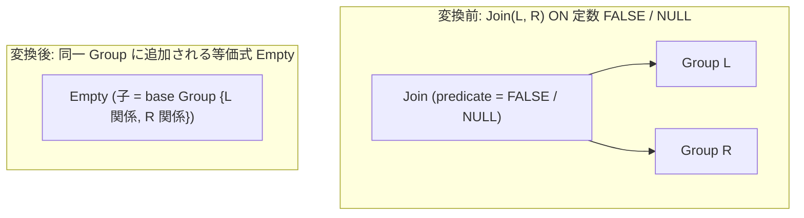

# join_on_false_to_empty

- 状態: draft / 執筆基準リビジョン: `3880673` (2026-09-12)
- 定義位置: `plan/cascades.cpp` の `RuleSet::Default()`（登録名 `"join_on_false_to_empty"`）

## 概要

`join_on_false_to_empty` は、結合述語が定数 FALSE または NULL である内部結合 `Join(L, R, FALSE/NULL)` を空集合 `Empty` へと置き換える等価式をグループに追加する論理変換Ruleです。

結合述語が恒偽である場合、結合結果の組が1行も生成されないことが証明されるため、左右双方の入力走査・結合評価を完全にバイパスできます。メモ内の関係集合（Relations）の整合性を維持するため、親グループと同一の関係集合を持つ基本グループ（base Group）を生成し、その直上に `Empty` を配置します。

## 変換前後の関係

親グループ内に、同一の関係集合を網羅する空集合の等価式を追加します。



元の結合式は残存しますが、コスト評価において `Empty` 代替式が選択されることで、実行時に入力テーブルのスキャンや結合処理が一切行われません。

## 適用条件

パターン照合には `Join(Any("left"), Any("right"))` を用い、対象演算子は `LogicalOperator::kJoin` です。述語を持たない `kCrossJoin` はパターンレベルで除外されます。

```cpp
    // join_on_false_to_empty: Join(L, R, FALSE/NULL predicate) -> Empty.
    // When the join predicate is a constant FALSE or NULL, no rows can match.
    // The empty alternative preserves the group's relation set (a Limit over
    // the left child alone would fail relation validation and drop the right
    // side's schema).
    built.Add(Rule(
        "join_on_false_to_empty", Join(Any("left"), Any("right")),
        [](const Bindings&, Memo& memo, GroupId group,
           const LogicalExpression& expression) {
          if (!expression.predicate) {
            return;
          }
          const Expression pred = *expression.predicate;
          if (pred->Type() != TypeTag::kConstantValue) {
            return;
          }
          const Value val = pred->AsConstantValue().GetValue();
          if (!val.IsNull() && val.Truthy()) {
            return;
          }
          // Predicate is FALSE or NULL: the join yields no rows.
          const GroupId base = memo.EnsureGroup(memo.Get(group).relations);
          if (base == group) {
            return;
          }
          memo.AddExpression(
              group, LogicalExpression{.operation = LogicalOperator::kEmpty,
                                       .children = {base}});
        },
        LogicalOperator::kJoin));
```

発火条件および非発火のガード条件は以下の通りです。

1. **述語の存在**: 有効な結合述語を持つこと。
2. **定数式の要求**: 述語が単一の定数リテラル（`TypeTag::kConstantValue`）であること。
3. **三値論理における非真条件**: 定数値が NULL であるか、または偽（`!val.Truthy()`）であること。真（TRUE）の定数は除外されます。
4. **非循環性**: `EnsureGroup` で取得した `base` グループが親グループ自身でないこと（`base != group`）。

## 意味論的根拠と三値論理・代数的一致

関係代数の内部結合 $L \bowtie_p R$ において、出力行は述語 $p$ を真（TRUE）と評価する行ペアの集合です。SQL の三値論理（Three-Valued Logic）において、述語が定数 FALSE または定数 NULL（UNKNOWN）に評価される場合、真となるペアは存在しません。したがって、結果行数は厳密に 0 行となり、空集合 `Empty` への置換は完全に意味論を保存します。

定数値が真（TRUE）の場合を除外する理由は、真の結合条件はクロス積（$|L| \times |R|$ 行）と等価であり、空集合への縮約を行うと結果行が消失して意味論が壊れるためです。

また、`base` グループを新設して `Empty` の子ノードとする設計は、メモ構造における関係集合（Relations）の検証契約を満たすための必然的な措置です。初期実装では左入力に `Limit(0)` を掛ける手法が試みられましたが、親グループが保持すべき右入力側のリレーション情報が欠落し、`Memo::AddExpression` の関係集合バリデーションで弾かれる欠陥が生じました。現行の実装では、親グループと同一の関係集合を持つ `base` を確保することで、スキーマ整合性を維持したまま安全に空集合を表現します。

## 実装の詳細

変換ラムダは以下の手順で進行します。

1. **定数値の判定**: `val.IsNull() || !val.Truthy()` により、FALSE または NULL を厳格に判定します。
2. **基底グループの確保**: `memo.EnsureGroup(memo.Get(group).relations)` を呼び出し、親グループと同一のリレーション集合をキーとする `base` グループを取得します。
3. **循環参照の遮断**: `base == group` の場合、自らを子ノードとする自己参照式が生成されて無限ループを引き起こすため、早期リターンにより処理を中断します。
4. **論理式の登録**: `children = {base}` を設定した `kEmpty` 式を親グループに追加します。

## 最適化効果

本Ruleの適用により、以下の最適化が行われます。

- **結合処理および全テーブルアクセスの省略**: 結合述語が恒偽である場合、左右双方のテーブル走査やインデックス探索、ハッシュ表構築などの処理がすべて不要となります。
- **式書き換えとの協調**: `JOIN ON 1 = 2` のような明示的な偽条件だけでなく、式書き換え層（`expression/rewrite.cpp`）の定数畳み込みによって ON 句が `FALSE` に縮約されたクエリに対しても発火し、不要な計算を根本から排除します。

## 関連 Rule との相互作用

- `eliminate_false_selection`: Selection 演算子において定数 FALSE/NULL を空集合へ簡約する対照的なRuleです。
- `join_empty_simplification`: 本Ruleが導入した `kEmpty` 式を検知し、上位の結合ツリーへ空集合を連鎖伝播させる後続Ruleです。
- `setop_empty_simplification`: 集合演算において空集合を処理するRuleであり、同一の `base` グループ生成設計を共有します。

## 検証テスト

- `plan/cascades_test.cpp`:
  - `CascadesTest.JoinOnFalseToEmptyPreservesRelationSet`: 述語定数 `0`（偽）を持つ2表結合を探索した際、親グループに関係集合を保持した `kEmpty` 式が正しく追加されることを検証。
