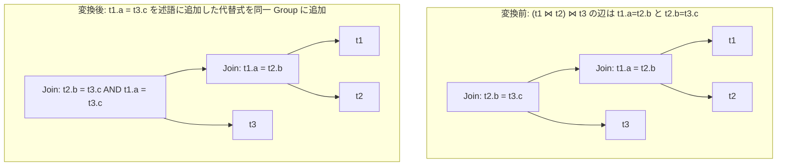

# join_predicate_transitivity

- 状態: draft / 執筆基準リビジョン: `3880673` (2026-09-12)
- 定義位置: `plan/cascades.cpp` の `RuleSet::Default()`（登録式。変換はラムダ内で完結）

## 概要

`join_predicate_transitivity` は、結合述語に含まれる「列 = 列」の等式条件群に対し、推移律（transitivity）を適用して新たな等式結合条件を演繹・導出する論理変換Ruleです。

例えば、`t1.a = t2.b` かつ `t2.b = t3.c` であるとき、推移律より `t1.a = t3.c` を導出し、結合述語の連言集合へ追加します。これにより、多表結合グラフにおける潜在的な結合辺（join edge）を補完し、任意の2表ペアを直接結合する新たな結合順序の探索を可能にします。

## 変換前後の関係

同一グループ内に、推移律によって導出された等式述語を追加した新たな結合論理式を登録します。



元の結合式も保持されるため、探索エンジンは推移等式を評価に含めるか否かをコストに基づいて選択できます。

## 適用条件

パターン照合は `Join()` であり、対象演算子は `LogicalOperator::kJoin` です。

変換ラムダ内で以下の条件を順次評価します。

1. **述語の存在**: 結合ノードが有効な結合述語を持つこと。
2. **列対列等式の抽出**: 述語の連言から、両辺が `TypeTag::kColumnValue` である等号式（`BinaryOperation::kEquals`）を抽出する。
3. **等式数の下限**: 抽出された等式が2本以上存在すること（`equalities.size() < 2` の場合は不発）。
4. **推移対の成立**: 順序対の中で共通列を共有し、かつ自己ループ（`a1 == b2` 等の自明な恒真等式）にならない4通りの組み合わせを検出すること。
5. **異リレーション間の制約**: 導出候補の左右の列が、互いに異なるスキーマ名（リレーション名）を持つこと（`first.schema != second.schema`）。
6. **未登録性**: 導出候補の等式（およびその左右反転式）が、既存および追加済みの連言集合内に文字列レベルで存在しないこと。

```cpp
          if (equalities.size() < 2) {
            return;
          }
```

## 意味論的根拠と代数的一致

本変換の健全性は、等号関係の推移律（$A = B \land B = C \implies A = C$）および関係代数の選択連言の同値性に基づきます。

内部結合の出力行は、すべての結合連言を真（TRUE）とする行ペアから構成されます。三値論理において、いずれかの等式が UNKNOWN（NULL 含む）または FALSE となる行は出力から除外されます。したがって、`t1.a = t2.b` と `t2.b = t3.c` を共に満たす行において、`t1.a = t3.c` は必然的に成立します。追加される等式は、既に除外対象である行以外を削ることはなく、行集合の意味的一致性が厳密に保たれます。

各ガード条件の根拠は以下の通りです。

- **非定数列への限定**: 定数を含む等式（`t1.a = 1`）からの推論は `infer_join_predicates` の専任領域であり、結合述語の列対列に限定して処理を重複させません。
- **異リレーション制約（`first.schema != second.schema`）**: 単一リレーション内の列同士の等式（`t1.a = t1.c`）は単一表スキャンフィルタの領域であり、結合グラフの結合辺を補完する本Ruleの目的から外れるため保守的に除外します。
- **自明等式の排除**: `t1.a = t1.a` のような冗長な自己等式の生成を論理式検査で排除します。

## 実装の詳細

推論された等式は、同一グループに登録される新しい結合式の述語へ合流されます。

```cpp
          if (added) {
            LogicalExpression rewritten = expression;
            rewritten.predicate =
                CanonicalizeConjuncts(CombineConjuncts(new_conjuncts));
            memo.AddExpression(group, std::move(rewritten));
          }
```

1. **4通りの接続パターンの網羅**: `(a1 = b1)` と `(a2 = b2)` に対し、共有列が左右のどの位置にあっても正しく接続できるように 4 つの条件分岐を評価します。

   ```cpp
              if (b1 == a2 && a1 != b2) {
                inferred = {a1, b2};
              } else if (b1 == b2 && a1 != a2) {
                inferred = {a1, a2};
              } else if (a1 == a2 && b1 != b2) {
                inferred = {b1, b2};
              } else if (a1 == b2 && b1 != a2) {
                inferred = {b1, a2};
              }
   ```

2. **重複排除と正規化**: 新たに導出された等式は既存連言と照合され、重複がなければ `CombineConjuncts` で結合された後、`CanonicalizeConjuncts` によってソート・重複排除・矛盾検出が行われます。
3. **論理式の複製**: 元の結合式の子グループおよびスキーマ情報を完全に引き継ぎつつ、`predicate` のみを更新して親グループへ追加します。

## 最適化効果

推移律による結合辺の補完は、多表結合最適化において極めて重要な効果をもたらします。

- **直積（Cross Product）結合の回避**: 本来間接的にしか結ばれていなかった表対（例: `t1` と `t3`）に直接の結合述語が付与されるため、結合順序探索（`join_enumeration` や `join_associativity_*`）において、直積を介さない中間結合木 `(t1 ⋈ t3)` を安全に列挙可能となります。
- **結合物理アルゴリズムの解放**: ハッシュ結合やマージ結合は等値キーの存在を前提とします。辺の補完により、直積ネステッドループ結合しか選択できなかった組み合わせに対してハッシュ結合が適用可能となります。

## 関連 Rule との相互作用

- `infer_join_predicates`: 定数等式からの推論を担当する姉妹Ruleです。
- `inferred_inequality_pushdown`: 本Ruleによって伸長された等式鎖を経由して、不等号条件を他表へプッシュダウンします。
- `redundant_join_predicate_elimination`: 推移閉包の形成により冗長となった結合等式を整理・削除する逆方向のRuleです。
- `join_enumeration`: 本Ruleが提供する補完された結合述語を利用して、最適な結合順序を探索します。

## 検証テスト

- `plan/cascades_test.cpp`:
  - `CascadesTest.JoinPredicateTransitivity`: `t1.a = t2.b` および `t2.b = t3.c` を持つ結合式から、親グループ内に `t1.a = t3.c` を含む代替式が生成されることを検証。
