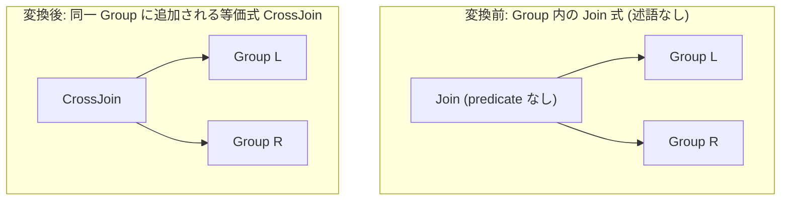

# join_to_cross_if_no_predicate

- 状態: draft / 執筆基準リビジョン: `3880673` (2026-09-12)
- 定義位置: `plan/cascades.cpp` の `RuleSet::Default()`（登録名 `"join_to_cross_if_no_predicate"`）

## 概要

`join_to_cross_if_no_predicate` は、結合述語を持たない内部結合 `Join(L, R)` を、同一の子ノードを持つクロス結合 `CrossJoin(L, R)` に型付けした等価式を生成する論理変換Ruleです。

関係代数において結合述語が存在しない内部結合は直積（Cartesian Product）と完全に一致します。これを論理計画段階で `kCrossJoin` として明示化することにより、物理計画探索においてクロス積専用の実行アルゴリズム（`cross_join`）および正確なコストモデルの適用を可能にします。

## 変換前後の関係

親グループ内に、同一の子グループを参照する `LogicalOperator::kCrossJoin` 式を追加します。



元の `kJoin` 式と新たに生成された `kCrossJoin` 式が同一グループに共存し、探索空間が正規化されます。

## 適用条件

パターン照合には `Join(Any("left"), Any("right"))` を使用し、対象演算子は `LogicalOperator::kJoin` です。

```cpp
    built.Add(Rule(
        "join_to_cross_if_no_predicate", Join(Any("left"), Any("right")),
        [](const Bindings& bindings, Memo& memo, GroupId group,
           const LogicalExpression& expression) {
          if (expression.predicate) {
            return;
          }
          memo.AddExpression(
              group, LogicalExpression{.operation = LogicalOperator::kCrossJoin,
                                       .children = {bindings.at("left"),
                                                    bindings.at("right")}});
        },
        LogicalOperator::kJoin));
```

発火条件は以下の1点のみです。

1. **結合述語の不在**: 式が有効な述語（`expression.predicate`）を**持たない**こと。

述語が1つでも存在する場合、早期リターンにより発火が完全に遮断されます。

## 意味論的根拠と代数的一致

関係代数の定義により、述語 $p$ を伴わない内部結合は直積そのものです。

$$L \bowtie_{\text{true}} R \equiv L \times R$$

ガード条件 `if (expression.predicate) return;` の必要性は極めて明確です。もし述語を持つ内部結合 `Join(L, R, p)` を誤って `CrossJoin(L, R)` へ変換した場合、フィルタ条件 $p$ の評価点が消失し、出力行数が $|L \bowtie_p R|$ から $|L| \times |R|$ へと激増してクエリの意味論が破綻します。

述語を持たない `kJoin` 式は、以下のようなケースでメモ内に生成されます。

- クエリパーサーが `FROM t1, t2` のように WHERE 句を持たない非連結な関係を分解した初期論理木。
- `join_enumeration` が非連結な結合グラフにおいて網羅列挙にフォールバックした際。

なお、`JOIN ON TRUE` のように恒真述語が明示的に付与されている場合、述語オブジェクトが存在する限り本Ruleは発火しません（式書き換え層による述語除去との役割分担）。

## 実装の詳細

変換ラムダは極めて簡潔であり、述語の不在を確認した後、`LogicalOperator::kCrossJoin` を設定した論理式を親グループへ登録します。

- **子ノードの継承**: `bindings.at("left")` および `bindings.at("right")` をそのまま子ノード配列に設定します。
- **メタデータの整合性**: `kCrossJoin` は `kJoin` と同様に2入力演算子として定義されており、左右の子グループが構成する関係集合の和が親グループと厳密に一致するため、`Memo::AddExpression` の関係集合バリデーションを無条件に通過します。

## 最適化効果

本Ruleの適用により、以下の探索上のメリットが得られます。

- **専用物理オペレータの選択**: `kJoin` は通常ハッシュ結合やマージ結合、インデックス結合などの等値キーを前提とする実装Ruleの対象となります。述語が存在しない結合に対してハッシュ結合アルゴリズムを試行することは無駄であり、`kCrossJoin` に型付けされることで直積専用オペレータ（`cross_join`）へ直接誘導されます。
- **コスト計算の正確化と早期枝刈り**: 直積のカーディナリティは入力行数の積算（$|L| \times |R|$）として正確に見積もられるため、コストベース探索において非効率な直積結合プランが即座にペナルティを受け、適切な枝刈りが行われます。

## 関連 Rule との相互作用

- `cross_to_inner_with_predicate`: 上位の選択演算を直積と結合して内部結合へ戻す逆方向のRuleです（`Selection(CrossJoin(L, R), p) -> Join(L, R, p)`）。
- `join_identity_dummy`: 本Ruleによって生成された `kCrossJoin` の片側が `DummyScan` である場合に、結合そのものを除去します。
- `join_commutativity`: 交換された `kJoin` 式に対しても本Ruleが適用されるため、直積関係に対して順序2通り × 演算子型2種の計4代替がメモ内で網羅されます。

## 検証テスト

- `plan/cascades_test.cpp`:
  - `CascadesTest.RuleCanBeRemovedWithoutOptimizerChanges`: 結合列挙等を抑制した環境で、本Ruleによって root グループにクロス結合代替が生成されることを検証。
  - `CascadesTest.DefaultRulesIncludePredicateAndProjectionTransforms`: 既定の RuleSet に `join_to_cross_if_no_predicate` が登録されていることを検証。
- `plan/optimizer_test.cpp`:
  - `OptimizerTest.UnqualifiedJoinBecomesExplicitCrossJoin`: 修飾なし結合クエリが最終的に Cross Join 物理実装を選択することをエンドツーエンドで検証。
