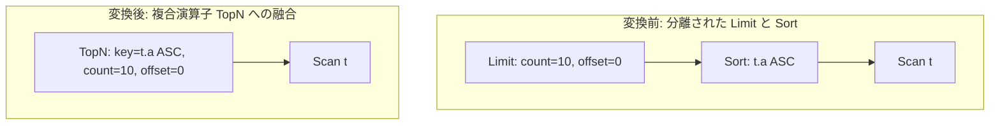

# limit_push_through_sort

- 状態: draft   /   執筆基準リビジョン: `3880673` (2026-09-12)
- 定義位置: `plan/cascades.cpp` の `RuleSet::Default()`（登録名 `"limit_push_through_sort"`）

## 概要

ソート演算の上に位置する行数制限 $\text{Limit}(\text{Sort}(X))$ を単一の $\text{TopN}(X)$ 演算子へと融合（fuse）する論理 Rule です。

行数制限をソート演算子の入力側へ押し込むことは意味論の破綻（ソート前の任意の $N$ 行に対するソートへの変質）を招くため、代数的な下位押し込みではなく、全順序ソートと行数制限を兼ね備えた複合演算子 TopN への置換として安全に定義されています。

## 変換前後の関係



## 適用条件

パターンは `Limit(Sort(Any(), "sort"))` であり、ルートが `kLimit` ノードであることを検査します（`plan/cascades.cpp`）。

```cpp
    // limit_push_through_sort: Limit(Sort(X)) -> TopN(X).  LIMIT n OVER
    // ORDER BY means "the n smallest"; a Limit pushed BELOW the sort would
    // instead mean "sort an arbitrary n input rows" -- a cheaper but WRONG
    // plan the cost model would prefer.  TopN is the sound fusion, so the
    // rule now only ever produces that.  OFFSET cannot be pushed below the
    // sort (it must skip post-sort rows), so offset != 0 does not fire.
```

適用判定（guard）は以下の条件により構成されます。

1. **オフセット不在および有限カウント**: `limit_count > 0` かつ `limit_offset == 0` であること。
   ```cpp
   if (expression.limit_count == 0 || expression.limit_offset != 0) {
     return;
   }
   ```
2. **ソートノードの適合性**: 子グループ内の論理式が `kSort` であり、単一の子を持ち、かつその子が現在のグループ自身を指していないこと（`sort.children[0] != group` による自己参照防止）。

## 意味論的根拠と押し込み禁止の理由

### 1. 意味論の保存と不健全な押し込みの排除
SQL における `ORDER BY ... LIMIT n` は「ソート順序における最小（または最大）の $n$ 行」を取得する仕様です。

もし Limit を Sort の下流へ単に押し込んだ場合、式は $\text{Sort}(\text{Limit}_n(X))$ となり、「入力関係 $X$ から任意に選ばれた $n$ 行を取り出してソートする」意味へと変質します。これは計算量が小さいためコストモデルが誤って選択しやすい極めて危険な不正プランです。したがって、下位押し込みではなく、順序付けされた上位 $n$ 件のみを抽出する代数演算子 $\text{TopN}$ への融合のみが正当化されます。

### 2. OFFSET の分離性
$\text{OFFSET } m$ は「ソート順序確定後の先頭 $m$ 行をスキップする」操作であり、ソート前に入力タプルをスキップすることは不可能です。現行の $\text{TopN}$ 物理実装（優先度付きキューによる $k$-選択）はオフセットを含まない先頭 $n$ 行の抽出に特化しているため、`offset != 0` の場合は本 Rule の発火を抑止し、ソート後のストリームに対する明示的な `Limit` 演算子として維持します。

## 実装の詳細

ソート演算子のソートキー配列（`target_list`）、昇順フラグ（`sort_ascending`）、NULL 配置方針（`sort_nulls_first`）、および出力スキーマを完全に複製して $\text{TopN}$ ノードを構成します。

```cpp
            memo.AddExpression(
                group,
                LogicalExpression{.operation = LogicalOperator::kTopN,
                                  .children = sort.children,
                                  .target_list = sort.target_list,
                                  .sort_ascending = sort.sort_ascending,
                                  .sort_nulls_first = sort.sort_nulls_first,
                                  .limit_count = expression.limit_count,
                                  .limit_offset = 0,
                                  .output_schema = sort.output_schema});
            return;
```

変換後のノードはソートの子グループ（`sort.children`）に直接接続され、中間の一時ソートノードは計画からバイパスされます。

## 最適化効果

- **計算量削減**: 全データソートの計算量 $O(N \log N)$ が、サイズ $k = \text{count}$ の有界ヒープを用いた $O(N \log k)$ へ削減されます。
- **メモリ消費量削減**: 全タプルをバッファリングするソートバッファ（外部ソートを含む）が不要となり、メモリフットプリントが上限 $k$ タプルに制限されます。

## 関連 Rule との相互作用

- `push_filter_through_sort`: 行選択フィルタはソートと可換であるため先行して押し込まれますが、本 Rule はソートと行数制限の融合を担います。
- `topn_push_through_projection`: 融合によって生成された $\text{TopN}$ ノードは、さらに下層の射影ノードを越えて押し込むことが可能です。
- `eliminate_double_sort`: TopN 化されずに残存した完全ソートノードの重複除去を担います。

## 検証テスト

`plan/cascades_test.cpp` にて以下の動作が検証されています。

- `CascadesTest.LimitPushThroughSortKeepsOffsetOnTop`:
  `OFFSET > 0` を含むクエリにおいて、誤った下位押し込みが発生せず、ソート後に Limit 演算子が保持されることを確認します。
