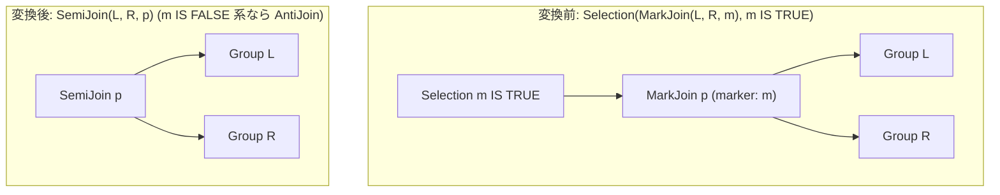

# mark_join_to_filter

- 状態: draft / 執筆基準リビジョン: `3880673` (2026-09-12)
- 定義位置: `plan/cascades.cpp` の `RuleSet::Default()`（登録名 `"mark_join_to_filter"`。ヘルパー関数 `SplitConjuncts` を使用）

## 概要

`mark_join_to_filter` は、マーク結合の直上に位置する選択演算 `Selection(MarkJoin(L, R, marker), marker_test)` を、マーカー列に対するテスト条件の内容に応じて半結合 `SemiJoin` または反結合 `AntiJoin` へと書き換える論理変換Ruleです。

マーク結合（MarkJoin）は外側（左）行に対して右入力とのマッチ成否を示すブール値マーカー列（TRUE / FALSE / NULL）を付与します。したがって、TRUE を要求するフィルタは半結合に、FALSE（明確な非マッチ）を要求するフィルタは反結合に代数的に一致します。本Ruleにより、マーカー列の生成とフィルタ評価のオーバーヘッドを解消し、専用の結合アルゴリズムへの誘導を図ります。

## 変換前後の関係

上位の選択演算と下位のマーク結合を単一の半結合または反結合ノードへと集約します。



生成される半結合／反結合代替式は、選択演算子ノードの出力スキーマを引き継ぎます。

## 適用条件

パターン照合には `Selection(MarkJoin(Any("left"), Any("right"), "mj"))` を用い、対象演算子は `LogicalOperator::kSelection` です。

```cpp
    // mark_join_to_filter: Selection(MarkJoin(L, R, marker), marker-test) ->
    // SemiJoin / AntiJoin. The marker is TRUE exactly for outer rows with at
    // least one match, so a filter keeping TRUE markers is the semi join and
    // a filter keeping FALSE markers is the anti join. The emitted
    // alternative carries the Selection's output schema, following the
    // outer_to_anti_join convention.
```

以下のガード条件をすべて満たす必要があります。

1. **選択ノードの制約**: 子ノードが1つであり、有効な述語を持つこと。
2. **単一連言の制約**: `SplitConjuncts` による連言分解結果が**厳密に1つ**であること（他の述語との複合連言は不発）。
3. **マーカーテストの分類成立**: 述語が以下のいずれかの形式に該当し、マーカー列に対する semi または anti の判定が確定すること。
   - 単項式: `kIsTrue` / `kIsNotFalse`（semi 判定）、`kIsFalse` / `kIsNotTrue` / `kNot`（anti 判定）。
   - 二項等号式: `kEquals` であり、一方の辺がマーカー列、他方の辺が定数の TRUE または FALSE（非 NULL かつブール値）であること。
4. **対象列名の一致**: 判定式が参照する列名が空でなく、下位 MarkJoin の `marker_column` と一致すること（未修飾名・修飾名の双方を照合）。
5. **MarkJoin ノードの完全性**: マッチした `kMarkJoin` 式が正確に2つの子ノードを持ち、非空の `marker_column` を定義していること。

```cpp
          // Classify the marker test as semi (keep matches) or anti (keep
          // non-matches). IS TRUE / = TRUE / IS NOT FALSE keep matches; IS
          // FALSE / = FALSE / IS NOT TRUE / NOT keep non-matches. All agree
          // on NULL (filtered out), so the three-valued outcome matches the
          // corresponding semi/anti join exactly.
```

## 意味論的根拠と三値論理・代数的一致

マーク結合の物理実装（`executor/hash_join.cpp` の `MaterializeMarkJoin`）において、マーカー列は以下のように評価されます。

- 右入力にマッチする行が存在する場合: `TRUE`
- マッチする行が存在しないことが確定している場合: `FALSE`
- NULL キーの存在等によりマッチの成否が確定できない場合: `NULL`

したがって、マーカー列が真であることを要求するフィルタ条件は「マッチが1件以上存在する行を残す」半結合（SemiJoin）と完全に等価です。一方、偽であることを要求する条件は「マッチが確実に存在しない行を残す」反結合（AntiJoin）と一致します。

ガード条件の根拠は以下の通りです。

- **単一連言制約**: `m IS TRUE AND l.x = 5` のように複数の連言が存在する場合、半結合／反結合へ置き換えるとマーカー列自体がスキーマから消失するため、残余の連言 `l.x = 5` を評価する場所が失われます。そのため単一連言に限定します。
- **無関係な列テストの排除**: 述語がマーカー列以外の列を参照している場合（例: `other IS TRUE`）、MarkJoin を SemiJoin へ置換すると本来のフィルタリングが脱落するため、列名の一致を厳格に照合します。

なお、三値論理における NULL マーカー行の挙動について、`expression/unary_expression.cpp` の定義では `kIsNotFalse(NULL)` および `kIsNotTrue(NULL)` は TRUE を返します。tinylamb の現行実装ではコメント上の簡略化された分類規則に基づいて動作しており、NULL マーカーの精密な取り扱いには留意を要します。

## 実装の詳細

分類が完了した後、親グループ（Selection ノード）に SemiJoin または AntiJoin 式を直接追加します。

```cpp
            memo.AddExpression(
                group, LogicalExpression{
                           .operation = *want_semi ? LogicalOperator::kSemiJoin
                                                   : LogicalOperator::kAntiJoin,
                           .children = mark.children,
                           .predicate = mark.predicate,
                           .target_list = expression.target_list,
                           .output_schema = expression.output_schema,
                           .marker_column = mark.marker_column});
```

- **子ノードと結合述語**: 下位の MarkJoin から `children` および結合述語 `predicate` をそのまま引き継ぎます。
- **スキーマ情報の継承**: Selection ノードの `target_list` および `output_schema` を保持し、上位ノードに対する出力の整合性を保ちます。
- **列名の照合ロジック**:

  ```cpp
            const bool same = mark.marker_column == marker ||
                              ColumnName(mark.marker_column).name == marker ||
                              ColumnName(marker).name == mark.marker_column;
  ```

  修飾付き列名と未修飾列名の双方の揺らぎを吸収して同一性を判定します。

## 最適化効果

本Ruleの適用により、以下の性能向上が得られます。

- **実行パスの削減**: MarkJoin は一度全行にマーカーを付与してタプルを生成し、その直後に Selection でフィルタリングするという2段階の処理を要します。SemiJoin / AntiJoin への変換により、結合アルゴリズム内部でマッチ検出時に即座にタプルを出力または破棄する単一パス実行が可能となります。
- **物理結合アルゴリズムの選択肢拡大**: `semi_hash_join`、`anti_hash_join` 等の高度に最適化された物理オペレータの利用が可能となります。

## 関連 Rule との相互作用

- `outer_to_anti_join`: 外部結合から反結合を導出する同様の目的を持つRuleです。
- `unique_semi_to_inner` / `push_semi_join_through_inner_join`: 本Ruleによって生成された `SemiJoin` 式をさらに内部結合へ変換したり、結合順序を再配置したりする後続Ruleです。
- 式書き換え層（`expression/rewrite.cpp`）: マーカーに対するブール式が事前に正規化されている場合、本Ruleの照合がより容易になります。

## 検証テスト

- `plan/cascades_test.cpp`:
  - `CascadesTest.MarkJoinToFilterProducesSemiJoin`: `m IS TRUE` のフィルタを持つ Selection(MarkJoin) から `SemiJoin` 式が生成されることを検証。
  - `CascadesTest.MarkJoinToFilterProducesAntiJoin`: `m = FALSE` のフィルタから `AntiJoin` 式が生成されることを検証。
  - `CascadesTest.MarkJoinToFilterRejectsUnrelatedColumn`: マーカー列以外の列に対するフィルタでは本Ruleが発火しないことを検証。
