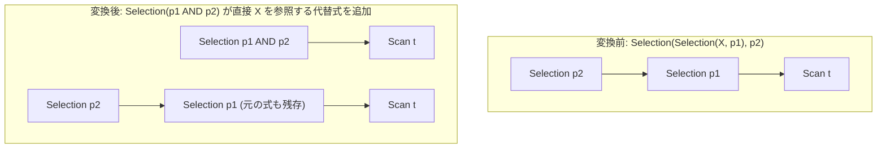

# merge_adjacent_filters

- 状態: draft / 執筆基準リビジョン: `3880673` (2026-09-12)
- 定義位置: `plan/cascades.cpp` の `RuleSet::Default()`（登録名 `"merge_adjacent_filters"`。ヘルパー関数 `CanonicalizeConjuncts` を使用）

## 概要

`merge_adjacent_filters` は、隣接する2段の選択演算 `Selection(Selection(X, p1), p2)` を検知し、内側の選択ノードをバイパスして孫ノード `X` に直接接続した単一の選択演算 `Selection(X, p1 AND p2)` を等価代替式として追加する論理変換Ruleです。

`merge_selections` と同一のトポロジにマッチしますが、内側グループを挟むのではなく孫グループへと直接リンクを張り直す（flattening）点に構造上の特徴があります。

## 変換前後の関係

親グループ内に、内側ノードを介さず直接入力 `X` を参照する合成選択ノードを追加します。



元の多段式もメモ内に保持され、探索エンジンがコスト比較を行います。

## 適用条件

パターン照合には `Selection(Selection(Any(), "inner"))` を用い、対象演算子は `LogicalOperator::kSelection` です。

```cpp
          for (const LogicalExpression& inner : inner_group.expressions) {
            if (inner.operation != LogicalOperator::kSelection ||
                inner.children.empty() || inner.children[0] == group) {
              continue;
            }
```

発火には以下のガード条件をすべて満たす必要があります。

1. **内側ノードの演算子**: 内側グループ内の代替式が `LogicalOperator::kSelection` であること。
2. **内側ノードの子の存在**: 内側の選択ノードが1つ以上の子グループを持つこと（`!inner.children.empty()`）。
3. **非循環性の担保**: 内側選択ノードの第0子グループが、親グループ自身（`group`）でないこと（循環参照の完全防止）。

## 意味論的根拠と連言正規化・循環防止

関係代数における選択演算の連続適用 $\sigma_{p2}(\sigma_{p1}(X))$ は、論理積の可換性および結合性により $\sigma_{p1 \land p2}(X)$ と完全に等価です。三値論理においても、行が結果に残る条件は $p1 = \text{TRUE} \land p2 = \text{TRUE}$ であり、合成述語による行集合の変動はありません。

ガード条件の根拠は以下の通りです。

- **循環参照の防止**: `inner.children[0] == group` の検査は、メモ構造における自己循環の発生を防ぐ必須の防御壁です。本Ruleは内側ノードを1段読み飛ばして孫ノードに接続するため、孫ノードが親グループ自身を指している場合、自己を子とする無限再帰式が生成されてメモの式上限（4096）を食いつぶすことになります。
- **連言の正規化**: 合成された述語は直ちに `CanonicalizeConjuncts` を通過します。これにより、連言項の辞書順ソート、重複項の排除、矛盾する項（例: `x = 1 AND x = 2`）の定数 FALSE への畳み込みが行われ、式木が無駄に肥大化することを防止します。

## 実装の詳細

登録コメントにおいて本Ruleの設計意図が明示されています。

```cpp
    // merge_adjacent_filters: Selection(Selection(X, p1), p2) ->
    //   Selection(p1 AND p2, X). Flattens two-level filter chains.
    // NOTE: This is semantically equivalent to merge_selections but
    // provides the flattened form directly.
```

変換処理では、内側の述語と外側の述語を結合した上で、子ノードに内側ノードの `children` を直接指定します。

```cpp
            const Expression merged = CanonicalizeConjuncts(
                BinaryExpressionExp(*inner.predicate, BinaryOperation::kAnd,
                                    *expression.predicate));
            memo.AddExpression(
                group,
                LogicalExpression{.operation = LogicalOperator::kSelection,
                                  .children = inner.children,
                                  .predicate = merged});
```

`merge_selections` が親の `children`（内側グループ）を維持するのに対し、本Ruleは `children = inner.children` とすることで、中間グループの介在を排除したフラットなプラン代替を直接メモに供給します。

## 最適化効果

本Ruleの適用により、以下の効果が得られます。

- **物理実行オーバーヘッドの削減**: 2段に分かれていたフィルタ実行（タプルのアンパックとタプルイテレータのネスト）が1段に集約され、連言評価の短絡評価（short-circuit）が効率的に働きます。
- **下流プッシュダウンRuleの活性化**: 多段フィルタが存在すると、中間ノードが障壁となって `push_selection_into_scan`（`SelectionWithin(0, Scan(...))` パターン）や `push_selection_through_join` などのプッシュダウンRuleがマッチしない問題が生じます。フラット化により、下位演算子との直接照合が可能となり、スキャンフィルタへの統合が促進されます。

## 関連 Rule との相互作用

- `merge_selections`: 同一の入力にマッチし、内側グループを保持したまま述語を統合する兄弟Ruleです。
- `push_selection_into_scan`: 本Ruleによってスキャンノードの直上に配置された単一 Selection から述語を抽出し、スキャンフィルタへ合流させます。
- `eliminate_false_selection` / `eliminate_true_selection`: 連言の正規化によって述語全体が定数 FALSE または定数 TRUE に縮約された場合、それらを空集合またはバイパスへと簡約します。

## 検証テスト

- `plan/cascades_test.cpp`:
  - `CascadesTest.MergeAdjacentFiltersCombinesBothPredicates`: `Selection(a.y = 2, Selection(a.x = 1, scan))` に対し、`a.x = 1 AND a.y = 2` を持つ単一の Selection がスキャンに直接接続された代替式として生成されることを検証。
