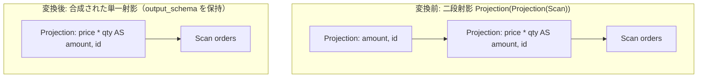

# merge_adjacent_projections

- 状態: draft / 執筆基準リビジョン: `3880673` (2026-09-12)
- 定義位置: `plan/cascades.cpp` の `RuleSet::Default()`（登録名 `"merge_adjacent_projections"`）

## 概要

二段に連続する射影演算 $\Pi_1(\Pi_2(X))$ を単一の射影演算 $\Pi_{1 \circ 2}(X)$ へ合成する論理 Rule です。

兄弟関係にある `merge_projections` と同様の式合成を行いますが、本 Rule は外側射影の出力スキーマ（`output_schema`）を明示的に継承し、最初に適用成功した代替案のみを採用して探索分岐の爆発を抑止する点に特徴があります。

## 変換前後の関係

内側で `price * qty AS amount, id` を計算し、外側で `amount, id` を取り出す二段射影の合成例を示します。



## 適用条件

パターンは `Projection(Projection(Any(), "inner"))` です（`plan/cascades.cpp`）。

```cpp
    // merge_adjacent_projections: Projection(Projection(X)) -> Projection(X)
    built.Add(Rule(
        "merge_adjacent_projections", Projection(Projection(Any(), "inner")),
```

適用判定（guard）は以下の 4 条件から成ります。

1. **演算子の適合**: 内側式が論理射影演算子（`kProjection`）であること。
2. **非循環性**: 内側ノードが 1 つ以上の子を持ち、その第 1 子が現在のグループ自身を指していないこと（`inner.children[0] != group` による無限ループ防止）。
3. **式の完全置換性**: 外側の `target_list` 内のすべての列参照が、内側の `target_list` の定義式により漏れなくインライン展開可能であること（`RewriteThroughOutputs` の成功）。
4. **非空合成**: 合成後のターゲットリスト `composed` が空でないこと。

## 意味論的根拠と安全性制約

### 1. 関係代数における射影の合成
属性変換写像 $f: X \to Y$ および $g: Y \to Z$ に対し、射影の合成は写像の合成 $g \circ f: X \to Z$ に等しく、中間属性集合 $Y$ のタプル具体化を回避しても最終的な属性集合 $Z$ の計算結果は完全に一致します。

### 2. 出力スキーマの明示的継承
`merge_adjacent_projections` との決定的な差異は、合成された論理式ノードへ外側の `output_schema` が設定される点にあります。

```cpp
            memo.AddExpression(
                group,
                LogicalExpression{.operation = LogicalOperator::kProjection,
                                  .children = inner.children,
                                  .target_list = std::move(composed),
                                  .output_schema = expression.output_schema});
            return;
```

クエリ全体のルート射影やサブクエリ境界に位置する射影では、列の別名（エイリアス）や NOT NULL 制約情報が `output_schema` に保持されています。これを欠落させると、後続のコスト計算や物理演算子の選択において属性参照の解決に齟齬が生じる恐れがあります。

また、内側グループ内に複数の射影候補が存在する場合でも、最初に成功した 1 つを登録した時点で探索を終了（`return`）することで、同一グループ内での冗長な等価ノードの生成を最小限に抑えています。

## 最適化効果

- **中間タプルの具体化抑止**: 実行エンジンにおいてタプルバッファへの列コピーや中間式の計算ステップが 1 演算子分削除されます。
- **後続 Rule への露出**: 下層のスキャン演算子や結合演算子の直上に最終計算式が配置されることで、インデックス条件への取り込みや計算のプッシュダウンが容易になります。

## 関連 Rule との相互作用

- `merge_projections`: 同一の代数変換を行う Rule です。探索方針およびスキーマ伝播の差異を補完し合います。
- `eliminate_identity_projection`: 合成によって入出力が同一となった恒等射影（$\Pi_A(A)$）を完全に除去します。
- `push_projection_through_join`: 結合下に押し込まれた射影がテーブルスキャン上の射影と衝突した際、本 Rule により 1 段へ集約されます。

## 検証テスト

- `plan/cascades_test.cpp`:
  - `MergeAdjacentProjectionsCompose`:
    2 段の射影が正しく 1 段に合成され、外側の出力定義が維持されることを確認します。
