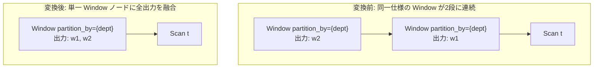

# merge_adjacent_windows

- 状態: draft / 執筆基準リビジョン: `3880673` (2026-09-12)
- 定義位置: `plan/cascades.cpp` の `RuleSet::Default()`（登録名 `"merge_adjacent_windows"`）

## 概要

`merge_adjacent_windows` は、隣接する2段のウィンドウ演算 `Window_1(Window_2(X))` について、双方が同一の PARTITION BY およびソート仕様を持つ場合に、外側 Window が内側 Window の出力列を参照していないことを確認した上で、単一のウィンドウ演算 `Window(X)` へ融合（fuse）する論理変換Ruleです。

同一仕様のウィンドウ演算を1ノードに統合することで、重複するデータソートおよびパーティショニング処理を1回に集約し、タプル処理オーバーヘッドを大幅に削減します。

## 変換前後の関係

2段に積み重なった Window ノードをバイパスし、内側 Window の入力 `X` に直接接続された統合 Window ノードを同一グループに追加します。



統合後のノードは、内側および外側の双方で計算されるすべてのウィンドウ関数出力を単一の実行パスで評価します。

## 適用条件

パターン照合には `Window(Any("input"))` を用い、対象演算子は `LogicalOperator::kWindow` です。

```cpp
    // merge_adjacent_windows: Fuse Window_1(Window_2(X)) into a single
    // Window(X) when both windows have identical PARTITION BY and sort
    // specifications, and Window_1 does not reference Window_2's outputs.
```

変換ラムダ内で以下のガード条件を厳格に判定します。

1. **演算子とノード形状**: 外側式が `kWindow` であり単一の子を持つこと。また、内側グループ内に `kWindow` で子を1つ持ち、その子が親グループ自身でない代替式が存在すること（自己循環の防止）。
2. **PARTITION BY の完全一致**: 両ノードのパーティションキーの要素数が一致し、各キー式の文字列表現（`ToString()`）が完全に一致すること。

   ```cpp
             if (expression.partition_by.size() !=
                 inner_win.partition_by.size()) {
               continue;
             }
             bool part_match = true;
             for (size_t i = 0; i < expression.partition_by.size(); ++i) {
               if (expression.partition_by[i]->ToString() !=
                   inner_win.partition_by[i]->ToString()) {
                 part_match = false;
                 break;
               }
             }
             if (!part_match) {
               continue;
             }
   ```

3. **ソート仕様の完全一致**: 昇順／降順フラグベクトル（`sort_ascending`）および NULLS FIRST/LAST フラグベクトル（`sort_nulls_first`）が完全に一致すること。

   ```cpp
             if (expression.sort_ascending != inner_win.sort_ascending ||
                 expression.sort_nulls_first != inner_win.sort_nulls_first) {
               continue;
             }
   ```

4. **出力参照の非依存性**: 外側の target list に含まれる各式が、内側 Window の生成する出力列名（`inner_outputs`）を一切参照していないこと。

   ```cpp
             bool touches_inner_output = false;
             for (const auto& target : expression.target_list) {
               if (!target.expression) {
                 continue;
               }
               for (const auto& col : target.expression->TouchedColumns()) {
                 if (inner_outputs.contains(col.name)) {
                   touches_inner_output = true;
                   break;
                 }
               }
             }
             if (touches_inner_output) {
               continue;
             }
   ```

## 意味論的根拠と物理実行の契約

ウィンドウ関数の値は、行が属するパーティション内の境界と指定されたウィンドウフレーム、およびパーティション内の順序のみに依存して決定されます。入力行集合とその順序付け仕様が完全に同一である場合、2つのウィンドウ関数群は互いに干渉することなく並行して計算可能です。

ガード条件の根拠は以下の通りです。

- **依存関係の遮断（条件4）**: 外側 Window が内側 Window の出力列（例: `w1`）を引数として参照している場合（例: `LAG(w1) OVER (...)` のようなネスト）、内側ノードの計算完了前に入力行を処理することは不可能です。単一ノードへの融合は同一行の評価コンテキスト上で並行計算を行うため、先行計算列への依存が存在すると未定義の値を参照することになり意味論が破綻します。
- **仕様の一致（条件2, 3）**: パーティションやソート順が異なる場合、行の並び順およびグループ化境界が物理的に異なるため、単一のデータ走査パスで同時に計算することはできません。

## 実装の詳細

融合処理では、内側 Window の出力リストに外側 Window の出力リストを連結した新しいターゲットリストを作成し、内側 Window の子ノードへ直接接続します。

```cpp
            std::vector<NamedExpression> merged_targets = inner_win.target_list;
            for (const auto& target : expression.target_list) {
              merged_targets.push_back(target);
            }

            LogicalExpression merged_win = expression;
            merged_win.children = inner_win.children;
            merged_win.target_list = std::move(merged_targets);
            memo.AddExpression(group, std::move(merged_win));
```

- **子ノードの置換**: `merged_win.children = inner_win.children` により、内側ノードが介在していた一段をスキップします。
- **ターゲットリストの合成**: `inner_win.target_list`（先行出力）の末尾に `expression.target_list`（後続出力）を追記することで、列の順序性を保存します。

## 最適化効果

本Ruleの適用により、以下の性能向上が得られます。

- **ソーティングおよびパーティショニングの削減**: ウィンドウ演算の物理実行（`WindowExecutor`）において最もコストを消費するデータ並べ替え処理が、2回から1回へと半減します。
- **タプルのコピー・メモリオーバーヘッド削減**: 中間タプルの生成とバッファリングが省略され、メモリ消費量とキャッシュ局所性が改善されます。

## 関連 Rule との相互作用

- `split_window`: 異なるウィンドウ仕様を持つ単一ノードを適切な評価単位へ分解する対向Ruleです。分解後に同一仕様となったノード同士を本Ruleが再融合します。
- `window_frame_sort_sharing`: 同一パーティションで順序仕様が緩やかに互換な場合に実行順を共有する関連Ruleです。
- `no_op_window_elimination`: 出力がクエリ全体で全く参照されないウィンドウ演算そのものを消去するRuleです。

## 検証テスト

- `plan/cascades_test.cpp`:
  - `CascadesTest.MergeAdjacentWindows`: `PARTITION BY dept` を持つ2段の Window 式から、入力スキャンに直結した単一の Window 代替式が生成されることを検証。
  - `CascadesTest.DefaultRulesIncludePredicateAndProjectionTransforms`: 既定の RuleSet 内に `merge_adjacent_windows` が登録されていることを検証。
