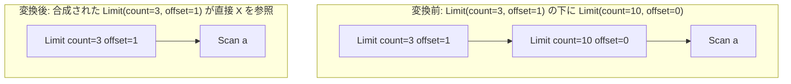

# merge_limits

- 状態: draft / 執筆基準リビジョン: `3880673` (2026-09-12)
- 定義位置: `plan/cascades.cpp` の `RuleSet::Default()`（登録名 `"merge_limits"`）

## 概要

`merge_limits` は、入れ子になった2段階の行数制限演算 `Limit(Limit(X))` を検知し、オフセットを加算合成した上で、行数上限をより厳しい制約値へ縮約した単一の `kLimit` 演算子へと統合する論理変換Ruleです。

中間 Limit ノードをバイパスして入力 `X` に直接接続された1段の Limit 代替式を生成することにより、実行時における二重のタプルカウントおよびスライシング処理を排除します。

## 変換前後の関係

外側グループ内に、中間 Limit を排して孫ノード `X` を直接参照する合成 Limit 論理式を追加します。



合成の意味論は「内側の offset を先行して消費し、その残余予算に対して外側の limit/offset 制約を適用する」ことに基づきます。

## 適用条件

パターン照合には `Limit(Limit(Any(), "inner"))` を用い、対象演算子は `LogicalOperator::kLimit` です。

```cpp
          for (const LogicalExpression& inner :
               memo.Get(bindings.at("inner")).expressions) {
            if (inner.operation != LogicalOperator::kLimit ||
                inner.children.empty() || inner.children[0] == group) {
              continue;
            }
```

発火には以下のガード条件を満たす必要があります。

1. **子ノードの演算子**: 子グループ内の代替式が `LogicalOperator::kLimit` であること。
2. **非空の子ノード**: 内側 Limit が子グループを1つ以上保持していること。
3. **非循環性の担保**: 内側 Limit の第0子グループが、親グループ自身（`group`）でないこと（自己循環参照の防止）。

## 意味論的根拠と多重度保存・循環防止

多重度および順序集合のスライス操作において、外側 $L_o(count_o, offset_o)$ と内側 $L_i(count_i, offset_i)$ の合成結果 $(count, offset)$ は以下の代数演算によって厳密に一意決定されます。

```cpp
            const size_t offset = inner.limit_offset + expression.limit_offset;
            size_t count = 0;
            if (inner.limit_count == 0) {
              count = expression.limit_count;
            } else if (expression.limit_offset >= inner.limit_count) {
              count = 0;
            } else if (expression.limit_count == 0) {
              count = inner.limit_count - expression.limit_offset;
            } else {
              count = std::min(expression.limit_count,
                               inner.limit_count - expression.limit_offset);
            }
```

各分岐の必要性は以下の通りです。

- **オフセットの加算**: 内側で読み飛ばした行数と外側で読み飛ばす行数は直列に累積するため、$offset = offset_i + offset_o$ となります。
- **上限超過による空化**: 外側のオフセットが内側の行数上限に達している場合（$offset_o \ge count_i$）、外側ノードに到達するタプルは存在せず、$count = 0$ と確定します。ここで誤って単なる最小値（`min`）を取ると、空であるべき結果に行が不当に復活してしまいます。
- **制約の包含**: 内側の残余行数（$count_i - offset_o$）と外側の上限 $count_o$ の小さい方を採用することで、双方が課した制約の積集合が保存されます（`count == 0` は上限なしを表現）。

また、`inner.children[0] == group` による循環防止チェックは、メモ構造における閉路形成を防止するための必須のガードレールです。

## 実装の詳細

合成された `count` および `offset` を保持する新しい `kLimit` 式を構築し、親グループに追加します。

```cpp
            memo.AddExpression(
                group, LogicalExpression{.operation = LogicalOperator::kLimit,
                                         .children = inner.children,
                                         .limit_count = count,
                                         .limit_offset = offset});
```

- **子ノードの直接接続**: `children = inner.children` を設定することにより、内側の Limit ノードを読み飛ばして孫ノードに直結します。
- **Memo 上の共存**: 元の二段 Limit も代替として維持され、コストモデルに基づいて最適な物理プラン（またはパイプライン処理）が決定されます。

## 最適化効果

本Ruleの適用により、以下の効果が得られます。

- **物理実行段数の削減**: `LimitExecutor` の評価パスが2段から1段へと削減され、タプルの受け渡しオーバーヘッドが半減します。
- **下位カーディナリティの正確な伝播**: 正確に合成された行数制約が孫ノードへ直接伝わるため、下位の結合や集約のコスト計算における行数見積もりが精緻化され、より適切な物理アルゴリズムが選択されます。

## 関連 Rule との相互作用

- `push_limit_through_union_all` / `union_all_push_limit`: UNION ALL の各ブランチに Limit を押し込んだ後、ブランチ側で新設された Limit と上位 Limit が再び結合する局面で本Ruleが発火します。
- `limit_push_through_sort`: 1段に集約された Limit は、ソートノードと組み合わされることで TopN オペレータへの変換を促進します。

## 検証テスト

- `plan/cascades_test.cpp`:
  - `CascadesTest.MergeLimitsComposesNestedLimits`: `Limit(10, 0)` の直上に `Limit(3, 1)` が配置されたプランを探索し、`count=3, offset=1` でスキャンに直結する単一 Limit 代替が生成されることを検証。
  - `CascadesTest.DefaultRulesIncludePredicateAndProjectionTransforms`: 既定の RuleSet 内に `merge_limits` が登録されていることを検証。
