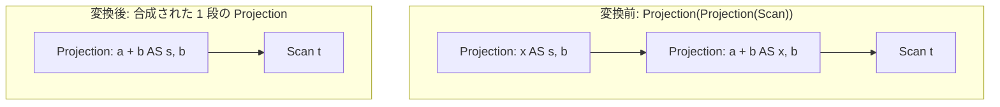

# merge_projections

- 状態: draft / 執筆基準リビジョン: `3880673` (2026-09-12)
- 定義位置: `plan/cascades.cpp` の `RuleSet::Default()`（登録名 `"merge_projections"`）

## 概要

`merge_projections` は、隣接する2段の射影演算 `Projection(Projection(X))` について、外側ノードのターゲットリストに含まれる列参照を内側ノードの出力定義式でインライン展開し、単一の射影演算 `Projection(X)` へと合成する論理変換Ruleです（Apache Calcite の ProjectMerge に相当）。

中間の列集合をメモリ上にマテリアライズするオーバーヘッドを排除し、タプルの詰め替えと式評価の実行パスを1段に集約します。

## 変換前後の関係

内側射影ノードをバイパスし、孫ノード `X` を直接入力とする合成射影ノードを親グループに追加します。



元の2段射影式もメモ内に保持され、コストモデルに基づいて最適な代替案が選択されます。

## 適用条件

パターン照合には `Projection(Projection(Any(), "inner"))` を用います。

```cpp
    // Projection(Projection(X)): compose the outer target list through the
    // inner one so later costing sees a single projection (Calcite
    // ProjectMerge).
    built.Add(Rule(
        "merge_projections", Projection(Projection(Any(), "inner")),
```

変換ラムダ内において、子グループの各式について以下のガード条件をすべて満たす必要があります。

1. **参照の完全解決**: 外側のターゲットリスト内のすべての出力項目について、ヘルパー関数 `RewriteThroughOutputs` による内側ターゲットリストを通じた書き換えが成功すること（1つでも解決不能な列があれば `std::nullopt` となり即座に不発）。
2. **合成結果の非空性**: 合成されたターゲットリスト `composed` が空でないこと。
3. **子ノードの存在**: 内側射影ノードが子グループを1つ以上持っていること。
4. **非循環性の担保**: 内側射影ノードの第0子グループが親グループ自身でないこと（`inner.children[0] != group`）。

## 意味論的根拠と属性マッピングの同一性

関係代数における射影の合成 $\pi_{L_1}(\pi_{L_2}(X))$ は、式木における代入操作によって $\pi_{L_1 \circ L_2}(X)$ と等価に還元されます。

各ガード条件の必要性は以下の通りです。

- **列参照の完全性（条件1）**: 内側射影が出力していない属性を外側射影が参照している場合、内側を飛び越えて孫ノードに接続すると属性の供給源が喪失します。`RewriteThroughOutputs` は、参照された列を供給する内側出力を見つけられない場合に失敗（`std::nullopt`）を返し、不完全な式生成を未然に防止します。
- **循環参照の遮断（条件4）**: 内側ノードの子が親グループを指している場合、合成ノードの追加により自己参照ループが発生してメモの整合性不変条件が破壊されるため、これを確実に除外します。

## 実装の詳細

ターゲットリストの合成は、外側リストの走査と式木の置換によって実行されます。

```cpp
            std::vector<NamedExpression> composed;
            composed.reserve(expression.target_list.size());
            bool ok = true;
            for (const NamedExpression& output : expression.target_list) {
              std::optional<Expression> rewritten =
                  RewriteThroughOutputs(output.expression, inner.target_list);
              if (!rewritten) {
                ok = false;
                break;
              }
              composed.emplace_back(output.name, *rewritten);
            }
```

核となる置換処理は `plan/cascades.cpp` の `RewriteThroughOutputs` が担います。

```cpp
  if (expression->Type() == TypeTag::kColumnValue) {
    const ColumnName& column = expression->AsColumnValue().GetColumnName();
    for (const NamedExpression& output : outputs) {
      if (OutputMatchesColumn(output, column)) {
        return output.expression;
      }
    }
    return std::nullopt;
  }
```

- **列参照のマッチング**: 外側の列参照に対し、内側の出力名が一致するか、または内側の定義式自体が同一列への参照であるかを `OutputMatchesColumn` により判定します。エイリアス（別名）が付与されている場合も、内側の元定義式へと透過的に展開されます。
- **代替式の登録**:

  ```cpp
            memo.AddExpression(
                group,
                LogicalExpression{.operation = LogicalOperator::kProjection,
                                  .children = inner.children,
                                  .target_list = std::move(composed)});
  ```

  親グループの出力スキーマおよび出力名は外側の指定を保持したまま、子ノードのみを内側の入力へと繋ぎ替えます。

## 最適化効果

本Ruleの適用により、以下の性能向上が得られます。

- **行変換オーバーヘッドの半減**: タプルイテレータのネスト段数が減少し、タプルメモリの再割り当てや列の詰め替え回数が削減されます。
- **定数畳み込みと共通式排除の促進**: 2段に分かれていた式が1つの式木に統合されるため、後続の式書き換え層による定数畳み込みや、同一部分式の検出が容易になります。

## 関連 Rule との相互作用

- `merge_adjacent_projections`: 同一の `Projection(Projection(X))` を対象とする兄弟Ruleです。あちらは外側の `output_schema` を明示設定し最初に成功した代替で探索を抜けるのに対し、本Ruleはすべての内側代替を網羅的に試行します。
- `eliminate_identity_projection`: 合成の結果、射影が入力列をそのまま通過させるだけの恒等射影（Identity Projection）となった場合、その射影自体を消去します。
- `projection_constant_propagation`: 内側出力に含まれる定数値を外側の参照へ折り込む特殊化Ruleです。

## 検証テスト

- `plan/cascades_test.cpp`:
  - `CascadesTest.MergeProjectionsComposesTargetLists`: 内側出力の定義式を用いて外側のターゲットリストが合成され、単一の射影式が生成されることを検証。
  - `CascadesTest.DefaultRulesIncludePredicateAndProjectionTransforms`: 既定の RuleSet 内に `merge_projections` が正しく登録されていることを検証。
